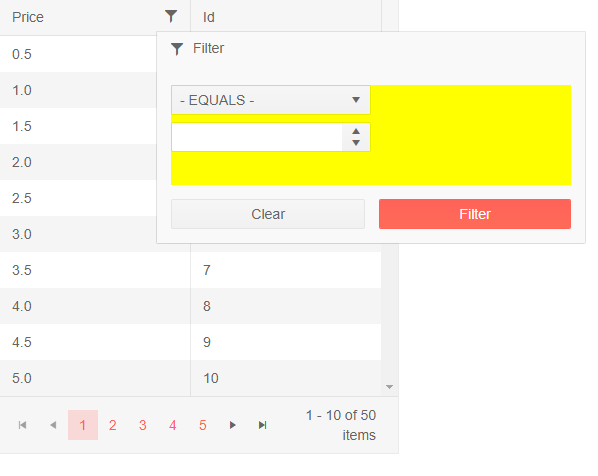
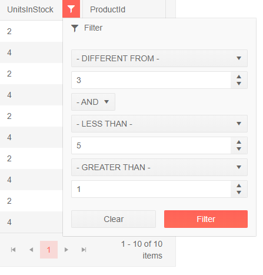

# Filter Template

The Filter Template lets you customize the appearance and logic of the built-in filters. It lets you step on the built-in filtering logic of the grid and implement your own design and logic for setting their values.

There are two different templates you can use depending on the [Filter Mode]() that you use:

<!-- Start Document Outline -->

* [Filter Menu](#filter-menu)
	* [Basic Template - Single Filter Operator](#basic-template---single-filter-operator)
	* [Add A Third Filter Operator](#add-a-third-filter-operator)
* [Filter Row](#filter-row)

<!-- End Document Outline -->

## Filter Menu

By default, the filter menu contains two filter values that are tied with a logical operator - OR or AND. The filter template for it (`<FilterMenuTemplate>` under the corresponding `<GridColumn>`) provides you with the default composite filter in the `FilterDescriptor` field of its `context`, and the `Filter` and `Clear` buttons below the template.

You can get started from the following examples:

* [Basic Template - Single Filter Operator](#basic-template---single-filter-operator)
* [Add A Third Filter Operator](#add-a-third-filter-operator)


### Basic Template - Single Filter Operator

In the example below, you can see how to:

* Keep only one input (declare only one, and clear the subsequent filter from the composite filter the grid provides).
* Customize the user input experience (set some properties to the numeric textbox or the corresponding editor you use).
* Choose the desired filter operators while using custom text for them (a dropdown list with the desired data source).
* Change the size of the filter popup (defining your own layout with desired size and styles) - which is not mandatory.

Comments in the code offer more insights into how all the features tie together.

>caption Customize Filter Menu operators and value area to use only one operator

````CSHTML
@using Telerik.DataSource

<TelerikGrid Data="@GridData" Pageable="true" Width="400px"
             FilterMode="@GridFilterMode.FilterMenu">
    <GridColumns>
        <GridColumn Field="@nameof(SampleData.Price)">
            <FilterMenuTemplate>
                @{
                    // we step on the built-in filter descriptor of the grid
                    // and reuse it to populate it from the custom filter input
                    // the built-in Filter and Clear buttons of the grid remain available
                    // and in this case we ensure only one filter is used, and customize the way
                    // filter operators and values are provided to the grid filtering
                    UnitPriceFilterMenuTemplateContext = context;

                    // leave only one filter descriptor (there are two by default)
                    var descriptor1 = UnitPriceFilterMenuTemplateContext.FilterDescriptor.FilterDescriptors.ElementAtOrDefault(0);
                    UnitPriceFilterMenuTemplateContext.FilterDescriptor.FilterDescriptors.Clear();
                    UnitPriceFilterMenuTemplateContext.FilterDescriptor.FilterDescriptors.Add(descriptor1);
                }

                @* you can customize the appearance and size of the template area *@
                <div style="width: 400px; height: 100px; background:yellow;">
                    <div>
                        <TelerikDropDownList Data="@FilterOperatorsList" @bind-Value="@SelectedFilterOperator" PopupHeight="auto" Width="50%">
                        </TelerikDropDownList>
                    </div>

                    <div>
                        <TelerikNumericTextBox @bind-Value="@UnitPrice" Step="0.5m" Decimals="1" Width="50%"></TelerikNumericTextBox>
                    </div>
                </div>
            </FilterMenuTemplate>
        </GridColumn>
        <GridColumn Field="@(nameof(SampleData.Id))" Title="Id" Filterable="false"></GridColumn>
    </GridColumns>
</TelerikGrid>

@code {
    // sample data for the grid
    List<SampleData> GridData { get; set; } = Enumerable.Range(1, 50).Select(x => new SampleData { Id = x, Price = x * 0.5m }).ToList();

    // stores the default filter context with the default column filter that the Grid has
    // this lets you manipulate it and reuse it according to your logic
    public FilterMenuTemplateContext UnitPriceFilterMenuTemplateContext { get; set; }

    // this references the first built-in filter descriptor so you can easily
    // populate its value from the custom filter component - a numeric textbox in this sample
    public FilterDescriptor UnitPriceFilterDescriptor
    {
        get
        {
            var descriptor = UnitPriceFilterMenuTemplateContext.FilterDescriptor.FilterDescriptors.ElementAt(0) as FilterDescriptor;
            return descriptor;
        }
    }

    // the value that is used for the custom filter
    // populated with two-way binding of the custom filter component
    public decimal? UnitPrice
    {
        get => (decimal?)(UnitPriceFilterDescriptor.Value);
        set => UnitPriceFilterDescriptor.Value = (decimal?)value;
    }

    // filter operator field - two-way binding with the custom filter component
    FilterOperator SelectedFilterOperator
    {
        get => (FilterOperator)(UnitPriceFilterDescriptor.Operator);
        set => UnitPriceFilterDescriptor.Operator = value;
    }

    // the custom list of filter operators - we can change the available ones, the default one and their text as needed
    List<FilterOperatorDdlModel> FilterOperatorsList { get; set; } = new List<FilterOperatorDdlModel>
    {
        new FilterOperatorDdlModel { Text = "- LESS THAN -", Value = FilterOperator.IsLessThan },
        new FilterOperatorDdlModel { Text = "- EQUALS -", Value = FilterOperator.IsEqualTo},
        new FilterOperatorDdlModel { Text = "- GREATER THAN -", Value = FilterOperator.IsGreaterThan }
    };

    // models for the data - the grid and the custom list of filter operators

    public class SampleData
    {
        public int Id { get; set; }
        public decimal Price { get; set; }
    }

    public class FilterOperatorDdlModel
    {
        public Telerik.DataSource.FilterOperator Value { get; set; }
        public string Text { get; set; }
    }
}
````

>caption The result from the snippet above after opening the filter menu



### Add A Third Filter Operator

In the example below, you can see how to:

* mimic the default behavior (by implementing the default functionality)
* add a third operator (by adding another instance of the filter operator editor)
* provide custom filter operators lists and texts (through the data sources of the custom dropdowns)

Comments in the code offer more insights into how all the features tie together.

>caption Add a third filter operator

````CSHTML
@using Telerik.DataSource

<TelerikGrid Data="@GridData" Pageable="true" Width="300px"
             FilterMode="@GridFilterMode.FilterMenu">
    <GridColumns>
        <GridColumn Field="@nameof(SampleData.UnitsInStock)">
            <FilterMenuTemplate>
                @{
                    UnitsInStockFilterMenuTemplateContext = context;

                    var compositeFilterDescriptor = UnitsInStockFilterMenuTemplateContext.FilterDescriptor as CompositeFilterDescriptor;

                    var descriptor1 = compositeFilterDescriptor.FilterDescriptors.ElementAtOrDefault(0) as FilterDescriptor;

                    var descriptor3 = new FilterDescriptor()
                    {
                        Member = descriptor1.Member,
                        MemberType = descriptor1.MemberType,
                    };

                    UnitsInStockFilterMenuTemplateContext.FilterDescriptor.FilterDescriptors.Add(descriptor3);
                }

                @* first filter logic *@
                <div>
                    <TelerikDropDownList Data="@UnitsInStockFilterOperators"
                                         @bind-Value="@UnitsInStockFilterOperator1"
                                         TextField="@(nameof(FilterOperatorDescriptor.Text))"
                                         ValueField="@(nameof(FilterOperatorDescriptor.Operator))"
                                         PopupHeight="auto">
                    </TelerikDropDownList>
                </div>
                <div>
                    <TelerikNumericTextBox @bind-Value="@UnitsInStockFilterValue1"></TelerikNumericTextBox>
                </div>

                @* logical operator *@
                <div>
                    <TelerikDropDownList @bind-Value="@UnitsInStockFilterLogicalOperator1"
                                         Data="@FilterLogicalOperators"
                                         Width="75px" PopupHeight="auto"
                                         TextField="@nameof(FilterLogicalOperatorDescriptor.Text)"
                                         ValueField="@nameof(FilterLogicalOperatorDescriptor.Operator)">
                    </TelerikDropDownList>
                </div>

                @* second filter logic *@
                <div>
                    <TelerikDropDownList Data="@UnitsInStockFilterOperators"
                                         @bind-Value="@UnitsInStockFilterOperator2"
                                         TextField="@(nameof(FilterOperatorDescriptor.Text))"
                                         ValueField="@(nameof(FilterOperatorDescriptor.Operator))"
                                         PopupHeight="auto">
                    </TelerikDropDownList>
                </div>
                <div>
                    <TelerikNumericTextBox @bind-Value="@UnitsInStockFilterValue2"></TelerikNumericTextBox>
                </div>

                @* third filter logic *@
                <div>
                    <TelerikDropDownList Data="@UnitsInStockFilterOperators"
                                         @bind-Value="@UnitsInStockFilterOperator3"
                                         TextField="@(nameof(FilterOperatorDescriptor.Text))"
                                         ValueField="@(nameof(FilterOperatorDescriptor.Operator))"
                                         PopupHeight="auto">
                    </TelerikDropDownList>
                </div>
                <div>
                    <TelerikNumericTextBox @bind-Value="@UnitsInStockFilterValue3"></TelerikNumericTextBox>
                </div>
            </FilterMenuTemplate>
        </GridColumn>
        <GridColumn Field="@nameof(SampleData.ProductId)" Filterable="false" />
    </GridColumns>
</TelerikGrid>

@code {
    public List<SampleData> GridData { get; set; } = Enumerable.Range(1, 50).Select(x => new SampleData { ProductId = x, UnitsInStock = x % 10 }).ToList();

    // data sources for the custom filter dropdowns
    public List<FilterLogicalOperatorDescriptor> FilterLogicalOperators { get; set; }
    public List<FilterOperatorDescriptor> UnitsInStockFilterOperators { get; set; }

    // the filter template context that lets you customize its filter operators list
    public FilterMenuTemplateContext UnitsInStockFilterMenuTemplateContext { get; set; }

    // get the filter descriptor list from the context
    public CompositeFilterDescriptor UnitsInStockCompositeFilterDescriptor
    {
        get => UnitsInStockFilterMenuTemplateContext.FilterDescriptor;
    }

    // custom filter operators- they use two-way binding with the customized components in the template
    public FilterOperator UnitsInStockFilterOperator1
    {
        get => UnitsInStockFilterDescriptor1.Operator;
        set => UnitsInStockFilterDescriptor1.Operator = value;
    }

    public FilterOperator UnitsInStockFilterOperator2
    {
        get => UnitsInStockFilterDescriptor2.Operator;
        set => UnitsInStockFilterDescriptor2.Operator = value;
    }

    public FilterOperator UnitsInStockFilterOperator3
    {
        get => UnitsInStockFilterDescriptor3.Operator;
        set => UnitsInStockFilterDescriptor3.Operator = value;
    }

    // custom filter values - they use two-way binding with the customized components in the template
    public short? UnitsInStockFilterValue1
    {
        get => (short?)(UnitsInStockFilterDescriptor1.Value);
        set => UnitsInStockFilterDescriptor1.Value = (short?)value;
    }

    public short? UnitsInStockFilterValue2
    {
        get => (short?)(UnitsInStockFilterDescriptor2.Value);
        set => UnitsInStockFilterDescriptor2.Value = (short?)value;
    }

    public short? UnitsInStockFilterValue3
    {
        get => (short?)(UnitsInStockFilterDescriptor3.Value);
        set => UnitsInStockFilterDescriptor3.Value = (short?)value;
    }

    // logical operator value
    public FilterCompositionLogicalOperator UnitsInStockFilterLogicalOperator1
    {
        get => UnitsInStockCompositeFilterDescriptor.LogicalOperator;
        set => UnitsInStockCompositeFilterDescriptor.LogicalOperator = value;
    }

    // shortcuts to get the filter descriptors
    public FilterDescriptor UnitsInStockFilterDescriptor1 => GetUnitsInStockFilterDescriptor(0);

    public FilterDescriptor UnitsInStockFilterDescriptor2 => GetUnitsInStockFilterDescriptor(1);

    public FilterDescriptor UnitsInStockFilterDescriptor3 => GetUnitsInStockFilterDescriptor(2);

    public FilterDescriptor GetUnitsInStockFilterDescriptor(int index)
    {
        var unitsInStockFilter = UnitsInStockFilterMenuTemplateContext.FilterDescriptor;
        var descriptor = unitsInStockFilter.FilterDescriptors.ElementAtOrDefault(index) as FilterDescriptor;
        return descriptor;
    }


    // initialize data for the filter operators and logical operators lists
    protected override async Task OnInitializedAsync()
    {
        // filter operators
        UnitsInStockFilterOperators = GetNumericFilterOperators();
        // logical operators
        FilterLogicalOperators = GetFilterLogicalOperators();
    }


    // model class for the custom dropdowns with the filter operators
    public class FilterOperatorDescriptor
    {
        public string Text { get; set; } = "Is equal to";

        public FilterOperator Operator { get; set; } = FilterOperator.IsEqualTo;
    }

    // model class for the dropdowns with logical operators list
    public class FilterLogicalOperatorDescriptor
    {
        public string Text { get; set; }

        public FilterCompositionLogicalOperator Operator { get; set; }
    }

    // provide a list with the custom logical operators to the template
    public List<FilterLogicalOperatorDescriptor> GetFilterLogicalOperators()
    {
        var data = new List<FilterLogicalOperatorDescriptor>();

        data.Add(new FilterLogicalOperatorDescriptor()
        {
            Text = "- OR -",
            Operator = FilterCompositionLogicalOperator.Or
        });

        data.Add(new FilterLogicalOperatorDescriptor()
        {
            Text = "- AND -",
            Operator = FilterCompositionLogicalOperator.And
        });

        return data;
    }

    // provide a list with the filter operators to the template
    public List<FilterOperatorDescriptor> GetNumericFilterOperators()
    {
        var data = new List<FilterOperatorDescriptor>();

        data.Add(new FilterOperatorDescriptor()
        {
            Text = "- DIFFERENT FROM -",
            Operator = FilterOperator.IsNotEqualTo
        });

        data.Add(new FilterOperatorDescriptor()
        {
            Text = "- LESS THAN -",
            Operator = FilterOperator.IsLessThan
        });

        data.Add(new FilterOperatorDescriptor()
        {
            Text = "- GREATER THAN -",
            Operator = FilterOperator.IsGreaterThan
        });

        return data;
    }

    // sample model for the grid
    public class SampleData
    {
        public int ProductId { get; set; }
        public int UnitsInStock { get; set; }
    }
}
````

>caption The result from the code snippet above, after opening the filter menu and applying some filteres




## Filter Row


## See Also

 * [Live Demo: Grid Custom Filter](https://demos.telerik.com/blazor-ui/grid/custom-filter)

