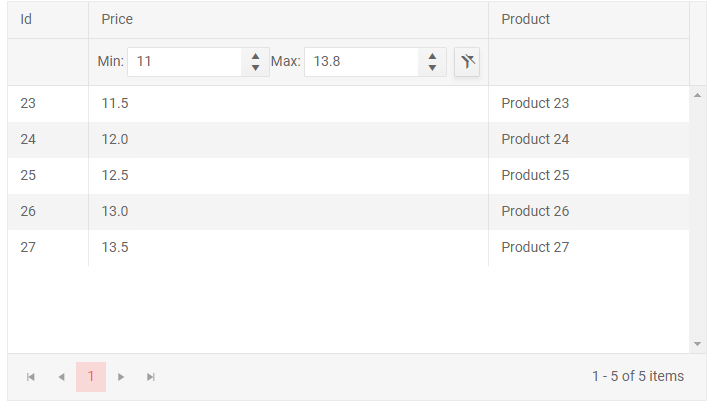
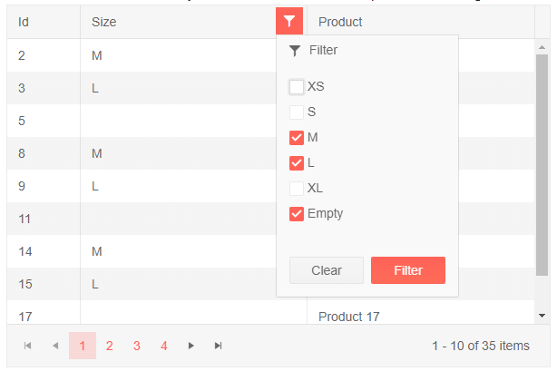

# Filter Template

The Filter Template lets you customize the appearance and logic of the built-in filters. It lets you step on the built-in filtering logic of the grid and implement your own design and logic for setting their values.

There are two different templates you can use depending on the [Filter Mode](slug:components/grid/filtering) that you chose:

* [Filter Row Template](#filter-row-template)
* [Filter Menu Template](#filter-menu-template)
* [Filter Menu Buttons Template](#filter-menu-buttons-template)

## Filter Row Template

By default, the filter row puts an appropriate editor (like a numeric textbox for numbers) and its `ValueChanged` handler triggers grid filtering on every keystroke. There is also a button for the user to choose a filter operator, and a clear filter button when there is a value in the editor.

To customize the filter cell, use the `<FilterCellTemplate>` tag of the `<GridColumn>`. It receives a `context` of type `FilterCellTemplateContext` that provides the following members:

* `FilterDescriptor` - a [CompositeFilterDescriptor](slug:Telerik.DataSource.CompositeFilterDescriptor) object that describes the column filter. By default, its `FilterDescriptors` field contains two `FilterDescriptor` instances and its `LogicalOperator` is `AND`. You can populate the filter values in the existing `FilterDescriptors` and add more instances. You can change their [filter operator](slug:common-features-filter-operators) and the `LogicalOperator` of the `CompositeFilterDescriptor`.

* `FilterAsync()` - an `async` method that invokes the built-in grid filtering logic (including a handler to [`OnRead`](slug:components/grid/manual-operations) if you use one) so you can call upon it easily from your template (e.g., when a value changes or a button is clicked).

* `ClearFilterAsync()` - an `async` method that invokes the built-in grid clear filtering logic (including a handler to [`OnRead`](slug:components/grid/manual-operations) if you use one) so you can call upon it easily from your template (e.g., when a value is cleared or a button is clicked).

You can store a reference to each column's context in a field in the view-model, so you can write the handlers in the standard C# code, instead of using lambdas in the markup. You can also pass the context as a Parameter to your own separate filter component to reduce clutter in the main grid markup and code.

### Examples

The example below shows a custom filter that:

* Implements a min-max filter in the filter cell through two numeric textboxes.
* Filters in the `OnChange` event (only when the user presses Enter or blurs the input) to reduce database calls.
* Shows how you can store a reference to the context or use it inline in the template.
* Showcases building a filter descriptor with two filters and sample logic that always filters the data even if one of the inputs is empty.

You can find more examples in the [Live Demo: Custom Filter Row](https://demos.telerik.com/blazor-ui/grid/custom-filter-row) that is available in your local installation under the `demos` folder. Also check [How to implement a filter operator dropdown list in a Filter Row Template](slug:grid-kb-filter-operator-dropdown) in order to mimic the default filter row UI.

>caption Custom Filter Row Template - Min and Max filters on OnChange

<demo metaUrl="client/grid/templates-filter-row/" height="500"></demo>

>caption The result from the code snippet above after filtering

## Filter Menu Template

By default, the filter menu contains two filter values that are tied with a logical operator - OR or AND, with filtering being triggered through a dedicated Filter button and a Clear button removes the filter.

To customize the filter menu, use the `<FilterMenuTemplate>` tag of the `<GridColumn>`. The `Filter` and `Clear` buttons are still available below the template.

The template receives a `context` of type `FilterMenuTemplateContext` that provides the following members:

* `FilterDescriptor` - the object that describes the column filter. By default it has two filters with the type and name of the field, and you can add more to its `FilterDescriptors` collection, or change its `LogicalOperator` from the default `AND`.
* `FilterAsync` - applies the defined filters in the Filter Menu to the Grid component.
* `ClearFilterAsync` - clears the applied filters.

You can store a reference to each column's context in a field in the view-model, so you can reference it from event handlers in the standard C# code, instead of passing it as an argument to lambdas in the markup only. You can also pass the context as a Parameter to your own separate filter component to reduce clutter in the main grid markup and code.

### Examples

The example below shows a custom filter that:

* Implements a multi checkbox filter that lets the user choose several values from the data source.
    * Shows how you can handle `null` filters now that the user cannot choose a filter operator on their own.
* Shows how you can store a reference to the context or use it inline in the template.
* Showcases building multiple filter descriptors for each value the user chooses.

You can find more examples in the [Live Demo: Custom Filter Menu](https://demos.telerik.com/blazor-ui/grid/custom-filter-menu) that is available in your local installation under the `demos` folder.

For an example with the CheckboxList Filter, see the [Custom Data](slug:grid-checklist-filter#custom-data) section in its article.

>caption Custom Filter Menu Template - Multiple Checkboxes

>tip The grid can create a checkbox filter for you, see the [CheckBoxList Filtering](slug:grid-checklist-filter) article.

<demo metaUrl="client/grid/templates-filter-menu/" height="550"></demo>

>caption The result from the code snippet above, after filtering

## Filter Menu Buttons Template

By default, the Filter Menu renders `Filter` and `Clear` buttons. You can customize or remove them entirely by using the `FilterMenuButtonsTemplate` tag. 

The template receives a `context` of type `FilterMenuTemplateContext` that provides the following members:

* `FilterDescriptor`—the object that describes the column filter. By default, the column filter has two filters: one for the type and another for the name of the field. You can modify the column filter by:
   * Adding more filters to the `FilterDescriptors` collection.
   * Changing the `LogicalOperator` (`AND` by default).
   * Using the `FilterDescriptor` to create a custom button that applies a predefined filter. 
* `FilterAsync`—applies the filters defined in the Filter Menu to the Grid component.
* `ClearFilterAsync`—clears the applied filters.

>caption Using custom filter menu buttons

<demo metaUrl="client/grid/templates-filter-buttons/" height="550"></demo>

## See Also

* [Live Demo: Grid Custom Filter Row](https://demos.telerik.com/blazor-ui/grid/custom-filter-row)
* [Live Demo: Grid Custom Filter Menu](https://demos.telerik.com/blazor-ui/grid/custom-filter-menu)
* [KB: Use Filter Operator DropDown List in Filter Row Template](slug:grid-kb-filter-operator-dropdown)
* [KB: Use Custom DateTime Filters in a Filter Template](slug:grid-kb-custom-datetime-filters)
* [Blazor Grid](slug:grid-overview)
