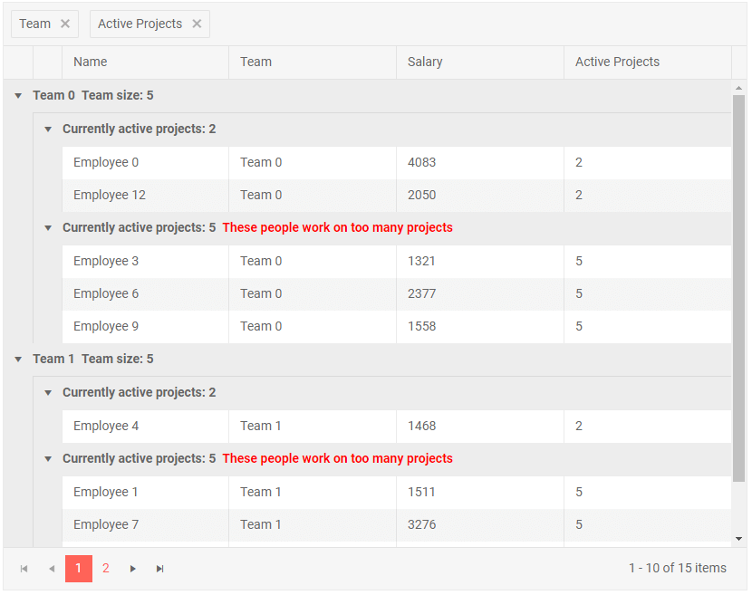

# Group Header

When the grid is grouped, the top row above the group provides information about the current group value by default. You can use this template to add custom content there in addition to the current value. For more information and examples, see the [Aggregates]() article.

>caption Sample Group Header Template

````CSHTML
@* Group by the Team and Active Projects fields to see the results *@

<TelerikGrid Data=@GridData Groupable="true" Pageable="true" Height="650px">
    <GridAggregates>
        <GridAggregate Field=@nameof(Employee.Team) Aggregate="@GridAggregateType.Count" />
    </GridAggregates>
    <GridColumns>
        <GridColumn Field=@nameof(Employee.Name) Groupable="false" />
        <GridColumn Field=@nameof(Employee.Team) Title="Team">
            <GroupHeaderTemplate>
                @context.Value @* the default text you would get without the template *@
                &nbsp;<span>Team size: @context.Count</span>
            </GroupHeaderTemplate>
        </GridColumn>
        <GridColumn Field=@nameof(Employee.Salary) Title="Salary" Groupable="false" />
        <GridColumn Field=@nameof(Employee.ActiveProjects) Title="Active Projects">
            <GroupHeaderTemplate>
                @{
                    <span>Currently active projects: @context.Value &nbsp;</span>

                    //sample of conditional logic in the group header
                    if ( (int)context.Value > 3) // in a real case, ensure type safety and add defensive checks
                    {
                        <strong style="color: red;">These people work on too many projects</strong>
                    }
                }
            </GroupHeaderTemplate>
        </GridColumn>
    </GridColumns>
</TelerikGrid>

@code {
    public List<Employee> GridData { get; set; }

    protected override void OnInitialized()
    {
        GridData = new List<Employee>();
        var rand = new Random();
        for (int i = 0; i < 15; i++)
        {
            Random rnd = new Random();
            GridData.Add(new Employee()
            {
                EmployeeId = i,
                Name = "Employee " + i.ToString(),
                Team = "Team " + i % 3,
                Salary = rnd.Next(1000, 5000),
                ActiveProjects = i % 4 == 0 ? 2 : 5
            });
        }
    }

    public class Employee
    {
        public int EmployeeId { get; set; }
        public string Name { get; set; }
        public string Team { get; set; }
        public decimal Salary { get; set; }
        public int ActiveProjects { get; set; }
    }
}
````

>caption The result from the code snippet above after grouping by the `Team` and `Active Projects` columns



## See Also

 * [Live Demo: Grid Templates](https://demos.telerik.com/blazor-ui/grid/templates)
 * [Live Demo: Grid Custom Editor Template](https://demos.telerik.com/blazor-ui/grid/customeditor)

