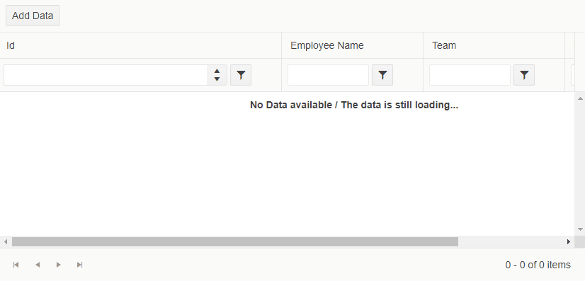

# No Data Template

The `NoDataTemplate` allows you to define custom content when the Grid has no data to show. It lets you change the default **No records available** localizable text.

>caption Custom content for an empty Grid



>caption Use the NoDataTemplate to override the message shown while the data is still loading or when you try to filter a non-existing item

````CSHTML
@* The example showcases a Grid with a delay upon initializing its data and filtering on non-existing data *@

<TelerikGrid Data="@MyData" Height="400px" Width="830px"
             Pageable="true"
             FilterMode="Telerik.Blazor.GridFilterMode.FilterRow">
    <GridToolBar>
        <GridCommandButton OnClick="@LoadData">Add Data</GridCommandButton>
    </GridToolBar>
    <GridColumns>
        <GridColumn Field="@(nameof(SampleData.Id))" Width="400px" />
        <GridColumn Field="@(nameof(SampleData.Name))" Title="Employee Name" Width="200px" />
        <GridColumn Field="@(nameof(SampleData.Team))" Title="Team" Width="200px" />
        <GridColumn Field="@(nameof(SampleData.HireDate))" Title="Hire Date" Width="200px" />
    </GridColumns>
    <NoDataTemplate>
        <strong>No Data available / The data is still loading...</strong>
    </NoDataTemplate>
</TelerikGrid>

@code { 
    public IEnumerable<SampleData> MyData { get; set; }

    async Task LoadData()
    {
        await Task.Delay(2000);

        MyData = Enumerable.Range(1, 30).Select(x => new SampleData
        {
            Id = x,
            Name = "name " + x,
            Team = "team " + x % 5,
            HireDate = DateTime.Now.AddDays(-x).Date
        });
    }

    public class SampleData
    {
        public int Id { get; set; }
        public string Name { get; set; }
        public string Team { get; set; }
        public DateTime HireDate { get; set; }
    }
}
````

## See Also

 * [Live Demo: Grid Templates](https://demos.telerik.com/blazor-ui/grid/templates)
 * [Live Demo: Grid - No Data Template](https://demos.telerik.com/blazor-ui/grid/no-data-template)

