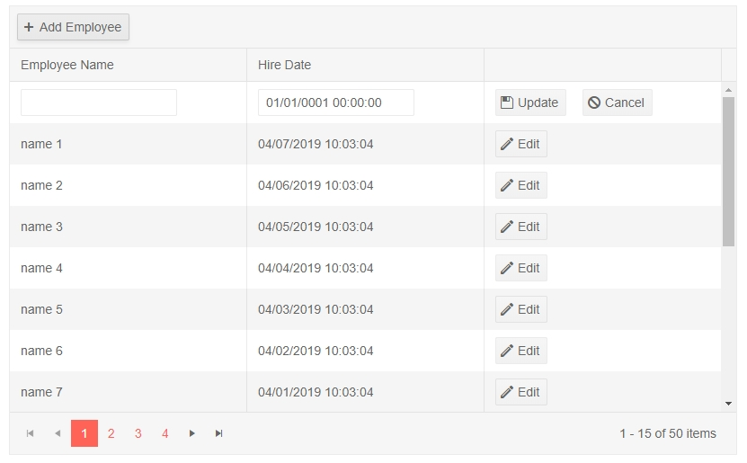
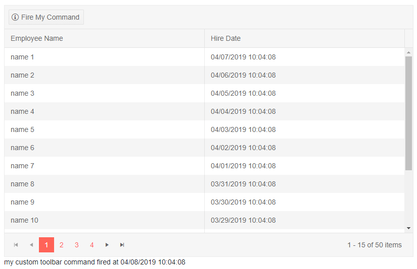

# Grid Toolbar

The grid provides a toolbar where you can add a variety of actions that are not tied to a concrete row:

* [Built-in Commands](#built-in-commands)
* [Custom Commands](#custom-commands)

To use a toolbar, define `GridCommandButton` instances in the `GridToolBar` tag of the grid. You can read more about the features available in those buttons in the [Command Column]() article.

>note The toolbar is not associated with an item from the data source. The `Item` field on the click event handler argument will always be `null` and the `Edit`, `Update`, `Cancel` commands do not work with it.

## Built-in Commands

The grid offers built-in commands that you can invoke through its toolbar. To use them, set the `Command` property of the button to the command name. The built-in command names are:

* `Add` - startes inserting a new item in the grid.

>caption How to insert a new item in the grid

````CSHTML
@result

<TelerikGrid Data=@MyData Pageable="true" PageSize="15" EditMode="@GridEditMode.Inline" Height="500px"
            OnUpdate="@UpdateHandler" OnCreate="@CreateHandler">
	<GridToolBar>
		<GridCommandButton Command="Add" Icon="add">Add Employee</GridCommandButton>
	</GridToolBar>
	<GridColumns>
		<GridColumn Field=@nameof(SampleData.Name) Title="Employee Name" />
		<GridColumn Field=@nameof(SampleData.HireDate) Title="Hire Date" />
		<GridCommandColumn>
			<GridCommandButton Command="Edit" Icon="edit">Edit</GridCommandButton>
			<GridCommandButton Command="Save" Icon="save" ShowInEdit="true">Update</GridCommandButton>
			<GridCommandButton Command="Cancel" Icon="cancel" ShowInEdit="true">Cancel</GridCommandButton>
		</GridCommandColumn>
	</GridColumns>
</TelerikGrid>

@code {
	string result;

	private void UpdateHandler(GridCommandEventArgs args)
	{
		SampleData alteredItem = args.Item as SampleData;
		
		result = string.Format("Employee with ID {0} now has name {1} and hire date {2}", alteredItem.ID, alteredItem.Name, alteredItem.HireDate);
		
		StateHasChanged();
	}
	
	private void CreateHandler(GridCommandEventArgs args)
	{
		SampleData alteredItem = args.Item as SampleData;
	    
	    result = string.Format("On {2} you added the employee {0} who was hired on {1}.", alteredItem.Name, alteredItem.HireDate, DateTime.Now);
	    
		StateHasChanged();
	}

	//in a real case, keep the models in dedicated locations, this is just an easy to copy and see example
	public class SampleData
	{
		public int ID { get; set; }
		public string Name { get; set; }
		public DateTime HireDate { get; set; }
	}

	public IEnumerable<SampleData> MyData = Enumerable.Range(1, 50).Select(x => new SampleData
	{
		ID = x,
		Name = "name " + x,
		HireDate = DateTime.Now.AddDays(-x)
	});
}
````

>caption The result from the code snippet above, after built-in Create button in the toolbar was clicked



## Custom Commands

You can use the toolbar to add buttons that invoke actions specific to your application.

>caption How to define a custom command in the grid toolbar

````CSHTML
@result

<TelerikGrid Data=@MyData Pageable="true" PageSize="15">
	<GridToolBar>
		<GridCommandButton Command="MyToolbarCommand" OnClick="@MyCommandFromToolbar" Icon="info">Fire My Command</GridCommandButton>
	</GridToolBar>
	<GridColumns>
		<GridColumn Field=@nameof(SampleData.Name) Title="Employee Name" />
		<GridColumn Field=@nameof(SampleData.HireDate) Title="Hire Date" />
	</GridColumns>
</TelerikGrid>

@code {
	string result;

	private void MyCommandFromToolbar(GridCommandEventArgs args)
	{
		//note - the args.Item object is null because the command item is not associated with an item

		result = "my custom toolbar command fired at " + DateTime.Now.ToString();

		StateHasChanged();
	}

	//in a real case, keep the models in dedicated locations, this is just an easy to copy and see example
	public class SampleData
	{
		public int ID { get; set; }
		public string Name { get; set; }
		public DateTime HireDate { get; set; }
	}

	public IEnumerable<SampleData> MyData = Enumerable.Range(1, 50).Select(x => new SampleData
	{
		ID = x,
		Name = "name " + x,
		HireDate = DateTime.Now.AddDays(-x)
	});
}
````

>caption The result from the code snippet above, after the custom command button in the toolbar was clicked



## See Also

  * [Live Demo: Grid Toolbar](https://demos.telerik.com/blazor-ui/grid/inlineediting)
