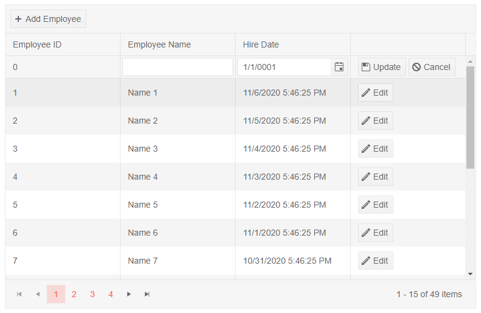
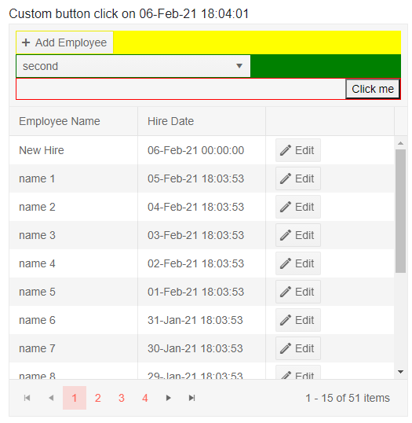

# Grid Toolbar

The grid provides a toolbar where you can add a variety of actions that are not tied to a concrete row.

To use a toolbar, define the `GridToolBar` tag of the grid. In it, you can use arbitrary HTML and components to get the desired layout, and also `GridCommandButton` instances in (you can read more about the features available in those buttons in the [Command Column]() article).

>note The toolbar is not associated with an item from the data source. The `Item` field on the click event handler argument of a `GridCommandButton` will always be `null` and the `Edit`, `Update`, `Cancel` commands do not work with it.

In this article, you will learn how to use:

* [Built-in Commands](#built-in-commands)
* [Custom Commands](#custom-commands)
* [Custom Layout](#custom-layout)


## Built-in Commands

The grid offers built-in commands that you can invoke through its toolbar. To use them, set the `Command` property of the button to the command name. The built-in command names are:

* `Add` - starts inserting a new item in the grid.

>caption How to insert a new item in the grid

````CSHTML
@result

<TelerikGrid Data=@MyData Pageable="true" PageSize="15" EditMode="@GridEditMode.Inline" Height="500px"
             OnUpdate="@UpdateHandler" OnCreate="@CreateHandler">
    <GridToolBar>
        <GridCommandButton Command="Add" Icon="add">Add Employee</GridCommandButton>
    </GridToolBar>
    <GridColumns>
        <GridColumn Field=@nameof(SampleData.ID) Editable="false" Title="Employee ID" />
        <GridColumn Field=@nameof(SampleData.Name) Title="Employee Name" />
        <GridColumn Field=@nameof(SampleData.HireDate) Title="Hire Date" />
        <GridCommandColumn>
            <GridCommandButton Command="Edit" Icon="edit">Edit</GridCommandButton>
            <GridCommandButton Command="Save" Icon="save" ShowInEdit="true">Update</GridCommandButton>
            <GridCommandButton Command="Cancel" Icon="cancel" ShowInEdit="true">Cancel</GridCommandButton>
        </GridCommandColumn>
    </GridColumns>
</TelerikGrid>

@code {
    string result;
    public List<SampleData> MyData { get; set; }

    private async Task UpdateHandler(GridCommandEventArgs args)
    {
        SampleData item = args.Item as SampleData;

        // perform actual data source operations here through your service
        SampleData updatedItem = await MyService.Update(item);

        // update the local view-model data with the service data
        await GetGridData();

        result = string.Format("Employee with ID {0} now has name {1} and hire date {2}", updatedItem.ID, updatedItem.Name, updatedItem.HireDate);
    }

    private async Task CreateHandler(GridCommandEventArgs args)
    {
        SampleData item = args.Item as SampleData;

        // perform actual data source operations here through your service
        SampleData insertedItem = await MyService.Create(item);

        // update the local view-model data with the service data
        await GetGridData();

        result = string.Format("On {2} you added the employee {0} who was hired on {1}.", insertedItem.Name, insertedItem.HireDate, DateTime.Now);
    }

    //in a real case, keep the models in dedicated locations, this is just an easy to copy and see example
    public class SampleData
    {
        public int ID { get; set; }
        public string Name { get; set; }
        public DateTime HireDate { get; set; }
    }

    async Task GetGridData()
    {
        MyData = await MyService.Read();
    }

    protected override async Task OnInitializedAsync()
    {
        await GetGridData();
    }

    // the following static class mimics an actual data service that handles the actual data source
    // replace it with your actual service through the DI, this only mimics how the API can look like and works for this standalone page
    public static class MyService
    {
        private static List<SampleData> _data { get; set; } = new List<SampleData>();

        public static async Task<SampleData> Create(SampleData itemToInsert)
        {
            itemToInsert.ID = _data.Count + 1;
            _data.Insert(0, itemToInsert);

            return await Task.FromResult(itemToInsert);
        }

        public static async Task<List<SampleData>> Read()
        {
            if (_data.Count < 1)
            {
                for (int i = 1; i < 50; i++)
                {
                    _data.Add(new SampleData()
                    {
                        ID = i,
                        Name = "Name " + i.ToString(),
                        HireDate = DateTime.Now.AddDays(-i)
                    });
                }
            }

            return await Task.FromResult(_data);
        }

        public static async Task<SampleData> Update(SampleData itemToUpdate)
        {
            var index = _data.FindIndex(i => i.ID == itemToUpdate.ID);
            if (index != -1)
            {
                _data[index] = itemToUpdate;
                return await Task.FromResult(_data[index]);
            }

            throw new Exception("no item to update");
        }
    }
}
````

>caption The result from the code snippet above, after the built-in Create button in the toolbar was clicked



## Custom Commands

You can use the toolbar to add buttons that invoke actions specific to your application.

>caption How to define a custom command in the grid toolbar

````CSHTML
@result

<TelerikGrid Data=@MyData Pageable="true" PageSize="15">
	<GridToolBar>
		<GridCommandButton Command="MyToolbarCommand" OnClick="@MyCommandFromToolbar" Icon="info">Fire My Command</GridCommandButton>
	</GridToolBar>
	<GridColumns>
		<GridColumn Field=@nameof(SampleData.Name) Title="Employee Name" />
		<GridColumn Field=@nameof(SampleData.HireDate) Title="Hire Date" />
	</GridColumns>
</TelerikGrid>

@code {
	string result;

	private void MyCommandFromToolbar(GridCommandEventArgs args)
	{
		//note - the args.Item object is null because the command item is not associated with an item

		result = "my custom toolbar command fired at " + DateTime.Now.ToString();

		StateHasChanged();
	}

	//in a real case, keep the models in dedicated locations, this is just an easy to copy and see example
	public class SampleData
	{
		public int ID { get; set; }
		public string Name { get; set; }
		public DateTime HireDate { get; set; }
	}

	public IEnumerable<SampleData> MyData = Enumerable.Range(1, 50).Select(x => new SampleData
	{
		ID = x,
		Name = "name " + x,
		HireDate = DateTime.Now.AddDays(-x)
	});
}
````

>caption The result from the code snippet above, after the custom command button in the toolbar was clicked


## Custom Layout

You can add your own HTML and components to create a more complex layout in the grid header to match your business needs. You can still use the grid command buttons, as well as other components and logic.

>caption Custom Grid Toolbar Layout

````CSHTML
@result

<TelerikGrid Data=@MyData Pageable="true" PageSize="15" EditMode="@GridEditMode.Inline" Height="500px" OnCreate="@CreateHandler">
    <GridToolBar>
        <div style="background:yellow">
            <GridCommandButton Command="Add" Icon="add">Add Employee</GridCommandButton>
        </div>
        <div style="background: green;">
            <TelerikDropDownList Data="@( new List<string>() { "first", "second", "third" } )" TValue="string" TItem="string" ValueChanged="@( (string itm) => result = itm )"></TelerikDropDownList>
        </div>
        <div style="border: 1px solid red;">
            <div style="float:right;"><button @onclick="@( () => result = $"Custom button click on {DateTime.Now}"  )">Click me</button></div>
            <div style="clear:both;"></div>
        </div>
    </GridToolBar>
    <GridColumns>
        <GridColumn Field=@nameof(SampleData.Name) Title="Employee Name" />
        <GridColumn Field=@nameof(SampleData.HireDate) Title="Hire Date" />
        <GridCommandColumn>
            <GridCommandButton Command="Edit" Icon="edit">Edit</GridCommandButton>
            <GridCommandButton Command="Save" Icon="save" ShowInEdit="true">Update</GridCommandButton>
            <GridCommandButton Command="Cancel" Icon="cancel" ShowInEdit="true">Cancel</GridCommandButton>
        </GridCommandColumn>
    </GridColumns>
</TelerikGrid>

@code {
    string result;

    private void CreateHandler(GridCommandEventArgs args)
    {
        SampleData newItem = args.Item as SampleData;
        MyData.Insert(0, newItem); // actual CRUD operations are not implemented, for brevity

        result = string.Format("On {2} you added the employee {0} who was hired on {1}.", newItem.Name, newItem.HireDate, DateTime.Now);
        StateHasChanged();
    }

    //in a real case, keep the models in dedicated locations, this is just an easy to copy and see example
    public class SampleData
    {
        public int ID { get; set; }
        public string Name { get; set; }
        public DateTime HireDate { get; set; }
    }

    public List<SampleData> MyData = Enumerable.Range(1, 50).Select(
        x => new SampleData
            {
                ID = x,
                Name = "name " + x,
                HireDate = DateTime.Now.AddDays(-x)
            }).ToList();
}
````

>caption The result from the code snippet above, after adding a row, changing the dropdown and clicking the custom button.



## See Also

  * [Live Demo: Grid Toolbar](https://demos.telerik.com/blazor-ui/grid/editing-inline)
