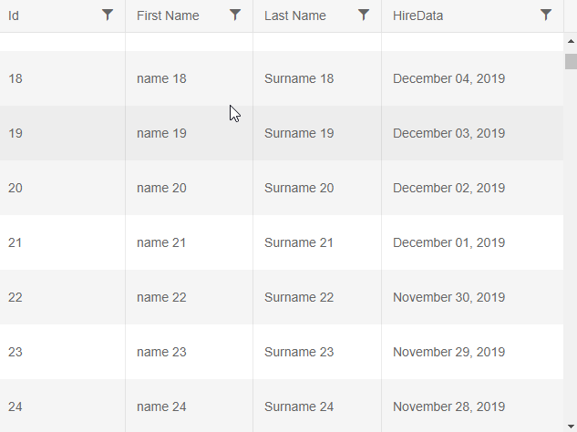

# Virtual Scrolling

Virtual scrolling is an alternative to paging. Instead of using a pager, the user scrolls vertically through all records in the data source.

The same set of elements is reused to improve performance. While the next data is loading, a loading indicator is shown on the cells. If the user scrolls back up after scrolling down to a next page, the previous page will be loaded anew from the data source, like with regular paging.

You can also Virtually Scroll the Grid Columns. More information can be found in the [Column Virtualization]() article.

## Requirements

To enable virtual scrolling:

1. Set `ScrollMode="@GridScrollMode.Virtual"` - this enables the virtualization of items
2. Provide  `Height`, `RowHeight`, and `PageSize` to the grid - this lets the grid calculate the position of the user in order to fetch the correct set of items from the data source.

>caption Sample of virtual scrolling in the Telerik Grid for Blazor

````CSHTML
@* Scroll the grid instead of paging *@

<TelerikGrid Data=@GridData
             ScrollMode="@GridScrollMode.Virtual"
             Height="480px" RowHeight="60" PageSize="20"
             Sortable="true" FilterMode="@GridFilterMode.FilterMenu">
    <GridColumns>
        <GridColumn Field="Id" />
        <GridColumn Field="Name" Title="First Name" />
        <GridColumn Field="LastName" Title="Last Name" />
        <GridColumn Field="HireData" Width="200px">
            <Template>
                @((context as SampleData).HireDate.ToString("MMMM dd, yyyy"))
            </Template>
        </GridColumn>
    </GridColumns>
</TelerikGrid>

@code {
    public List<SampleData> GridData { get; set; }

    protected override async Task OnInitializedAsync()
    {
        GridData = await GetData();
    }

    private async Task<List<SampleData>> GetData()
    {
        return Enumerable.Range(1, 1000).Select(x => new SampleData
        {
            Id = x,
            Name = $"name {x}",
            LastName = $"Surname {x}",
            HireDate = DateTime.Now.Date.AddDays(-x)
        }).ToList();
    }

    public class SampleData
    {
        public int Id { get; set; }
        public string Name { get; set; }
        public string LastName { get; set; }
        public DateTime HireDate { get; set; }
    }
}
````

>caption How virtual scrolling looks like (deliberately slowed down to showcase the loading placeholders)



>tip The column where long text is expected (the `Hire Date` in this example) has a width set so that the text does not break into multiple lines and increase the height of the row. See the notes below for more details.

## Notes

There are several things to keep in mind when using virtual scrolling:

* The `RowHeight` is a decimal value that is always considered as pixel values. If you use [row template](#row-template), make sure it matches the `RowHeight`. The `Height` does not have to be in pixels, but it may help you calculate the `PageSize` (see below).
    * If the row/cell height the browser would render is larger than the `RowHeight` value, the browser will ignore it. It can depend on the chosen Theme or other CSS rules, or on cell data that falls on more than one row. Inspect the rendered HTML to make sure the grid setting matches the rendering.

        The default grid rendering has padding in the cells, and the loading sign has a line height set in order to render. This may impose some minimum heights that can vary with the theme and/or custom styles on the page. You can remove both with the following rules: `.k-placeholder-line{display:none;} .k-grid td{margin:0;padding:0;}`.
    * The `RowHeight` must not change at runtime, because the new dimensions will cause issues with the scrolling logic.
    * Browser zoom or monitor DPI settings can cause the browser to render different dimensions than the expected and/or non-integer values, which can break the virtualization logic.
* Do not mix virtualization with paging, as they are alternatives to the same feature.
* Provide for a `PageSize` of the Grid that is large enough, so that the loaded table rows do not fit in the scrollable data area, otherwise the vertical virtual scrollbar will not be created and scrolling will not work. To do this, take into account the `Height` of the grid and the `RowHeight`.
* You can control how many rows are rendered through the `PageSize`. If performance does not suit your needs, tweak mostly that property (for example, if latency is high - fetch larger chunks of data so that a remote service is called less often; or when the browser is responding slowly, decrease the page size to render fewer DOM elements).
* When using the [`OnRead` event](), use the `PageSize` and `Skip` parameters to know what data to return, instead of `PageSize` and `Page` as with regular paging.
* Horizontal scrolling is not virtualized, all columns are rendered.
* Multiple Selection has some specifics when you use the `OnRead` event, you can read more about its behavior in the [Multiple Seletion](#checkbox-selection) article.

## Limitations

Virtualization is mainly a technique for improving client-side performance and the user experience. Its cost is that some features of the grid do not work with it. An alternative to that is to use [regular paging]() with [mantual data source operations]() to implement the desired performance of the data retrieval.

List of the known limitations of the virtual scrolling feature:

* [Hierarchy]() is not supported.
* [Grouping]() is not supported.
* The `Data` of the grid must contain more items than the `PageSize` in order for the virtual scrolling feature to work. You can work around this with something similar to `ScrollMode="@(DataCollection.Count() > 30 ? GridScrollMode.Virtual : GridScrollMode.Scrollable)"`


<!--
Code for the GIF

<TelerikGrid Data=@GridData
             ScrollMode="@GridScrollMode.Virtual"
             Height="480px" RowHeight="60" PageSize="20"
             Sortable="true" FilterMode="@GridFilterMode.FilterMenu"
             TotalCount=@Total OnRead=@ReadItems Width="640px">
    <GridColumns>
        <GridColumn Field="Id" />
        <GridColumn Field="Name" Title="First Name" />
        <GridColumn Field="LastName" Title="Last Name" />
        <GridColumn Field="HireData" Width="200px">
            <Template>
                @((context as SampleData).HireDate.ToString("MMMM dd, yyyy"))
            </Template>
        </GridColumn>
    </GridColumns>
</TelerikGrid>

@code {
    public List<SampleData> SourceData { get; set; }
    public int Total { get; set; } = 0;
    public List<SampleData> GridData { get; set; }

    protected override async Task OnInitializedAsync()
    {
        SourceData = await GetData();
    }

    private async Task<List<SampleData>> GetData()
    {
        return Enumerable.Range(1, 1000).Select(x => new SampleData
        {
            Id = x,
            Name = $"name {x}",
            LastName = $"Surname {x}",
            HireDate = DateTime.Now.Date.AddDays(-x)
        }).ToList();
    }

    protected async Task ReadItems(GridReadEventArgs args)
    {
        Console.WriteLine("before");
        await Task.Delay(500); //delay for creating the GIF
        Console.WriteLine("after");

        GridData = SourceData.Skip(args.Request.Skip).Take(args.Request.PageSize).ToList();
        Total = SourceData.Count;

        StateHasChanged();
    }

    public class SampleData
    {
        public int Id { get; set; }
        public string Name { get; set; }
        public string LastName { get; set; }
        public DateTime HireDate { get; set; }
    }
}

-->

## See Also

  * [Live Demo: Grid Virtual Scrolling](https://demos.telerik.com/blazor-ui/grid/virtual-scrolling)
