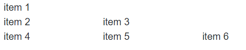
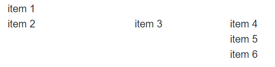
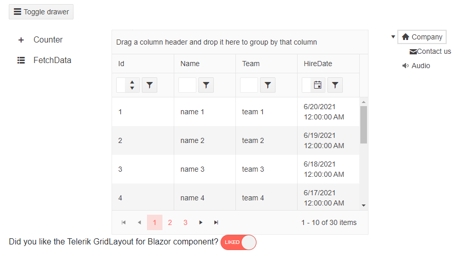

# Items

You can control the items in the GridLayout with the parameters they expose:

* [Row](#row)

* [Column](#column)

* [ColumnSpan](#columnspan)

* [RowSpan](#rowspan)

* [Example: Complex Grid Layout](#example-complex-grid-layout)


## Row

The `Row` parameter controls in which row the `GridLayoutItem` will reside. The row indexes in the component are `1-based`. If no rows are defined, the items will be displayed in `r = i / c` rows, where:

* `r` is the number of rows;

* `i` is the number of items;

* `c` is the number of columns;

>caption Distribute the GridLayout items across the rows. The result from the code snippet below.



````CSHTML
@* Distribute the GridLayout items across the rows in a custom manner. *@

<TelerikGridLayout>
    <GridLayoutRows>
        <GridLayoutRow></GridLayoutRow>
        <GridLayoutRow></GridLayoutRow>
        <GridLayoutRow></GridLayoutRow>
    </GridLayoutRows>
    <GridLayoutItems>
        <GridLayoutItem Row="1">
            <div>
                item 1
            </div>
        </GridLayoutItem>
        <GridLayoutItem Row="2">
            <div>
                item 2
            </div>
        </GridLayoutItem>
        <GridLayoutItem Row="2">
            <div>
                item 3
            </div>
        </GridLayoutItem>
        <GridLayoutItem Row="3">
            <div>
                item 4
            </div>
        </GridLayoutItem>
        <GridLayoutItem Row="3">
            <div>
                item 5
            </div>
        </GridLayoutItem>
        <GridLayoutItem Row="3">
            <div>
                item 6
            </div>
        </GridLayoutItem>
    </GridLayoutItems>
</TelerikGridLayout>
````

## Column

The `Column` parameter controls in which column the `GridLayoutItem` will reside. The column indexes in the component are `1-based`. If no columns are defined, the GridLayout items will be displayed in one column.

>caption Distribute the GridLayout items across the columns. The result from the code snippet below.



````CSHTML
@* Distribute the GridLayout items across the columns in a custom manner. *@

<TelerikGridLayout>
    <GridLayoutColumns>
        <GridLayoutColumn Width="200px"></GridLayoutColumn>
        <GridLayoutColumn Width="150px"></GridLayoutColumn>
        <GridLayoutColumn Width="150px"></GridLayoutColumn>
    </GridLayoutColumns>
    <GridLayoutItems>
        <GridLayoutItem Column="1">
            <div>
                item 1
            </div>
        </GridLayoutItem>
        <GridLayoutItem Column="1">
            <div>
                item 2
            </div>
        </GridLayoutItem>
        <GridLayoutItem Column="2">
            <div>
                item 3
            </div>
        </GridLayoutItem>
        <GridLayoutItem Column="3">
            <div>
                item 4
            </div>
        </GridLayoutItem>
        <GridLayoutItem Column="3">
            <div>
                item 5
            </div>
        </GridLayoutItem>
        <GridLayoutItem Column="3">
            <div>
                item 6
            </div>
        </GridLayoutItem>
    </GridLayoutItems>
</TelerikGridLayout>
````

## ColumnSpan

The `ColumnSpan` parameter defines the how many columns the item will occupy. 

>caption Change the column span of the first item with the numeric text box

````CSHTML
@* Change the column span of the first item. *@

<TelerikNumericTextBox @bind-Value="@ColumnSpan"></TelerikNumericTextBox>

<TelerikGridLayout>
    <GridLayoutColumns>
        <GridLayoutColumn Width="200px"></GridLayoutColumn>
        <GridLayoutColumn Width="150px"></GridLayoutColumn>
    </GridLayoutColumns>
    <GridLayoutItems>
        <GridLayoutItem Column="1" ColumnSpan="@ColumnSpan">
            <div>
                item 1
            </div>
        </GridLayoutItem>
        <GridLayoutItem Column="1">
            <div>
                item 2
            </div>
        </GridLayoutItem>
        <GridLayoutItem Column="2">
            <div>
                item 3
            </div>
        </GridLayoutItem>
        <GridLayoutItem Column="2">
            <div>
                item 4
            </div>
        </GridLayoutItem>
    </GridLayoutItems>
</TelerikGridLayout>

@code {
    public int? ColumnSpan { get; set; }
}
````

## RowSpan

The `RowSpan` parameter defines how many rows the item will occupy.

>caption Change the row span of the first item with the numeric text box


````CSHTML
@* Change the column span of the first item. *@

<TelerikNumericTextBox @bind-Value="@RowSpan"></TelerikNumericTextBox>

<TelerikGridLayout>
    <GridLayoutRows>
        <GridLayoutRow></GridLayoutRow>
        <GridLayoutRow></GridLayoutRow>
        <GridLayoutRow></GridLayoutRow>
    </GridLayoutRows>
    <GridLayoutItems>
        <GridLayoutItem Column="1" RowSpan="@RowSpan">
            <div>
                item 1
            </div>
        </GridLayoutItem>
        <GridLayoutItem Column="1">
            <div>
                item 2
            </div>
        </GridLayoutItem>
        <GridLayoutItem Column="2">
            <div>
                item 3
            </div>
        </GridLayoutItem>
        <GridLayoutItem Column="2">
            <div>
                item 4
            </div>
        </GridLayoutItem>
    </GridLayoutItems>
</TelerikGridLayout>

@code {
    public int? RowSpan { get; set; }
} 
````

## Example: Complex Grid Layout

You can use the exposed parameters of the GridLayout items to create more complex layouts.

>caption Create a page layout with the GridLayout component



````CSHTML
@* Create a page layout with the Telerik Components *@

<TelerikGridLayout>
    <GridLayoutColumns>
        <GridLayoutColumn Width="200px"></GridLayoutColumn>
        <GridLayoutColumn Width="500px"></GridLayoutColumn>
        <GridLayoutColumn Width="200px"></GridLayoutColumn>
    </GridLayoutColumns>
    <GridLayoutRows>
        <GridLayoutRow Height="50px"></GridLayoutRow>
        <GridLayoutRow Height="400px"></GridLayoutRow>
        <GridLayoutRow Height="100px"></GridLayoutRow>
    </GridLayoutRows>
    <GridLayoutItems>
        <GridLayoutItem Column="1" Row="1" ColumnSpan="3">
            <span>
                <TelerikButton OnClick="@(() => DrawerRef.ToggleAsync())" Icon="menu">Toggle drawer</TelerikButton>
            </span>
        </GridLayoutItem>
        <GridLayoutItem Column="1" Row="2">

            <div style="width: 200px">
                <TelerikDrawer Data="@DrawerData"
                               MiniMode="true"
                               Mode="DrawerMode.Push"
                               @ref="@DrawerRef"
                               @bind-SelectedItem="@SelectedItem">
                </TelerikDrawer>
            </div>

        </GridLayoutItem>
        <GridLayoutItem Column="2" Row="2">

            <TelerikGrid Data="@GridData"
                         AutoGenerateColumns="true"
                         Height="100%"
                         Width="100%"
                         Pageable="true"
                         Sortable="true"
                         Groupable="true"
                         FilterMode="Telerik.Blazor.GridFilterMode.FilterRow"
                         Resizable="true"
                         Reorderable="true">
            </TelerikGrid>

        </GridLayoutItem>
        <GridLayoutItem Column="3" Row="2">
            <TelerikTreeView Data="@TreeViewData">
                <TreeViewBindings>
                    <TreeViewBinding IconClassField="@nameof(TreeViewModel.MyIconClass)"
                                     ImageUrlField="@nameof(TreeViewModel.MyImageUrl)"
                                     IconField="@nameof(TreeViewModel.TelerikIcon)" />
                </TreeViewBindings>
            </TelerikTreeView>
        </GridLayoutItem>
        <GridLayoutItem Column="1" ColumnSpan="3">
            <TelerikSwitch @bind-Value="@likedLayout" Width="70px" Id="layout-liked" OnLabel="Liked" OffLabel="Not"></TelerikSwitch>
            <label for="layout-liked">Liked!</label>
        </GridLayoutItem>
    </GridLayoutItems>
</TelerikGridLayout>

@code {
    public bool likedLayout { get; set; } = true;

    public List<TreeViewModel> TreeViewData { get; set; }

    protected overrCoide void OnInitialized()
    {
        GenerateData();
    }

    public void GenerateData()
    {
        TreeViewData = new List<TreeViewModel>();

        TreeViewData.Add(new TreeViewModel()
        {
            Id = 1,
            Text = "Company",
            ParentId = null,
            HasChildren = true,
            TelerikIcon = "home"
        });

        TreeViewData.Add(new TreeViewModel()
        {
            Id = 2,
            Text = "Contact us",
            ParentId = 1,
            HasChildren = false,
            MyIconClass = "oi oi-envelope-closed"
        });

        TreeViewData.Add(new TreeViewModel()
        {
            Id = 3,
            Text = "Audio",
            ParentId = null,
            MyImageUrl = "https://docs.telerik.com/blazor-ui/images/speaker.png"
        });
    }

    public class TreeViewModel
    {
        public int Id { get; set; }
        public string Text { get; set; }
        public bool HasChildren { get; set; }
        public int? ParentId { get; set; }
        public string TelerikIcon { get; set; }
        public string MyIconClass { get; set; }
        public string MyImageUrl { get; set; }
    }

    public IEnumerable<SampleData> GridData = Enumerable.Range(1, 30).Select(x => new SampleData
    {
        Id = x,
        Name = "name " + x,
        Team = "team " + x % 5,
        HireDate = DateTime.Now.AddDays(-x).Date
    });

    public class SampleData
    {
        public int Id { get; set; }
        public string Name { get; set; }
        public string Team { get; set; }
        public DateTime HireDate { get; set; }
    }

    TelerikDrawer<DrawerItem> DrawerRef { get; set; }
    DrawerItem SelectedItem { get; set; }
    IEnumerable<DrawerItem> DrawerData { get; set; } =
        new List<DrawerItem>
        {
            new DrawerItem { Text = "Counter", Icon = "plus"},
            new DrawerItem { Text = "FetchData", Icon = "grid-layout"},
            };

    public class DrawerItem
    {
        public string Text { get; set; }
        public string Icon { get; set; }
    }
}
````

## See Also

  * [Overview]()