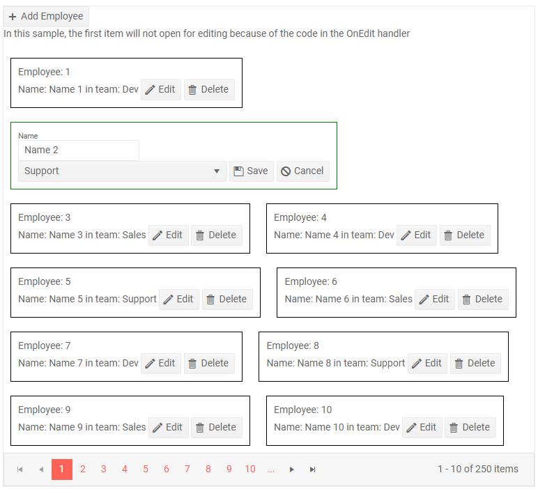

# Editing

The ListView lets you edit the data through a dedicated [edit template](#edit-template). You can put the items in edit/insert mode, as well as delete items through dedicated command buttons from the listview.

To invoke the commands, use the `ListViewCommandButton` component in the templates of the component. It can take the following built-in `Command` values:
* `Add` - initializes a new item insertion by adding the `EditTemplate` at the top of the listview.
* `Edit` - puts the item in whose `Template` it is in edit mode so it renders its `EditTemplate`.
* `Save` - saves the changes on the currently edited/inserted item.
* `Delete` - deletes the current item.
* `Cancel` - cancels the current operation (e.g., puts the edited item into read mode without saving changes, or removes thew newly inserted item).

The command buttons expose the standard button features such as icons, text, primary state and an `OnClick` event handler that you can use to implement custom commands, although you can use any button or DOM event handler for that.

The CUD operations are implemented through dedicated events that let you alter the data source (both in the view-model, in in your actual database):

* `OnUpdate` - fires when an existing item is saved.
* `OnEdit` - fires when the user clicks the Edit command, cancellable.
* `OnCreate` - fires when a new item is saved.
* `OnDelete` - fires when an item is deleted.
* `OnCancel` - fires when the Cancel button is clicked.

>caption How to edit data in the ListView

````
@* The actual data source operations depend on the app and must be implemented in the events the listview provides.
Implementing beautiful rendering is up to the application, this example shows the basics of the available events and commands.
*@

<TelerikListView Data="@ListViewData" Pageable="true"
                 OnCreate="@CreateHandler" OnDelete="@DeleteHandler" OnUpdate="@UpdateHandler"
                 OnEdit="@EditHandler" OnCancel="@CancelHandler">
    <EditTemplate>
        <div style="border: 1px solid green; margin: 10px; padding: 10px; display: inline-block;">
            <TelerikTextBox @bind-Value="@context.Name" Label="Name" /><br />
            <TelerikDropDownList Data="@Teams" @bind-Value="@context.Team" />
            <ListViewCommandButton Command="Save" Icon="@IconName.Save">Save</ListViewCommandButton>
            <ListViewCommandButton Command="Cancel" Icon="@IconName.Cancel">Cancel</ListViewCommandButton>
        </div>
    </EditTemplate>
    <Template>
        <div style="border: 1px solid black; margin: 10px; padding: 10px; display: inline-block;">
            Employee: @context.Id <br />
            Name: @context.Name in team: @context.Team
            <ListViewCommandButton Command="Edit" Icon="@IconName.Edit">Edit</ListViewCommandButton>
            <ListViewCommandButton Command="Delete" Icon="@IconName.Delete">Delete</ListViewCommandButton>
        </div>
    </Template>
    <HeaderTemplate>
        <ListViewCommandButton Command="Add" Icon="@IconName.Plus">Add Employee</ListViewCommandButton>
        <p>In this sample, the first item will not open for editing because of the code in the OnEdit handler</p>
    </HeaderTemplate>
</TelerikListView>

@code{
    async Task CreateHandler(ListViewCommandEventArgs e)
    {
        Employee insertedItem = e.Item as Employee;
        insertedItem.Id = ListViewData.Count + 1;
        ListViewData.Insert(0, insertedItem);

        // save to the actual data source here as well
    }

    async Task DeleteHandler(ListViewCommandEventArgs e)
    {
        Employee deletedItem = e.Item as Employee;

        ListViewData.Remove(deletedItem);

        // save to the actual data source here as well
    }

    async Task UpdateHandler(ListViewCommandEventArgs e)
    {
        Employee updatedItem = e.Item as Employee;

        int index = ListViewData.FindIndex(itm => itm.Id == updatedItem.Id);
        if (index > -1)
        {
            ListViewData[index] = updatedItem;
        }

        // save to the actual data source here as well
    }

    async Task EditHandler(ListViewCommandEventArgs e)
    {
        Employee currItem = e.Item as Employee;

        // prevent opening an item for editing on condition
        if (currItem.Id < 2)
        {
            e.IsCancelled = true;
        }
    }

    async Task CancelHandler(ListViewCommandEventArgs e)
    {
        Employee changedItem = e.Item as Employee;
        // this is the item as the user edited it, but chose to cancel editing/inserting
        Console.WriteLine($"user changed item {changedItem.Id} to have Name: {changedItem.Name} and Team: {changedItem.Team}");
    }

    // data and models follow

    List<Employee> ListViewData { get; set; }

    protected override void OnInitialized()
    {
        ListViewData = Enumerable.Range(1, 250).Select(x => new Employee
        {
            Id = x,
            Name = $"Name {x}",
            Team = Teams[x % Teams.Count]
        }).ToList();
    }

    List<string> Teams = new List<string> { "Sales", "Dev", "Support" };

    public class Employee
    {
        public int Id { get; set; }
        public string Name { get; set; }
        public string Team { get; set; }
    }
}
````

>caption The result from the code snippet above after clicking Edit for the second item



## See Also

  * [ListView Overview]()
   
  