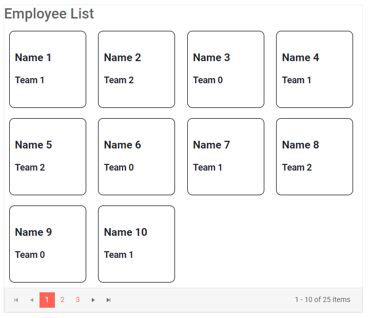

# ListView Overview

The ListView component is a fully customizable templated component that repeats your layout for each item in the data source. It lets you page the data, edit items through a dedicated edit template and also add header and footer templates.

To use a Telerik ListView for Blazor

1. add the `TelerikListView` tag
1. populate its `Data` property with the collection of items you want the user to see
1. define the `Template` for the items and add the relevant styles to your app
1. (optional) enable paging and set dimensions to the component

>caption ListView in read mode with paging enabled

````CSHTML
@* Styles would usually go to to the site stylesheet, and you can read more details about
the rest of the features the component provides further in this article *@

<TelerikListView Data="@ListViewData" Width="700px" Pageable="true">
    <HeaderTemplate>
        <h2>Employee List</h2>
    </HeaderTemplate>
    <Template>
        <div class="listview-item">
            <h4>@context.Name</h4>
            <h5>@context.Team</h5>
        </div>
    </Template>
</TelerikListView>

@code{
    List<SampleData> ListViewData { get; set; } = Enumerable.Range(1, 25).Select(x => new SampleData
    {
        Id = x,
        Name = $"Name {x}",
        Team = $"Team {x % 3}"
    }).ToList();

    public class SampleData
    {
        public int Id { get; set; }
        public string Name { get; set; }
        public string Team { get; set; }
    }
}

<style>
    .listview-item {
        height: 150px;
        width: 150px;
        display: inline-block;
        margin: 10px;
        border: 1px solid black;
        border-radius: 10px;
        padding: 10px;
    }
</style>
````

>caption The result from the code snippet above



>caption The ListView provides the following features:

* [Paging]() - you can enable automatic paging of the provided data so the user has less scrolling to do and the list can fit better in your layout
* [Templates]() - you fully control the rendering of the items and their layout. You can add header, footer, and a template for editing items.
* [Editing]() - you can define a template for an item in edit mode and add command buttons for the user to edit, delete and insert items.
* [Events]() - the CRUD operations happen through dedicated events, and there is also an option for [load-on-demand for the data](), which provides you with full control over the data operations and not only the rendering.

>caption Component namespace and reference

The ListView is a generic component and its type is determined by the type of the model you use as its data source.

````CSHTML
<TelerikListView Data="@ListViewData" @ref="@TheListViewRef">
    <Template>
        <div>
            <h4>@context.Name</h4>
            <h5>@context.Team</h5>
        </div>
    </Template>
</TelerikListView>

@code{
    Telerik.Blazor.Components.TelerikListView<SampleData> TheListViewRef { get; set; }

    List<SampleData> ListViewData { get; set; } = Enumerable.Range(1, 12).Select(x => new SampleData
    {
        Id = x,
        Name = $"Name {x}",
        Team = $"Team {x % 3}"
    }).ToList();

    public class SampleData
    {
        public int Id { get; set; }
        public string Name { get; set; }
        public string Team { get; set; }
    }
}
````


## See Also

  * [Data Binding]()
  * [Live Demo: ListView](https://demos.telerik.com/blazor-ui/listview/overview)

