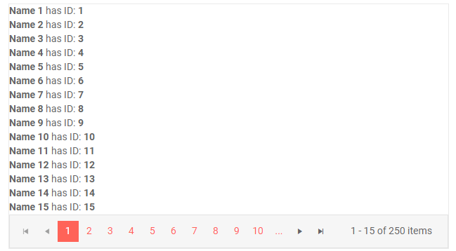
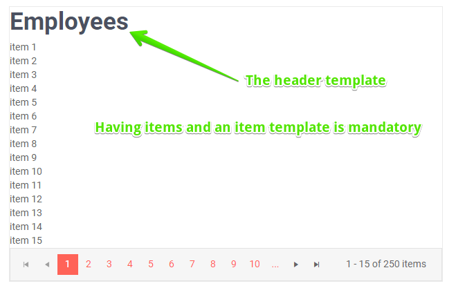
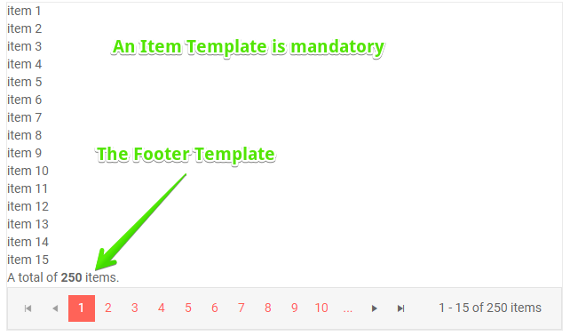

# ListView Templates

The ListView component is all about your templates - it does not have an item rendering of its own and lets you customize all aspects. You can define:

* [Template](#template) - mandatory, this is what is used to display all items
* [Edit Template](#edit-template) - the rendering of an item in edit or insert mode
* [Header Template](#header-template) - your own content above the list of items
* [Footer Template](#footer-template) - your own content after the list of items and before the [pager](slug:listview-paging)

## Template

This is the main building block of the listview component. You define the layout of each item through its `Template` and you can use the `context` which is the model from the data source in order to get the information for the item.

>caption Item template in the ListView

<demo metaUrl="client/listview/template/" height="420"></demo>

>caption The result from the snippet above

## Edit Template

This is the template that an item in edit or insert mode renders, instead of its item template. You can use it to add inputs or other editors so the user can modify the data. You can read more about editing data and see examples of using this template in the [ListView Editing](slug:listview-editing) article.

@[template](/_contentTemplates/common/inputs.md#edit-debouncedelay)

>caption Declaring an edit template in the ListView. Note: The CUD operations are not implemented in this example.

<demo metaUrl="client/listview/edittemplate/" height="420"></demo>

## Header Template

This piece of code renders just above the items, but within the main listview wrapper. You would commonly use it to show a heading or other description of the data. You can also add buttons or other components that will invoke actions (such as [filter or sort the data source](slug:listview-manual-operations#filter-and-sort), or [edit data](slug:listview-editing)).

>caption Header Template in the ListView

<demo metaUrl="client/listview/headertemplate/" height="420"></demo>

>caption The result from the code snippet above

## Footer Template

This piece of code renders just below the items, but within the main listview wrapper, and before the [pager](slug:listview-paging). You would commonly use it to show a summary of the data or add components to invoke commands or business logic.

>caption Footer Template in the ListView

<demo metaUrl="client/listview/footertemplate/" height="420"></demo>

>caption The result from the code snippet above

## See Also

  * [Live Demo: ListView Templates](https://demos.telerik.com/blazor-ui/listview/templates)
   
  
