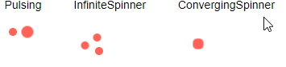
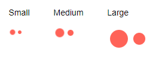

# Appearance Settings

The loader component provides the following parameters that control its appearance:

* [Type](#type)
* [Size](#size)
* [ThemeColor](#themecolor)

You can use all three together to get the desired appearance. This article will explain their effect one by one.

## Type

The `Type` parameter controls the general shape of the animation. It takes a member of the `Telerik.Blazor.Components.LoaderType` enum:

* `Pulsing`
* `InfiniteSpinner`
* `ConvergingSpinner`

You can see them in action in the [Loader Overview](https://demos.telerik.com/blazor-ui/loader/overview) Live Demo.

>caption Loader Types



````CSHTML
@foreach (LoaderType type in Enum.GetValues(typeof(Telerik.Blazor.Components.LoaderType)))
{
    <div style="float: left; margin: 20px;">
        @type
        <br /><br />
        <TelerikLoader Type="@type"></TelerikLoader>
    </div>
}
````

## Size

There are three predefined sizes for the loader that you can set through its `Size` parameter that takes a member of the `Telerik.Blazor.Components.LoaderSize` enum:

* `Small`
* `Medium`
* `Large`

You can see them in action in the [Loader Overview](https://demos.telerik.com/blazor-ui/loader/overview) Live Demo.

>caption Loader Size



````CSHTML
@foreach (LoaderSize size in Enum.GetValues(typeof(Telerik.Blazor.Components.LoaderSize)))
{
    <div style="float: left; margin: 20px;">
        @size
        <br /><br />
        <TelerikLoader Size="@size"></TelerikLoader>
    </div>
}
````

## ThemeColor

@[template](/_contentTemplates/loaders/themeColor.md#loaders-theme-color)

## See Also

  * [Live Demo: Loader Overview](https://demos.telerik.com/blazor-ui/loader/overview)
  * [Live Demo: Loader Appearance](https://demos.telerik.com/blazor-ui/loader/appearance)
