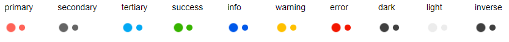

# Appearance Settings

The loader component provides the following parameters that control its appearance:

* [Type](#type)
* [Size](#size)
* [ThemeColor](#themecolor)

You can use all three together to get the desired appearance. This article will explain their effect one by one.

## Type

The `Type` parameter controls the general shape of the animation. It takes a member of the `Telerik.Blazor.Components.LoaderType` enum:

* `Pulsing`
* `InfiniteSpinner`
* `ConvergingSpinner`

You can see them in action in the [Loader Overview](https://demos.telerik.com/blazor-ui/loader/overview) Live Demo.

>caption Loader Types


````CSHTML
@foreach (LoaderType type in Enum.GetValues(typeof(Telerik.Blazor.Components.LoaderType)))
{
    <div style="float: left; margin: 20px;">
        @type
        <br /><br />
        <TelerikLoader Type="@type"></TelerikLoader>
    </div>
}
````

## Size

There are three predefined sizes for the loader that you can set through its `Size` parameter that takes a member of the `Telerik.Blazor.Components.LoaderSize` enum:

* `Small`
* `Medium`
* `Large`

You can see them in action in the [Loader Overview](https://demos.telerik.com/blazor-ui/loader/overview) Live Demo.

>caption Loader Size


````CSHTML
@foreach (LoaderSize size in Enum.GetValues(typeof(Telerik.Blazor.Components.LoaderSize)))
{
    <div style="float: left; margin: 20px;">
        @size
        <br /><br />
        <TelerikLoader Size="@size"></TelerikLoader>
    </div>
}
````

## ThemeColor

The color of the animated loading icon is controlled through the `ThemeColor` parameter. You can set it to a member of the `Telerik.Blazor.ThemeColor` enum:

* `Primary`
* `Secondary`
* `Tertiary`
* `Success`
* `Info`
* `Warning`
* `Error`
* `Dark`
* `Light`
* `Inverse`

These predefined options match the main [Telerik Theme]() and you can see that in action in the [Appearance](https://demos.telerik.com/blazor-ui/loader/appearance) Live Demo.

>caption Built-in Theme Colors



````CSHTML
@{
    var fields = typeof(Telerik.Blazor.ThemeColors)
                    .GetFields(System.Reflection.BindingFlags.Public | System.Reflection.BindingFlags.Static |
                       System.Reflection.BindingFlags.FlattenHierarchy)
                    .Where(fi => fi.IsLiteral && !fi.IsInitOnly).ToList();
    foreach (var f in fields)
    {
        string color = f.GetValue(null).ToString();
        <div style="float: left; margin: 20px;">
            @color
            <br /><br />
            <TelerikLoader ThemeColor="@color"></TelerikLoader>
        </div>
    }
}
````

The `ThemeColor` parameter renders as the `k-loader-<ThemeColor>` CSS class on the wrapping element and you can set it to a custom value to cascade through and set the color to a setting of your own without customizing the entire theme.

>caption Custom loader color without customizing the Telerik Theme


````CSHTML
<style>
    .k-loader-custom-color .k-loader-segment::after {
        background-color: cyan;
    }
</style>
<TelerikLoader ThemeColor="custom-color"></TelerikLoader>
````

## See Also

  * [Live Demo: Loader Overview](https://demos.telerik.com/blazor-ui/loader/overview)
  * [Live Demo: Loader Appearance](https://demos.telerik.com/blazor-ui/loader/appearance)
