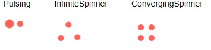

# Appearance Settings

The loader component provides the following parameters that control its appearance:

* [Type](#type)
* [Size](#size)
* [ThemeColor](#themecolor)

You can use all three together to get the desired appearance. This article will explain their effect one by one.


## Type

The `Type` parameter controls the loading animation shape. It takes a member of the `Telerik.Blazor.Components.LoaderType` enum:

* `Pulsing` (default)
* `InfiniteSpinner`
* `ConvergingSpinner`

See them in action in the [Loader Overview live demo](https://demos.telerik.com/blazor-ui/loader/overview).

>caption Loader Types



````RAZOR
@foreach (LoaderType type in Enum.GetValues(typeof(Telerik.Blazor.Components.LoaderType)))
{
    <div style="float: left; margin: 20px;">
        @type
        <br /><br />
        <TelerikLoader Type="@type"></TelerikLoader>
    </div>
}
````


## Size

The `Size` parameter accepts a `string` and there are three predefined sizes for the Loader. You can use the predefined properties in the `Telerik.Blazor.ThemeConstants.Loader.Size` static class:

* `Small` (equals `"sm"`)
* `Medium` (equals `"md"`) - default
* `Large` (equals `"lg"`)

See them in action in the [Loader Overview live demo](https://demos.telerik.com/blazor-ui/loader/overview).

>caption Loader Size


````RAZOR
@foreach (string size in LoaderSizes)
{
    <div style="float: left; margin: 20px;">
        @size
        <br /><br />
        <TelerikLoader Size="@size"></TelerikLoader>
    </div>
}

@code {
    List<string> LoaderSizes { get; set; } = new List<string>() {
        ThemeConstants.Loader.Size.Small,
        ThemeConstants.Loader.Size.Medium,
        ThemeConstants.Loader.Size.Large
    };
}
````


## ThemeColor

The `ThemeColor` parameter sets the color of the animated loading indicator. You can set it to a `string` property of the static class `ThemeConstants.Loader.ThemeColor`:

* `Primary`
* `Secondary`
* `Tertiary`
* `Success`
* `Info`
* `Warning`
* `Error`
* `Dark`
* `Light`
* `Inverse`

These predefined options match the main [Telerik Theme](slug:themes-overview) and you can see that in action in the [Loader Appearance live demo](https://demos.telerik.com/blazor-ui/loader/appearance).

>caption Built-in Theme Colors


````RAZOR
@{
    var fields = typeof(ThemeConstants.Loader.ThemeColor)
                    .GetFields(System.Reflection.BindingFlags.Public | System.Reflection.BindingFlags.Static |
                       System.Reflection.BindingFlags.FlattenHierarchy)
                    .Where(fi => fi.IsLiteral && !fi.IsInitOnly).ToList();
    foreach (var f in fields)
    {
        string color = f.GetValue(null).ToString();
        <div style="display: inline-block; margin: 20px;">
            @color
            <br /><br />
            <TelerikLoader ThemeColor="@color"></TelerikLoader>
        </div>
    }
}
````


### Custom Loader Colors

The `ThemeColor` parameter renders as the `k-loader-<ThemeColor>` CSS class on the wrapping element and you can set it to a custom value to cascade through and set the color to a setting of your own without customizing the entire theme.

>caption Custom Loader color without customizing the Telerik Theme


````RAZOR
<style>
    .k-loader-custom-color .k-loader-segment {
        background-color: cyan;
    }
</style>
<TelerikLoader ThemeColor="custom-color"></TelerikLoader>
````

@[template](/_contentTemplates/common/themebuilder-section.md#appearance-themebuilder)

## See Also

* [Live Demo: Loader Overview](https://demos.telerik.com/blazor-ui/loader/overview)
* [Live Demo: Loader Appearance](https://demos.telerik.com/blazor-ui/loader/appearance)
