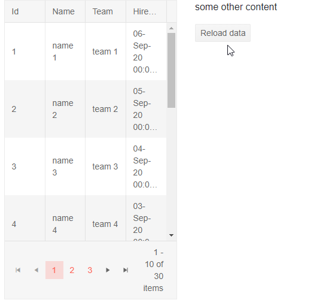

# Loader Overview

This article provides information about the <a href = "https://www.telerik.com/blazor-ui/loader" target="_blank">Blazor Loader component</a> and its core features.

The Loader component provides an animated indicator that you can use to show your users that the app is working on something and they should wait.

## Basic Loading Indicator

To add a Telerik Loader to your Blazor app, use the `<TelerikLoader>` tag and show it when needed by your app. You can also control its [visual appearance]() through parameters.


````CSHTML
@if (IsLoading)
{
    <TelerikLoader />
}
else
{
    @Data
}

@code {
    public bool IsLoading { get; set; }
    public string Data { get; set; }

    protected override async Task OnInitializedAsync()
    {
        await LoadData();
    }

    async Task LoadData()
    {
        IsLoading = true;
        await Task.Delay(2000);
        IsLoading = false;
        Data = "Your data goes here";
    }
}
````

## Visible Parameter

You can control whether the indicator is shown through its `Visible` parameter. This can be useful for integrating it into other components and/or for shortening the razor syntax.

>caption Loading indicator in a single click button


````CSHTML
@* Toggling the Loader and the Enabled state of the button through a single flag while working lets you implement a single-click button with a loading indicator *@

<TelerikButton Primary="true" OnClick="@GenerateReport" Enabled="@(!IsGeneratingReport)">
    <TelerikLoader Visible="@IsGeneratingReport" ThemeColor="light"></TelerikLoader>
    @( IsGeneratingReport ? "Generating Report" : "Generate Report" )
</TelerikButton>

@code {
    public bool IsGeneratingReport { get; set; }

    public async Task GenerateReport()
    {
        IsGeneratingReport = true;
        await Task.Delay(2000); // do actual work here
        IsGeneratingReport = false;
    }
}
````

## Sample Loading Panel

The `TelerikLoader` component is an animated icon that use can use in your apps. Sometimes, however, you may want to overlay a lot of content with a panel to show the user something is happening with it and to prevent an interaction with it. For example, while fetching data for a grid.

You can devise such a loading panel as needed by your app, and place a Telerik Loading Indicator inside to show the user something is happening. An example follows.

>caption Sample Loading Panel used twice in bootstrap columns



````CSHTML
@* for a real case - adjust styling as needed, and extract into a separate component and add the CSS rules to your site stylesheet *@

<div class="container">
    <div class="row">
        <div class="col">
            @if (isLoadingData)
            {
                @* sample loading panel, styles are at the end *@
                <div class="loading-panel-wrapper">
                    <div class="loading-panel-overlay"></div>
                    <TelerikLoader Size="@LoaderSize.Large" Type="@LoaderType.ConvergingSpinner" ThemeColor="@ThemeColors.Tertiary" />
                </div>
            }
            <TelerikGrid Data="@GridData" Height="500px" Pageable="true" AutoGenerateColumns="true">
            </TelerikGrid>
        </div>
        <div class="col">
            @if (isLoadingData)
            {
                @* In a real app, you should make this a component and put its styles in the app stylesheet
                    here we just copy it to showcase the concept of showing a loading sign *@
                <div class="loading-panel-wrapper">
                    <div class="loading-panel-overlay"></div>
                    <TelerikLoader Size="@LoaderSize.Large" Type="@LoaderType.ConvergingSpinner" ThemeColor="@ThemeColors.Tertiary" />
                </div>
            }
            <p>some other content</p>
            <TelerikButton OnClick="@FetchData">Reload data</TelerikButton>
        </div>
    </div>
</div>

@code {
    bool isLoadingData { get; set; }

    protected override async Task OnInitializedAsync()
    {
        await FetchData();
    }

    async Task FetchData()
    {
        Console.WriteLine("called");
        isLoadingData = true;
        await Task.Delay(2000); // simulate long operation
        GridData = Enumerable.Range(1, 30).Select(x => new SampleData
        {
            Id = x,
            Name = "name " + x,
            Team = "team " + x % 5,
            HireDate = DateTime.Now.AddDays(-x).Date
        });
        isLoadingData = false;
    }

    public IEnumerable<SampleData> GridData { get; set; } = Enumerable.Empty<SampleData>();
    public class SampleData
    {
        public int Id { get; set; }
        public string Name { get; set; }
        public string Team { get; set; }
        public DateTime HireDate { get; set; }
    }
}

<style>
    .loading-panel-wrapper {
        /* size and appearance that try to match its container with as little CSS as possible,
           you can alter them as necessary for your use case and as per your preferences 
        */
        width: 100%;
        height: 100%;
        min-height: 200px;
        position: absolute;
        z-index: 123456;
        /* one way center the loading indicator inside */
        display: flex;
        justify-content: center;
        align-items: center;
    }

        .loading-panel-wrapper .loading-panel-overlay {
            background: gray;
            position: absolute;
            width: 100%;
            height: 100%;
            opacity: 0.5;
        }
</style>
````

## See Also

  * [Live Demo: Loader](https://demos.telerik.com/blazor-ui/loader/overview)
  * [Appearance Settings]()
  * [API Reference](https://docs.telerik.com/blazor-ui/api/Telerik.Blazor.Components.TelerikLoader)
   
