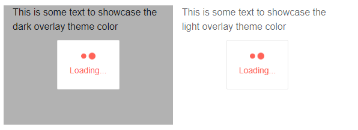
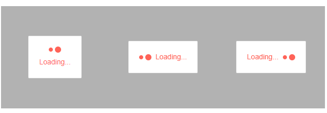

# Appearance Settings

The LoaderContainer component provides the following parameters that control its appearance:

* [LoaderContainer Specific](#loadercontainer-specific)
    * [OverlayThemeColor](#overlaythemecolor)
    * [LoaderPosition](#loaderposition)
* [Shared with the Loader Indicator](#shared-with-the-loader-indicator)
    * [Type](#type)
    * [Size](#size)
    * [ThemeColor](#themecolor)
    
You can see the appearance settings in action in the [LoaderContainer Customization](https://demos.telerik.com/blazor-ui/loadercontainer/customization) Live Demo.

## LoaderContainer Specific

### OverlayThemeColor

The `OverlayThemeColor` parameter controls the color of the overlay for the LoaderContainer. It takes a string from the options below. If you provide a `String.Empty`, `null` or invalid option (not listed below) the color of the overlay will be `transparent`.

* `dark` - the default background color.
* `light`

>caption Change the OverlayThemeColor



````CSHTML
@*This example shows the difference between the light and dark overlay theme colors*@

<div class="row">
    <div class="col-4" style="position: relative; height: 200px">
        <TelerikLoaderContainer OverlayThemeColor="dark"></TelerikLoaderContainer>

        <div>
            This is some text to showcase the dark overlay theme color
        </div>
    </div>
    <div class="col-4" style="position: relative">
        <TelerikLoaderContainer OverlayThemeColor="light"></TelerikLoaderContainer>

        <div>
            This is some text to showcase the light overlay theme color
        </div>
    </div>
</div>
````

### LoaderPosition

The `LoaderPosition` parameter controls the position of the loading indicator against the `Text` parameter. There are three predefined options which are members of the `LoaderPosition` enum:

* `Top` - the default position
* `Start`
* `End`

>capture The position of the Loader indicator

````CSHTML
@*The different positions of the loader indicator based on the predefault values.*@

<div class="row">
    <div class="col-4" style="position: relative; height: 200px">
        <TelerikLoaderContainer LoaderPosition="@LoaderPosition.Top"></TelerikLoaderContainer>
    </div>
    <div class="col-4" style="position: relative">
        <TelerikLoaderContainer LoaderPosition="@LoaderPosition.Start"></TelerikLoaderContainer>
    </div>
    <div class="col-4" style="position: relative"> 
        <TelerikLoaderContainer LoaderPosition="@LoaderPosition.End"></TelerikLoaderContainer>
    </div>
</div>
````



## Shared with the Loader Indicator

The LoaderContainer utilizes the [Loader]() component internally. Because of that the LoaderContainer and the Loader share appearance settings which you can use to style the loading indicator. 


>caption Setup the appearance settings for the LoaderContainer

````CSHTML
@*Customize the appearance of the LoaderContainer using the exposed parameters*@

<TelerikLoaderContainer LoaderType="@LoaderType.InfiniteSpinner"
                        LoaderPosition="@LoaderPosition.Start"
                        Size="@LoaderSize.Small"
                        ThemeColor="info">
</TelerikLoaderContainer>
````

### Type

@[template](/_contentTemplates/loaders/type.md#loaders-type)

### Size

@[template](/_contentTemplates/loaders/size.md#loaders-size)

### ThemeColor

@[template](/_contentTemplates/loaders/themeColor.md#loaders-theme-color)

## See Also

  * [Live Demo: LoaderContainer](https://demos.telerik.com/blazor-ui/loadercontainer/overview)
  * [Live Demo: LoaderContainer Customization](https://demos.telerik.com/blazor-ui/loadercontainer/customization)
