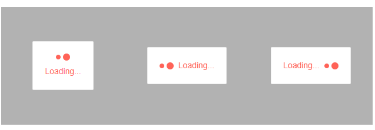

# Appearance Settings

This article explains how to control the LoaderContainer look and feel.

The LoaderContainer uses a nested internal [Loader component](slug:loader-overview) to show the animated indicator. The LoaderContainer exposes parameters, which directly control the Loader's appearance:

* [LoaderType](#loadertype)
* [Size](#size)
* [ThemeColor](#themecolor)

In addition, the LoaderContainer component provides a [LoaderPosition](#loaderposition) parameter.

You can see the appearance settings in action in the [LoaderContainer Appearance live demo](https://demos.telerik.com/blazor-ui/loadercontainer/appearance).


## LoaderPosition

The `LoaderPosition` parameter controls the position of the animated loading indicator in relation to the loading `Text`. There are three predefined options, which are members of the `LoaderPosition` enum:

* `Top` (default) - the loading animation is above the text
* `Start` - the loading animation is to the left of the text
* `End` - the loading animation is to the right of the text

>caption The position of the Loader indicator

````RAZOR
@*The different positions of the loader indicator based on the predefault values.*@

<div class="row">
    <div class="col-4" style="position: relative; height: 200px">
        <TelerikLoaderContainer LoaderPosition="@LoaderPosition.Top"></TelerikLoaderContainer>
    </div>
    <div class="col-4" style="position: relative; height: 200px">
        <TelerikLoaderContainer LoaderPosition="@LoaderPosition.Start"></TelerikLoaderContainer>
    </div>
    <div class="col-4" style="position: relative; height: 200px"> 
        <TelerikLoaderContainer LoaderPosition="@LoaderPosition.End"></TelerikLoaderContainer>
    </div>
</div>
````




## LoaderType

The `LoaderType` parameter of the LoaderContainer will affect the shape of animated loading indicator. The parameter works only when there is **no** [`<Template>`](slug:loadercontainer-template).

See the [Loader `Type` documentation](slug:loader-appearance#type) for the possible values and how the component looks.

>caption Setting TelerikLoaderContainer LoaderType

````RAZOR
<TelerikLoaderContainer LoaderType="@LoaderType.InfiniteSpinner" />
````


## Size

The `Size` parameter of the LoaderContainer will affect the dimensions of animated loading indicator. The parameter works only when there is **no** [`<Template>`](slug:loadercontainer-template).

See [Loader `Size`](slug:loader-appearance#size) for a list of possible values and how to set them more easily.

>caption Setting TelerikLoaderContainer Size

````RAZOR
<TelerikLoaderContainer Size="@ThemeConstants.Loader.Size.Large" />
````


## ThemeColor

The `ThemeColor` parameter of the LoaderContainer will affect the text color and the loading indicator color. The parameter works only when there is **no** [`<Template>`](slug:loadercontainer-template).

See [Loader `ThemeColor`](slug:loader-appearance#themecolor) for a list of possible values and how the component looks.

>caption Setting TelerikLoaderContainer ThemeColor

````RAZOR
<TelerikLoaderContainer ThemeColor="@ThemeConstants.Loader.ThemeColor.Primary" />
````

### Custom LoaderContainer Colors

The following example shows [how to override the CSS styles in the theme](slug:themes-override) and apply custom colors to all LoaderContainer elements.

>caption Custom LoaderContainer colors

````RAZOR
<TelerikLoaderContainer Class="custom-loading-colors" />

<style>
    /* overlay */
    .custom-loading-colors .k-loader-container-overlay {
        background-color: yellow;
    }

    /* panel */
    .custom-loading-colors .k-loader-container-panel {
        background-color: pink;
    }

    /* animation */
    .custom-loading-colors .k-loader {
        color: blue;
    }

    /* text */
    .custom-loading-colors .k-loader-container-label {
        color: purple !important;
        font-weight: bold;
    }
</style>
````

@[template](/_contentTemplates/common/themebuilder-section.md#appearance-themebuilder)

## Next Steps

* [Experiment with LoaderContainer templates](slug:loadercontainer-template)


## See Also

* [Live Demo: LoaderContainer Appearance](https://demos.telerik.com/blazor-ui/loadercontainer/appearance)
