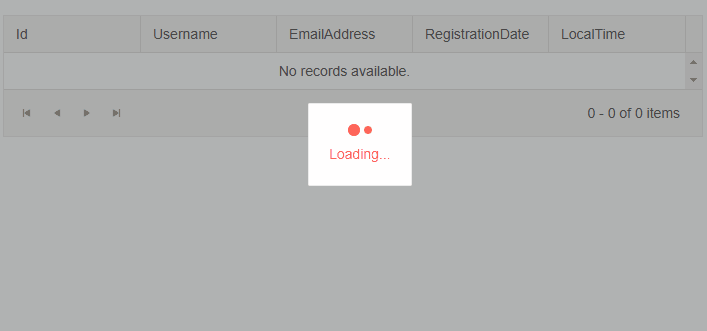

# LoaderContainer Overview

The Blazor LoaderContainer provides an animated indicator, a panel, and an overlay that can be used when the application is performing a time-consuming operation, for example, loading data.

## Basic LoaderContainer

To add a Telerik LoaderContainer to your Blazor application, use the `<TelerikLoaderContainer>` tag and show it when needed by your app by using its `Visible` parameter. You can also control its [visual appearance]() through parameters and customize it by using the [Template]().



````CSHTML
@*Show the LoaderContainer until the data for the Grid is loaded.*@

<TelerikLoaderContainer Visible="@(GridData == null ? true: false)"></TelerikLoaderContainer>

<TelerikGrid Data="@GridData" AutoGenerateColumns="true"
             Pageable="true" PageSize="4" Width="700px">
</TelerikGrid>

@code {
    public List<GridDataModel> GridData { get; set; }
    public class GridDataModel
    {
        public int Id { get; set; }
        public string Username { get; set; }
        public string EmailAddress { get; set; }
        public DateTime? RegistrationDate { get; set; }
        public DateTime? LocalTime { get; set; }
    }

    public List<GridDataModel> GenerateGridData()
    {
        var data = Enumerable.Range(1, 15).Select(i => new GridDataModel()
        {
            Id = i,
            Username = $"Username {i}",
            EmailAddress = $"user{i}@mail.com",
            RegistrationDate = DateTime.Now.AddDays(-2),
            LocalTime = DateTime.Now
        }).ToList();

        return data;
    }

    protected override async Task OnInitializedAsync()
    {
        await Task.Delay(3000);
        GridData = GenerateGridData();
    }
}
````

### Features

The LoaderContainer provides the following features:

* `Class` - `string` - the custom CSS class that will be rendered on the main wrapping element of the LoaderContainer component. You can use this parameter to make the cascading of CSS rules easier.

* `Visible` - `bool`, defaults to `true` - controls whether the LoaderContainer is visible. 

* `Text` - `string`, defaults to `Loading...` - the text that will appear next to the loading indicator. If this parameter is set to `null` or `String.Empty` the HTML element that hosts the string will not be rendered.

* `ThemeColor` - `string` - controls the color of the loader indicator. See the [Appearance]() article for more information and examples.

* `OverlayThemeColor` - `string` - configures the color of the overlay. See the [Appearance]() article for more information and examples.

* `LoaderType` - `enum` - controls the shape of the loader indicator. Takes a member of the `Telerik.Blazor.Component.LoaderType` enum. See the [Appearance]() article for more information and examples.

* `Size` - `enum` - controls the size of the loader indicator. Takes a member of the `Telerik.Blazor.Component.LoaderSize` enum. See the [Appearance]() article for more information and examples.

* `LoaderPosition` - `enum` - configures the position of the loader indicator against the `Text` parameter. Takes a member of the `Telerik.Blazor.Components.LoaderPosition`. You can find more information and examples in the [Appearance]() article.


>caption Component namespace and reference

````CSHTML
@*Get a reference to the LoaderContainer*@

<TelerikLoaderContainer @ref="@telerikLoaderReference"></TelerikLoaderContainer>

@code{
    Telerik.Blazor.Components.TelerikLoaderContainer telerikLoaderReference { get; set; }
}
````

## Example: Remove the Panel from the LoaderContainer

The panel is the white rectangular area that surrounds the loader indicator and the `Text` parameter of the component. By default, it is rendered to increase the contrast between the overlay and the rest of the component. In order to remove it, you can use some CSS rules as shown in the example below.

>note The panel will be rendered by default if you are using the [Template]().

````CSHTML
@*LoaderContainer with its most common features and removed panel with CSS.*@

<style>
    .myLoaderContainer .k-loader-container-panel {
        background-color: transparent;
        border: 0px;
    }
</style>

<TelerikLoaderContainer Class="myLoaderContainer"
                        Visible="@(GridData == null ? true: false)"
                        Size="@LoaderSize.Large"
                        Text="My custom loading text"
                        ThemeColor="light">
</TelerikLoaderContainer>

<TelerikGrid Data="@GridData" AutoGenerateColumns="true"
             Pageable="true" PageSize="4" Width="700px">
</TelerikGrid>

@code {
    public List<GridDataModel> GridData { get; set; }
    public class GridDataModel
    {
        public int Id { get; set; }
        public string Username { get; set; }
        public string EmailAddress { get; set; }
        public DateTime? RegistrationDate { get; set; }
        public DateTime? LocalTime { get; set; }
    }

    public List<GridDataModel> GenerateGridData()
    {
        var data = Enumerable.Range(1, 15).Select(i => new GridDataModel()
        {
            Id = i,
            Username = $"Username {i}",
            EmailAddress = $"user{i}@mail.com",
            RegistrationDate = DateTime.Now.AddDays(-2),
            LocalTime = DateTime.Now
        }).ToList();

        return data;
    }

    protected override async Task OnInitializedAsync()
    {
        await Task.Delay(6000);
        GridData = GenerateGridData();
    }
}
````

## See Also

  * [Live Demo: LoaderContainer](https://demos.telerik.com/blazor-ui/loadercontainer/overview)
  * [Appearance Settings]()
  * [API Reference](https://docs.telerik.com/blazor-ui/api/Telerik.Blazor.Components.TelerikLoaderContainer)
   
