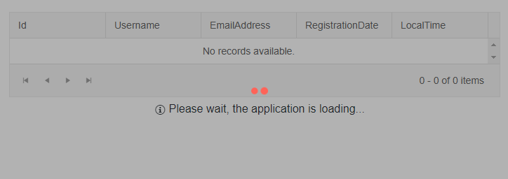
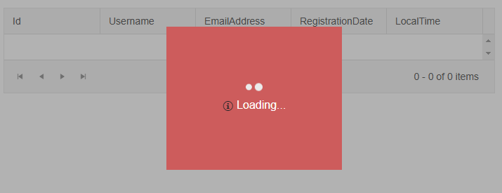

# LoaderContainer Templates

The LoaderContainerallows you to customize its rendering by using Templates. This article explains the available layout templates for the component.

* [Template](#template)


## Template

The `Template` allows you to control the rendering of the LoaderContainer. When you are using the `Template` there will be no panel rendered by default.

This section gives examples that show how to:

* [Create a Custom LoaderContainer](#create-a-custom-loader-container)
* [Implement a Custom Panel](#implement-a-custom-panel)


### Create a Custom LoaderContainer

````CSHTML
@* Customize the LoaderContainer using its Template *@

<TelerikLoaderContainer Visible="@true">
    <Template>
        <TelerikLoader></TelerikLoader>
        <div>
            <span><TelerikIcon Icon="@IconName.Information"></TelerikIcon></span>
            <span>Please wait, the application is loading...</span>
        </div>
    </Template>
</TelerikLoaderContainer>

<TelerikGrid Data="@GridData" AutoGenerateColumns="true"
             Pageable="true" PageSize="4" Width="700px">
</TelerikGrid>

@code {
    public List<GridDataModel> GridData { get; set; }
    public class GridDataModel
    {
        public int Id { get; set; }
        public string Username { get; set; }
        public string EmailAddress { get; set; }
        public DateTime? RegistrationDate { get; set; }
        public DateTime? LocalTime { get; set; }
    }

    public List<GridDataModel> GenerateGridData()
    {
        var data = Enumerable.Range(1, 15).Select(i => new GridDataModel()
        {
            Id = i,
            Username = $"Username {i}",
            EmailAddress = $"user{i}@mail.com",
            RegistrationDate = DateTime.Now.AddDays(-2),
            LocalTime = DateTime.Now
        }).ToList();

        return data;
    }

    protected override async Task OnInitializedAsync()
    {
        await Task.Delay(6000);
        GridData = GenerateGridData();
    }
}
````

>caption The result from the code snippet above



### Implement a Custom Panel

````CSHTML
@*Create a custom panel to highlight the loading indicator and the loading text*@

<style>
    .my-loader-container .k-loader-container-inner{
        background-color: indianred;
        padding: 80px;
    }
</style>

<TelerikLoaderContainer Class="my-loader-container" Visible="@true">
    <Template>
        <TelerikLoader ThemeColor="light"></TelerikLoader>
        <div>
            <span><TelerikIcon Icon="@IconName.Information"></TelerikIcon></span>
            <span style="color:white">Loading...</span>
        </div>
    </Template>
</TelerikLoaderContainer>

<TelerikGrid Data="@GridData" AutoGenerateColumns="true"
             Pageable="true" PageSize="4" Width="700px">
</TelerikGrid>

@code {
    public List<GridDataModel> GridData { get; set; }
    public class GridDataModel
    {
        public int Id { get; set; }
        public string Username { get; set; }
        public string EmailAddress { get; set; }
        public DateTime? RegistrationDate { get; set; }
        public DateTime? LocalTime { get; set; }
    }

    public List<GridDataModel> GenerateGridData()
    {
        var data = Enumerable.Range(1, 15).Select(i => new GridDataModel()
        {
            Id = i,
            Username = $"Username {i}",
            EmailAddress = $"user{i}@mail.com",
            RegistrationDate = DateTime.Now.AddDays(-2),
            LocalTime = DateTime.Now
        }).ToList();

        return data;
    }

    protected override async Task OnInitializedAsync()
    {
        await Task.Delay(6000);
        GridData = GenerateGridData();
    }
}
````

>caption The result from the code snippet above



## See Also

  * [Live Demo: LoaderContainer](https://demos.telerik.com/blazor-ui/loadercontainer/overview)
  * [Appearance Settings]()
  * [API Reference](https://docs.telerik.com/blazor-ui/api/Telerik.Blazor.Components.TelerikLoaderContainer)
   
