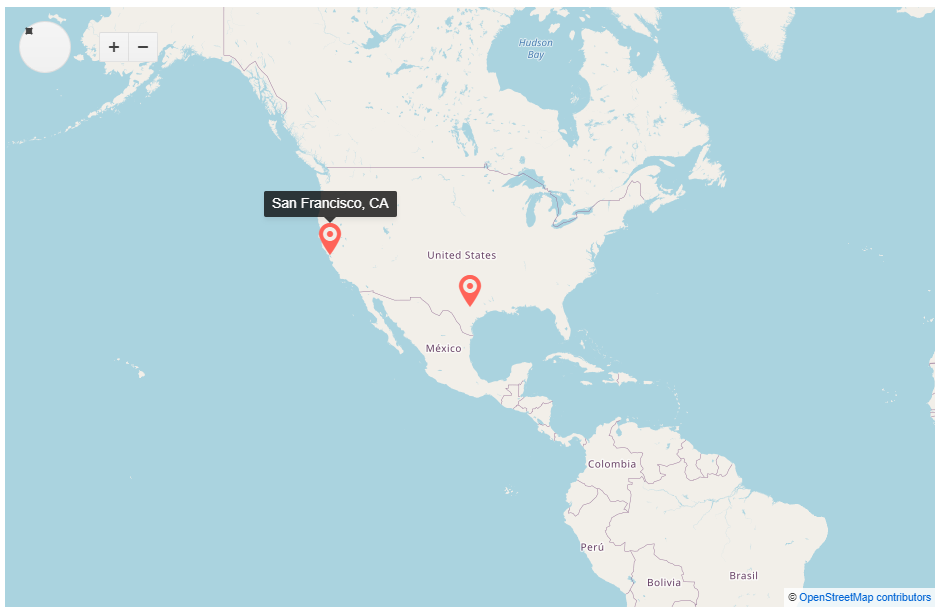
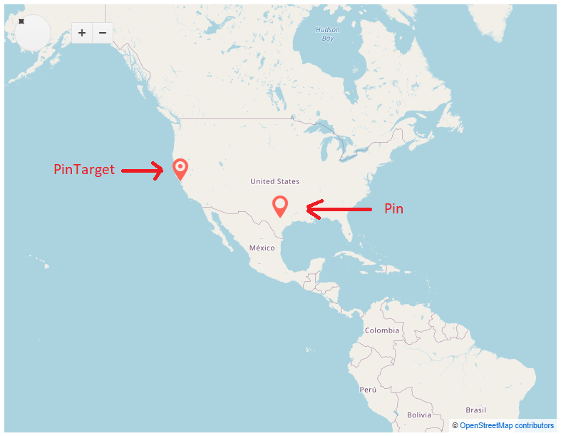
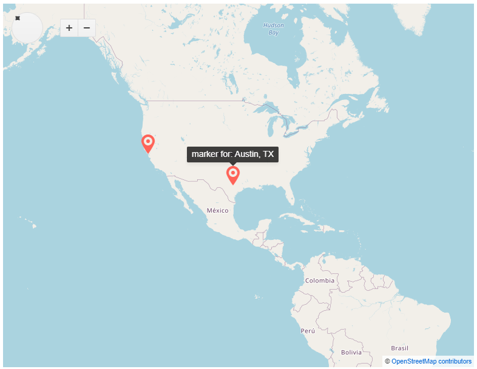

# Marker Layer

The marker functionality allows you to add points in the map. These points are defined by geographical position in the map and can show useful information to the user in a tooltip.

**To configure a Map Layer of type Marker:**

1. Add the `TelerikMap` tag.
2. Set the `Type` parameter of the `MapLayer` to `Marker`.
3. Set the `Data` parameter.
4. Set the `LocationField` and `TitleField` parameters.
5. Optionally, provide [Tooltip Settings](#marker-tooltip-settings) and choose [Marker Shape](#marker-shapes).

The following example demonstrates how to configure the Map Marker Layer.

>caption The Map Marker Layer configuration.

````CSHTML
@* This code snippet showcases an example of a Marker Layer configuration. *@

<TelerikMap Center="@Center" Zoom="3">
    <MapLayers>
        <MapLayer Type="@MapLayersType.Marker"
                  Data="@MarkerData1"
                  LocationField="@nameof(MarkerModel.LatLng)"
                  TitleField="@nameof(MarkerModel.Title)">
        </MapLayer>

        <MapLayer Type="@MapLayersType.Tile"
                  Attribution="@Attribution"
                  Subdomains="@Subdomains"
                  UrlTemplate="@UrlTemplate">
        </MapLayer>

        <MapLayer Type="@MapLayersType.Marker"
                  Data="@MarkerData2"
                  LocationField="@nameof(MarkerModel.LatLng)"
                  TitleField="@nameof(MarkerModel.Title)">
        </MapLayer>
    </MapLayers>
</TelerikMap>

@code {
    public string[] Subdomains { get; set; } = new string[] { "a", "b", "c" };
    public string UrlTemplate { get; set; } = "https://#= subdomain #.tile.openstreetmap.org/#= zoom #/#= x #/#= y #.png";
    public string Attribution { get; set; } = "&copy; <a href='https://osm.org/copyright'>OpenStreetMap contributors</a>";
    public double[] Center { get; set; } = new double[] { 30.268107, -97.744821 };

    public List<MarkerModel> MarkerData1 { get; set; } = new List<MarkerModel>()
    {
        new MarkerModel()
        {
            LatLng = new double[] { 30.268107, -97.744821 },
            Title = "Austin, TX"
        }
    };

    public List<MarkerModel> MarkerData2 { get; set; } = new List<MarkerModel>()
    {
        new MarkerModel()
        {
            LatLng = new double[] { 37.7749, -122.4194 },
            Title = "San Francisco, CA"
        }
    };

    public class MarkerModel
    {
        public double[] LatLng { get; set; }
        public string Title { get; set; }
    }
}
````

>caption The result from the above code snippet.



## Marker Shapes

The Markers in Map are two types - **Pin** and **PinTarget**. They can be defined using the `Shape` parameter of the `MapLayer` tag. The default visual appearance of the Marker is the **PinTarget**.

>caption Different Marker Shapes.



>caption The example for the above result.

````CSHTML
@* This code snippet showcases an example of the different Marker Shapes. *@

<TelerikMap Center="@Center" Zoom="3">
    <MapLayers>
        <MapLayer Type="@MapLayersType.Marker"
                  Data="@MarkerData1"
                  LocationField="@nameof(MarkerModel.LatLng)"
                  TitleField="@nameof(MarkerModel.Title)" Shape="MapMarkersShape.Pin">
        </MapLayer>

        <MapLayer Type="@MapLayersType.Tile"
                  Attribution="@Attribution"
                  Subdomains="@Subdomains"
                  UrlTemplate="@UrlTemplate">
        </MapLayer>

        <MapLayer Type="@MapLayersType.Marker"
                  Data="@MarkerData2"
                  LocationField="@nameof(MarkerModel.LatLng)"
                  TitleField="@nameof(MarkerModel.Title)" Shape="MapMarkersShape.PinTarget">
        </MapLayer>
    </MapLayers>
</TelerikMap>

@code {
    public string[] Subdomains { get; set; } = new string[] { "a", "b", "c" };
    public string UrlTemplate { get; set; } = "https://#= subdomain #.tile.openstreetmap.org/#= zoom #/#= x #/#= y #.png";
    public string Attribution { get; set; } = "&copy; <a href='https://osm.org/copyright'>OpenStreetMap contributors</a>";
    public double[] Center { get; set; } = new double[] { 30.268107, -97.744821 };

    public List<MarkerModel> MarkerData1 { get; set; } = new List<MarkerModel>()
    {
        new MarkerModel()
        {
            LatLng = new double[] { 30.268107, -97.744821 },
            Title = "Austin, TX"
        }
    };

    public List<MarkerModel> MarkerData2 { get; set; } = new List<MarkerModel>()
    {
        new MarkerModel()
        {
            LatLng = new double[] { 37.7749, -122.4194 },
            Title = "San Francisco, CA"
        }
    };

    public class MarkerModel
    {
        public double[] LatLng { get; set; }
        public string Title { get; set; }
    }
}
````

## Marker Tooltip Settings

The `MapLayerMarkerSettingsTooltip` tag allows you to fine tune the tooltips content, appearance and options. You can fully customize the HTML content of the tooltip.

>caption Marker Tooltip Template.



>caption The example for the above result.

````CSHTML
@* This code snippet showcases an example of the Marker Tooltip Settings. *@

<TelerikMap Center="@Center"
            Zoom="3">
    <MapLayers>
        <MapLayer Type="@MapLayersType.Marker"
                  Data="@MarkerData1"
                  LocationField="@nameof(MarkerModel.LatLng)"
                  TitleField="@nameof(MarkerModel.Title)">
                  <MapLayerMarkerSettings>
                      <MapLayerMarkerSettingsTooltip>
                          <Template>
                              @{
                                  var dataItem = context.DataItem as MarkerModel;
                              }

                              <div>marker for: @dataItem.Title</div>
                          </Template>
                      </MapLayerMarkerSettingsTooltip>
                  </MapLayerMarkerSettings>
        </MapLayer>

        <MapLayer Type="@MapLayersType.Tile"
                  Attribution="@Attribution"
                  Subdomains="@Subdomains"
                  UrlTemplate="@UrlTemplate">
        </MapLayer>

        <MapLayer Type="@MapLayersType.Marker"
                  Data="@MarkerData2"
                  LocationField="@nameof(MarkerModel.LatLng)"
                  TitleField="@nameof(MarkerModel.Title)">
          </MapLayer>
    </MapLayers>
</TelerikMap>

@code {
    public string[] Subdomains { get; set; } = new string[] { "a", "b", "c" };
    public string UrlTemplate { get; set; } = "https://#= subdomain #.tile.openstreetmap.org/#= zoom #/#= x #/#= y #.png";
    public string Attribution { get; set; } = "&copy; <a href='https://osm.org/copyright'>OpenStreetMap contributors</a>";
    public double[] Center { get; set; } = new double[] { 30.268107, -97.744821 };

    public List<MarkerModel> MarkerData1 { get; set; } = new List<MarkerModel>()
    {
        new MarkerModel()
        {
            LatLng = new double[] { 30.268107, -97.744821 },
            Title = "Austin, TX"
        }
    };

    public List<MarkerModel> MarkerData2 { get; set; } = new List<MarkerModel>()
    {
        new MarkerModel()
        {
            LatLng = new double[] { 37.7749, -122.4194 },
            Title = "San Francisco, CA"
        }
    };

    public class MarkerModel
    {
        public double[] LatLng { get; set; }
        public string Title { get; set; }
    }
}
````