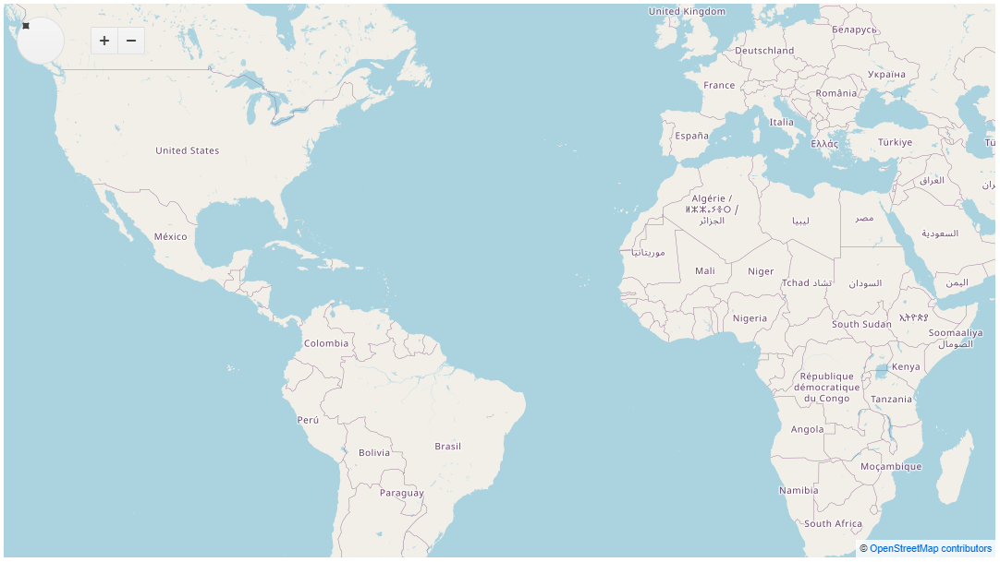

# Map Overview

The Map displays geospatial information organized in layers. It is supported for both desktop and mobile devices.

The component also provides tile layers, shape (vector) layers, and marker layers.

## Basics

To add a Telerik Map to your Blazor app:

1. Add the `TelerikMap` tag.
2. Add the `MapLayer` nested inside `MapLayers`.
3. Provide the `Type` property.
4. Set the `Attribution` and `Subdomains` properties.
5. Provide the `UrlTemplate` property.

The following example demonstrates how to set up the Map with its default configuration.

>caption A basic configuration of the Telerik Map.

````CSHTML
@* This code snippet showcases an example of a basic Map configuration. *@

<TelerikMap>
    <MapLayers>
        <MapLayer Type="@MapLayersType.Tile"
                  Attribution="@Attribution"
                  Subdomains="@Subdomains"
                  UrlTemplate="@UrlTemplate">
        </MapLayer>
    </MapLayers>
</TelerikMap>

@code {
    public string[] Subdomains { get; set; } = new string[] { "a", "b", "c" };
    public string UrlTemplate { get; set; } = "https://#= subdomain #.tile.openstreetmap.org/#= zoom #/#= x #/#= y #.png";
    public string Attribution { get; set; } = "&copy; <a href='https://osm.org/copyright'>OpenStreetMap contributors</a>";
}
````

>caption The result from the above code snippet.



For more information, refer to the [article on layers]() regarding the set of layers supported by the Map.

## Features

>caption The Map provides the following features:

### General Properties

* `TelerikMap.Center` - `double[]` - The map center. Coordinates are listed as [Latitude, Longitude].

* `TelerikMap.MinZoom` - `double` - The minimum zoom level. Typical web maps use zoom levels from 0 (the whole world) to 19 (sub-meter features).

* `TelerikMap.MaxZoom` - `double` - The maximum zoom level. Typical web maps use zoom levels from 0 (the whole world) to 19 (sub-meter features).

* `TelerikMap.MinSize` - `double` - The size of the map in pixels at zoom level 0.

* `TelerikMap.Pannable` - `bool` - Controls whether the user can pan the map.

* `TelerikMap.WrapAround` - `bool` - Specifies whether the map should wrap around the east-west edges.

* `TelerikMap.Zoom` - `double` - The initial zoom level. Typical web maps use zoom levels from 0 (the whole world) to 19 (sub-meter features). The map size is derived from the zoom level and minScale options: size = (2 ^ zoom) * minSize

* `TelerikMap.Zoomable` - `bool` - Controls whether the map zoom level can be changed by the user.

* `Class` - `string` - Specifies the class of the main DOM element.

* `Width` - `string` - Specifies the width of the main DOM element.

* `Height` - `string` - Specifies the height of the main DOM element.

### Properties for the Map Layers

* `MapLayers` - `List` - The configuration of the map layers. The layer type is determined by the value of the `Type` parameter.

* `MapLayers.Attribution` - `string` - The attribution for the layer.

* `MapLayers.Extent` - `double[]` - Specifies the extent of the region covered by this layer. The layer will be hidden when the specified area is out of view. Accepts a four-element array that specifies the extent covered by this layer: North-West latitude, longitude, South-East latitude, longitude.

* `MapLayers.Data` - `object` - The data for the layer.

* `MapLayers.LocationField` - `string` - The data item field which contains the marker (symbol) location. The field should be an array with two numbers - latitude and longitude in decimal degrees.

* `MapLayersMarkerSettings` - `object` - The default configuration of markers.

* `MapLayersMarkerSettings.Tooltip` - `object` - The configuration of the marker tooltip.

* `MapLayersMarkerSettings.Tooltip.Template` - `RenderFragment` - Specifies the tooltip template.

* `MapLayers.TileSize` - `double` - The size of the image tile in pixels.

* `MapLayers.TitleField` - `string` - The data item field which contains the marker title.

* `MapLayers.MaxSize` - `double` - The maximum symbol size for bubble layer symbols.

* `MapLayers.MinSize` - `double` - The minimum symbol size for bubble layer symbols.

* `MapLayers.MaxZoom` - `double` - The maximum zoom level at which to show this layer.

* `MapLayers.MinZoom` - `double` - The minimum zoom level at which to show this layer.

* `MapLayers.Opacity` - `double` - The opacity for the layer.

* `MapLayers.Subdomains` - `string[]` - A list of subdomains to use for loading tiles. Alternating between different subdomains allows more requests to be executed in parallel.

* `MapLayersBubbleSettings.Style` - `object` - The default style for bubbles (shapes).

* `MapLayersBubbleSettingsStyleFill` - `object` - The fill settings for layer bubbles.

* `MapLayersBubbleSettingsStyleFill.Color` - `string` - The default fill color for layer bubbles. Accepts a valid CSS color string, including hex and rgb.

* `MapLayersBubbleSettingsStyleFill.Opacity` - `double` - The default fill opacity (0 to 1) for layer bubbles.

* `MapLayersBubbleSettingsStyleStroke` - `object` - The stroke settings for layer bubbles.

* `MapLayersBubbleSettingsStyleStroke.Color` - `string` - The default stroke color for layer bubbles. Accepts a valid CSS color string, including hex and rgb.

* `MapLayersBubbleSettingsStyleStroke.DashType` - `enum` - `DashType` - The default dash type for layer bubbles.

* `MapLayersBubbleSettingsStyleStroke.Opacity` - `double` - The default stroke opacity (0 to 1) for layer bubbles.

* `MapLayersBubbleSettingsStyleStroke.Width` - `double` - The default stroke width for layer bubbles.

* `MapLayersShapeSettingsStyle` - `object` - The default style for bubbles.

* `MapLayersShapeSettingsStyleFill` - `object` - The fill settings for layer shapes.

* `MapLayersShapeSettingsStyleFill.Color` - `string` - The default fill color for layer shapes. Accepts a valid CSS color string, including hex and rgb.

* `MapLayersShapeSettingsStyleFill.Opacity` - `double` - The fill opacity of the shape.

* `MapLayersShapeSettingsStyleStroke` - `object` - The stroke settings for layer shapes.

* `MapLayersShapeSettingsStyleStroke.Color` - `string` - The stroke color of the shape.

* `MapLayersShapeSettingsStyleStroke.DashType` - `double` - The default dash type for layer shapes. The following dash types are supported: "dash" - a line consisting of dashes; "dashDot" - a line consisting of a repeating pattern of dash-dot; "dot" - a line consisting of dots; "longDash" - a line consisting of a repeating pattern of long-dash; "longDashDot" - a line consisting of a repeating pattern of long-dash-dot; "longDashDotDot" - a line consisting of a repeating pattern of long-dash-dot-dot or "solid" - a solid line.

* `MapLayersShapeSettingsStyleStroke.Opacity` - `double` - The default stroke opacity (0 to 1) for layer shapes.

* `MapLayersShapeSettingsStyleStroke.Width` - `double` - The default stroke width for layer shapes.

* `MapLayers.UrlTemplate` - `string` - The URL template for tile layers. Template variables: x - X coordinate of the tile; y - Y coordinate of the tile; zoom - zoom level or subdomain - Subdomain for this tile. See subdomains.

* `MapLayers.ValueField` - `string` - The value field for bubble layer symbols. The data item field should be a number.

* `MapLayers.ZIndex` - `double` - The zIndex for this layer. Layers are normally stacked in declaration order (last one is on top).

* `MapLayers.Shape` - `enum` - The marker shape for marker layers. The possible values are:
    * `MapMarkersShape.Pin`
    * `MapMarkersShape.PinTarget`

* `MapLayers.Symbol` - `enum` - The default symbol for bubble layers. The possible values are:
    * `MapLayersSymbol.Circle`
    * `MapLayersSymbol.Square`

* `MapLayers.Type` - `enum` - The type of the layer. The possible values are:
    * `MapLayersType.Tile`
    * `MapLayersType.Marker`
    * `MapLayersType.Shape`
    * `MapLayersType.Bubble`

### Properties for the Map Controls

* `MapControls` - `object` - The configuration of built-in map controls.

* `MapControlsAttribution` - `object` - Configures the built-in attribution control.

* `MapControlsAttribution.Position` - `enum` - Specifies the position of the attribtion control. The possible values are:
    * `MapControlsPosition.TopLeft`
    * `MapControlsPosition.TopRight`
    * `MapControlsPosition.BottomLeft`
    * `MapControlsPosition.BottomRight`

* `MapControlsNavigator` - `object` - Configures or disables the built-in navigator control (directional pad).

* `MapControlsNavigator.Position` - `enum` - Specifies the position of the navigation control. The possible values are:
    * `MapControlsPosition.TopLeft`
    * `MapControlsPosition.TopRight`
    * `MapControlsPosition.BottomLeft`
    * `MapControlsPosition.BottomRight`

* `MapControlsZoom` - `object` - Configures or disables the built-in zoom control (+/- button).

* `MapControlsZoom.Position` - `string` - Specifies the position of the zoom control.

## Methods

The Map methods are accessible through its reference.

* `Refresh` - redraws the component.

>caption Get a reference to the Map and use its methods.

````CSHTML
@* This code snippet showcases an example usage of the Refresh() method. *@

<TelerikButton OnClick="@( () => ChangeZoom() )">Change Size!</TelerikButton>
<br />
<br />

<TelerikMap @ref="MapRef" Zoom="@Zoom">
    <MapLayers>
        <MapLayer Type="@MapLayersType.Tile"
                  Attribution="@Attribution"
                  Subdomains="@Subdomains"
                  UrlTemplate="@UrlTemplate">
        </MapLayer>
    </MapLayers>
</TelerikMap>

@code {
    TelerikMap MapRef { get; set; }

    public double Zoom { get; set; } = 4;

    public void ChangeZoom()
    {
        Zoom = 1;
        MapRef.Refresh();
    }

    public string[] Subdomains { get; set; } = new string[] { "a", "b", "c" };
    public string UrlTemplate { get; set; } = "https://#= subdomain #.tile.openstreetmap.org/#= zoom #/#= x #/#= y #.png";
    public string Attribution { get; set; } = "&copy; <a href='https://osm.org/copyright'>OpenStreetMap contributors</a>";
}
````

## See Also

  * [Live Demo: Map](https://demos.telerik.com/blazor-ui/map/overview)