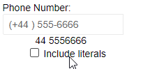
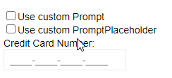

# Mask, Prompt, Value

This article explains the relationship and the configuration options that tie the Mask, the prompts and the Value of the Telerik MaskedTextbox for Blazor. The settings and behaviors described below let you customize the behavior of the component and what data you will get out of it.

## Mask

The `Mask` is the main feature of the component. It defines what input is allowed from the user at what positions.

You can use special characters called `Rules` in it to define its behavior. The other characters that have no special meaning but are always shown and the user cannot change them are called `Literal` characters.

>caption List of Rules (special characters) that define a mask behavior

- `0` - Digit (0-9)
- `9` - Digit (0-9) or `space`
- `#` - Digit (0-9), `space`, plus (`+`) and minus (`-`) signs
- `L` - Letter (a-Z)
- `?` - Letter (a-Z) or `space`
- `A` - Alphanumeric (0-9, a-Z)
- `a` - Alphanumeric (0-9, a-Z) or `space`
- `&` - Character (excluding `space`)
- `C` - Character or `space`

You can find some examples of different masks in the [Masks Live Demo](https://demos.telerik.com/blazor-ui/maskedtextbox/masks) and in the [Some Sample Masks](#some-sample-masks) section of the documentation.

By default, the `Value` of the component only includes the rules from the mask. You can, however, also include the literal characters by setting the `IncludeLiterals` parameter to true.

>caption Adding the literals to the value



````CSHTML
@* Toggle the checkbox to see the behavior *@

<TelerikMaskedTextBox Mask="(+999) 000-0000"
                      @bind-Value="@TheValue"
                      Label="Phone Number:"
                      IncludeLiterals="@ShouldAddLiterals">
</TelerikMaskedTextBox>

<span style="white-space: pre;">
    @TheValue
</span>
<label><input type="checkbox" @bind="@ShouldAddLiterals" /> Include literals</label>

@code{
    string TheValue { get; set; } = "44 5556666"; // the space accounts for three-digit codes
    bool ShouldAddLiterals { get; set; }
}
````


## Prompt

The prompt characters are the hints that the user sees in the mask where they have not written values yet. By default, they are underscores `_`. You can change it by setting the `Prompt` parameter to the desired `char`.

When the user has not filled in all the blank spaces in the mask, the Telerik Masked Textbox will replace them with the `PromptPlaceholder` in the `Value` that it will set in the view-model. By default, the `char` that is used is a simple space ` `. If you don't want such characters in the `Value`, set `PromptPlaceholder="null"`.

>caption Prompt and PromptPlacehlolder behavior



````CSHTML
@* Toggle the checkboxex and write a part of the card number to see the difference in the Value and input appearance *@

<div style="white-space: pre; text-decoration: underline;font-family: 'Courier New';">@TheValue</div>
<div>
    <label><input type="checkbox" @bind="@CustomPrompt" />Use custom Prompt</label>
    <br />
    <label><input type="checkbox" @bind="@CustomPromptPlaceholder" />Use custom PromptPlaceholder</label>
</div>
<TelerikMaskedTextBox PromptPlaceholder="@( CustomPromptPlaceholder ? "a"[0] : ' ' )"
                      Prompt="@( CustomPrompt ? "*"[0] : '_' )"
                      Mask="0000-0000-0000-0000" @bind-Value="@TheValue"
                      Label="Credit Card Number:">
</TelerikMaskedTextBox>
@code{
    string TheValue { get; set; } 

    bool CustomPrompt { get; set; }
    bool CustomPromptPlaceholder { get; set; }
}
````

## See Also

* [ValueChanged and Validation]()
