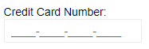

# MaskedTextbox Overview

The Blazor Masked Textbox component provides a mask and prompts the user to enter the data in the required format, and it prevents input that does not match the mask. You can use it to show the user the format the need to write things like phone numbers, credit card numbers, ZIP codes, IP addresses, percentage values and so on.

You can also add an animated floating Label, a custom CSS class or control various attributes of the `input` element such as the `name`, `placeholder`, `tabindex`, and [more](#features) and also respond to [events]().

To use a Telerik MaskedTextbox for Blazor:

1. Add the `<TelerikMaskedTextBox>` tag.
1. Set its `Value` to the `string` you want to get out of it.
1. Provide the desired [`Mask`]() to prompt the user.

>caption Basic masked textbox with two-way value binding and a credit card mask

````CSHTML
@TheValue
<br />

<TelerikMaskedTextBox Mask="0000-0000-0000-0000"
                      @bind-Value="@TheValue"
                      Label="Credit Card Number:">
</TelerikMaskedTextBox>

@code{
    string TheValue { get; set; }
}
````

>caption The result from the code snippet above before you start writing




## Features

>caption The Masked Textbox provides the following features:

* `Class` - the CSS class that will be rendered on the wrapping element of the component.

* `Enabled` - whether the `input` is enabled.

* `Id` - renders as the `id` attribute on the `<input />` element, so you can attach a `<label for="">` to the input.

* `IncludeLiterals` (defaults to `false`) - whether the literal characters from the mask (those characters that don't carry a special meaning such as brackets or dashes) are included in the `Value`. Read more in the [Mask and Prompt]() article.

* `Label` - the `label` element rendered next to the `input` to provide the user with information on its purpose. It covers the input in a fashion similar to a placeholder, and animates up on focus. If you don't want this effect or the height increase it causes, use the `Id` parameter to attach your own `<label>` tag. See also the `MaskOnFocus` parameter.

* `Mask` - the mask (pattern) that the user has to follow. Shown by default. Read more about its features in the [Mask and Prompt]() article.

* `MaskOnFocus` (defaults to `false`) - whether the mask will be shown to the user only while the input is focused. When set to `true`, the user will see the `Label` or `Placeholder` instead of the mask in case the textbox is empty. When there is some value in the input, the mask and input will be shown.

* `Name` - the `name` attribute of the HTML element. It is usually required so the `AutoComplete` will be honored by the browser.

* `PlaceHolder` - a `string` that maps to the `placeholder` attribute of the HTML element. If a `Label` is defined, it will be shown instead of the placeholder when the input is not focused. See also the `MaskOnFocus` parameter.

* `Prompt` - (`char`) - the prompt character the user will see in the mask where there is no user value already. Defaults to an underscore `_`. Read more in the [Mask and Prompt]() article.

* `PromptPlaceholder` (`char?`) - the character that is added to the raw `Value` for places where there is no user input yet. Defaults to an empty space ` ` so the string length matches the mask length. Read more in the [Mask and Prompt]() article.

* `TabIndex` - maps to the `tabindex` attribute of the HTML element. You can use it to customize the order in which the inputs in your form focus with the `Tab` key.

* `Title` - maps to the `title` attribute of the HTML element. You can use it to add a [tooltip]().

* `Value` - get/set the value of the input, can be used for binding.

* `Width` - the width of the `input`. See the [Dimensions]() article.

* Validation - see the [Input Validation]() article.


## Some Sample Masks

````CSHTML
@* type in the inputs to see the result. Depending on what you want to get, you may want to set IncludeLiterals=tru like for the percentage example at the end *@

<div style="white-space:pre;">
    @Phone
    @CardNumber
    @SSN
    @ZipCode
    @ZipPlus4Code
</div>

<TelerikMaskedTextBox Mask="(+999) 000-0000" Label="Phone Number:" @bind-Value="@Phone"></TelerikMaskedTextBox><br />
<TelerikMaskedTextBox Mask="0000-0000-0000-0000" Label="Credit Card:" @bind-Value="@CardNumber"></TelerikMaskedTextBox><br />
<TelerikMaskedTextBox Mask="000-00-0000" Label="SSN:" @bind-Value="@SSN"></TelerikMaskedTextBox><br />
<TelerikMaskedTextBox Mask="L0L 0LL" Label="UK Post Code:" @bind-Value="@UkPostcode"></TelerikMaskedTextBox><br />
<TelerikMaskedTextBox Mask="00000" Label="ZIP Code:" @bind-Value="@ZipCode"></TelerikMaskedTextBox><br />
<TelerikMaskedTextBox Mask="00000-0000" Label="ZIP+4 Code:" @bind-Value="@ZipPlus4Code"></TelerikMaskedTextBox><br />

@code{
    string Phone { get; set; }
    string CardNumber { get; set; }
    string SSN { get; set; }
    string UkPostcode { get; set; }
    string ZipCode { get; set; }
    string ZipPlus4Code { get; set; }
}

<hr />

<div style="white-space:pre;">
    @RawPercentage
    @ActualPercentage
</div>

<TelerikMaskedTextBox Mask="@PercentageMask"
                      IncludeLiterals="true"
                      PromptPlaceholder="null"
                      Value="@RawPercentage"
                      ValueChanged="@( (string v) => ParsePercentage(v) )"
                      Label="Percentage:">
</TelerikMaskedTextBox>

@code{
    string PercentageMask { get; set; } = $"00{System.Globalization.CultureInfo.CurrentCulture.NumberFormat.NumberDecimalSeparator}00%";
    string RawPercentage { get; set; }
    double ActualPercentage { get; set; }
    void ParsePercentage(string input)
    {
        RawPercentage = input;
        //note: this parses the value exactly and will result in numbers that can be between 0 and 100
        //and not like .NET usually treats percents as a value between 0 and 1
        ActualPercentage = double.Parse(input.Replace("%", "").Replace(" ", ""));
    }
}
````

>caption Sample phone number mask

````CSHTML
<TelerikMaskedTextBox Mask="(+999) 000-0000"
                      @bind-Value="@TheValue"
                      Label="Phone Number:">
</TelerikMaskedTextBox>

<span style="white-space: pre;">
    @TheValue
</span>

@code{
    string TheValue { get; set; } = "44 5556666"; // the space accounts for three-digit codes
}
````

## See Also

  * [Live Demo: MaskedTextbox](https://demos.telerik.com/blazor-ui/maskedtextbox/overview)
  * [Live Demo: MaskedTextbox Validation](https://demos.telerik.com/blazor-ui/maskedtextbox/validation)
  * [Input Validation]()
  * [API Reference](https://docs.telerik.com/blazor-ui/api/Telerik.Blazor.Components.TelerikMaskedTextBox)
