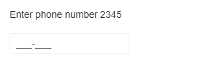

# Pasting

This article explains the behavior the Telerik MaskedTextbox has when the user pastes content in it.

While typing is the most common way people write in textboxes, they can also paste the data from somewhere else.

The user can put the cursor at any place in the textbox and write, and the next [rule]() will handle the input.

With pasting, there are several scenarios depending on the relationship between the rules, the pasted value and what is selected (highlighted) in the input.

>caption Pasting text with only valid symbols without literals

For example, if:

Mask: `0000-0000-0000-0000`

Pasted text: `12344321`

The result in the MaskedTextBox will be: `1234-4321--`

The valid numbers are distributed where the rules can take digits, and the dash `-` literals remain in-between.

>caption Pasting text with literals

For example, if:

Mask: `0000-0000-0000-0000`

Pasted text: `1234-4321`

The result in the MaskedTextBox will be: `1234-4321--`

The literals in the correct places do not take up space from the valid rules.

>caption Pasting text separated from other non-valid symbols

For example, if:

Mask: `0000-0000-0000-0000`

Pasted text: `12 3 4 = -4321`

The result in the MaskedTextBox will be: `1234-4321--`

The valid symbols are taken where possible and placed as early as possible.

>caption Pasting at specific location with selection

Content is pasted at the start of the selection/at the current cursor position and the rules above apply from that point onward.

For example, if the user has 5 symbols which are matching the input rules in the clipboard and uses the mouse to select 3 places from the mask and then paste, only the first 3 from all 5 characters will be populated.

## See Also

* [MaskedTextbox Overview]()
* [Rules, Masks, Prompts]()
