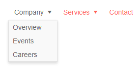

# Menu Data Binding to Hierarchical Data

This article explains how to bind the Menu for Blazor to hierarchical data. 
@[template](/_contentTemplates/menu/basic-example.md#data-binding-basics-link)


Hierarchical data means that the collection of child items is provided in a field of its parent's model. By default, this is the `Items` field. If there are items for a certain node, it will have an expand icon. The `HasChildren` field can override this, however, but it is not required for hierarchical data binding.

This approach of providing nodes lets you gather separate collections of data for certain sections or areas. Note that all menu item models must be of the same type.

>caption Example of using hierarchical data in a menu (for brevity, URLs are omitted)

````CSHTML
Hierarchical menu data source and navigation through different views

<TelerikMenu Data="@MenuItems"
             ItemsField="@nameof(MenuItem.SubSectionList)"
             TextField="@nameof(MenuItem.Section)"
             UrlField="@nameof(MenuItem.Page)">
</TelerikMenu>

@code {
    public List<MenuItem> MenuItems { get; set; }

    public class MenuItem
    {
        public string Section { get; set; }
        public string Page { get; set; }
        public List<MenuItem> SubSectionList { get; set; }
    }

    protected override void OnInitialized()
    {
        MenuItems = new List<MenuItem>()
{
            new MenuItem()
            {
                Section = "Company",
                SubSectionList = new List<MenuItem>()
                {
                    new MenuItem()
                    {
                        Section = "Overview",
                        Page = "company/overview"
                    },
                    new MenuItem()
                    {
                        Section = "Events",
                        Page = "events/all"
                    },
                    new MenuItem()
                    {
                        Section = "Careers",
                        Page = "careers"
                    }
                }
            },
            new MenuItem()
            {
                Section = "Services",
                SubSectionList = new List<MenuItem>()
        {
                    new MenuItem()
                    {
                        Section = "Consulting",
                        Page = "services/consulting"
                    },
                    new MenuItem()
                    {
                        Section = "Education",
                        Page = "services/education"
                    }
                }
            },
            new MenuItem()
            {
                Section = "Contact"
            }
        };

        base.OnInitialized();
    }
}
````

>caption The result from the code snippet above, after hovering the "Company" item




## See Also

  * [Menu Data Binding Basics]()
  * [Live Demo: Menu Hierarchical Data](https://demos.telerik.com/blazor-ui/menu/hierarchical-data)
  * [Binding to Flat Data]()

