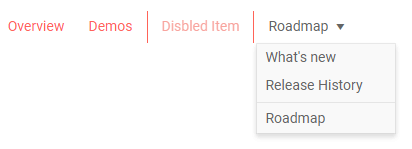

# Menu Data Binding Basics

This article explains the different ways to provide data to a Menu component, the properties related to data binding and their results.

@[template](/_contentTemplates/common/general-info.md#valuebind-vs-databind-link)

First, review:

* The available (bindable) [features of a menu item](#menu-item-features).
* How to match fields in the model with the menu item [data bindings](#data-bindings).

There are two modes of providing data to a menu, and they all use the items' features. Once you are familiar with the current article, choose the data binding more you wish to use:

* [Hierarchical data](slug:components/menu/data-binding/hierarchical-data) - separate collections of items and their child items.
* [Flat data](slug:components/menu/data-binding/flat-data) - a single collection of items with defined parent-child relationships.

## Menu Item Features

The menu items provide the following features that you control through the corresponding fields in their data binding:

* `Id` - a unique identifier for the item. Required for binding to flat data.

* `ParentId` - identifies the parent to whom the item belongs. Required only when binding to flat data. All items with the same `ParentId` will be rendered at the same level. For a root level item, this must be `null`.

* `HasChildren` - can hide child items. The menu will fetch its children from the data source based on the `Id`-`ParentId` relationships (for flat data) or on the presence of the `Items` collection (for hierarchical data). @[template](/_contentTemplates/menu/basic-example.md#has-children-behavior)

* `Items` - the collection of child items that will be rendered under the current item. Required only when binding to hierarchical data.

* `Text` - the text that will be shown on the item.

* `Icon` - The [Telerik Font or SVG icon](slug:common-features-icons) that will be rendered in the item. Read more in the [Icons article](slug:breadcrumb-icons).

* `IconVariant` - the SVG icon variant that will be rendered in the item.

* `Url` - the view the item will navigate to by generating a link.

* `Separator` - when set to `true`, the item will be just a line that makes a distinction between its neighbors clearly visible. Thus, you can place logically grouped items between two separators to distinguish them. A separator item does not render text, icons, children or a navigable link.

* `Disabled` - You can disable items by setting this field to `true`. Such items will keep rendering but will not be clickable.

## Data Bindings

The properties of a menu item match directly to a field of the model the menu is bound to. You provide that relationship by providing the name of the field from which the corresponding information is present. To do this, use the properties in the main `TelerikMenu` tag:

* IdField => Id
* ParentIdField => ParentId
* TextField => Text
* IconField => Icon
* IconVariantField => IconVariant
* UrlField => Url
* HasChildrenField => HasChildren
* ItemsField => Items
* DisabledField => DisabledField
* SeparatorField => Separator

To select an SVG icon variant for each item, set `IconVariantField` to the model property that holds the variant name. The default field name is `IconVariant`. See [SVG icon variants](slug:common-features-icons#use-svg-icon-variants).

>tip There are default values for the field names. If your model names match the defaults, you don't have to define them in the bindings settings.

@[template](/_contentTemplates/common/navigation-components.md#default-fields-match-issues)

>caption Default field names for menu item bindings. If you use these, you don't have to specify them in the `TelerikMenu` tag explicitly.

````RAZOR
public class MenuItem
{
	public int Id { get; set; }
	public string Text { get; set; }
	public int? ParentId { get; set; }
	public bool HasChildren { get; set; }
	public ISvgIcon Icon { get; set; }
	public string Url { get; set; }
	public bool Disabled { get; set; }
	public bool Separator { get; set; }
}
````

>caption Data bind the menu to a model with custom field names

<demo metaUrl="client/menu/overview/example-3/" height="320"></demo>

>caption The result from the snippet above




## See Also

* [Binding to Flat Data](slug:components/menu/data-binding/flat-data)
* [Binding to Hierarchical Data](slug:components/menu/data-binding/hierarchical-data)
* [Live Demo: Menu Flat Data](https://demos.telerik.com/blazor-ui/menu/flat-data)
* [Live Demo: Menu Hierarchical Data](https://demos.telerik.com/blazor-ui/menu/hierarchical-data)
