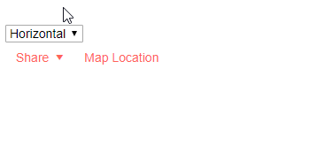

# Orientation

You can control the orientation of the Menu for Blazor so that it orders its items horizontally or vertically.

The default orientation is horizontal.

>caption Changing the orientation of a menu



>caption Set orientation

````CSHTML
@* Change the orientation of the menu to fit your layout *@

<select @bind=@orientation>
    <option value=@MenuOrientation.Horizontal>Horizontal</option>
    <option value=@MenuOrientation.Vertical>Vertical</option>
</select>

<TelerikMenu Data="@MenuItems" Orientation="@orientation">
</TelerikMenu>

@code {
    MenuOrientation orientation;

    public List<MenuItem> MenuItems { get; set; }

    public class MenuItem
    {
        public string Text { get; set; }
        public string Icon { get; set; }
        public string Url { get; set; }
        public List<MenuItem> Items { get; set; }
    }

    protected override void OnInitialized()
    {
        MenuItems = new List<MenuItem>()
        {
            new MenuItem()
            {
                Text = "Share",
                Icon = IconName.Share,
                Items = new List<MenuItem>()
                {
                    new MenuItem()
                    {
                        Text = "FaceBook",
                        Icon = IconName.Facebook,
                        Url = "https://facebook.com"
                    },
                    new MenuItem()
                    {
                        Text = "LinkedIn",
                        Icon = IconName.Linkedin,
                        Url = "https://linkedin.com"
                    },
                    new MenuItem()
                    {
                        Text = "Twitter",
                        Icon = IconName.Twitter,
                        Url = "https://twitter.com"
                    },
                }
            },
            new MenuItem()
            {
                Text = "Map Location",
                Icon = IconName.MarkerPin,
                Url = "https://maps.google.com"
            }
        };

        base.OnInitialized();
    }
}
````


## See Also

* [Menu Overview]()
* [Live Demo: Orientation](https://demos.telerik.com/blazor-ui/menu/orientation)
