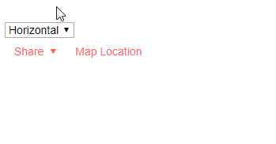

# Orientation

You can control the orientation of the Menu for Blazor so that it orders its items horizontally or vertically.

The default orientation is horizontal.

>caption Changing the orientation of a menu

>caption Set orientation

<demo metaUrl="client/menu/orientation/example-1/" height="320"></demo>

## See Also

* [Menu Overview](slug:components/menu/overview)
* [Live Demo: Orientation](https://demos.telerik.com/blazor-ui/menu/orientation)
