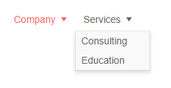

# Menu Overview

The Menu component displays data (flat or hierarchical) in a traditional menu-like structure. In addition to built-in navigation capabilities, you can browse through the items and their children, define [templates]() for the individual nodes, render text and icons/images, and respond to [events]().

To use a Telerik Menu for Blazor:

1. add the `TelerikMenu` tag
1. provide a collection of models to its `Data` property (read more in the [Data Binding article]())
1. match the fields in the models with the binding schema for the nodes

>caption Basic menu with hierarchical data binding and built-in navigation

````CSHTML
@using Telerik.Blazor.Components.Menu

<TelerikMenu Data="@MenuItems"
             UrlField="@nameof(MenuItem.Page)"
             ItemsField="@nameof(MenuItem.SubSectionList)"
             TextField="@nameof(MenuItem.Section)">
</TelerikMenu>

@code {
    public List<MenuItem> MenuItems { get; set; }
    
    public class MenuItem
    {
        public string Section { get; set; }
        public string Page { get; set; }
        public List<MenuItem> SubSectionList { get; set; }
    }
    
    protected override void OnInitialized()
    {
        MenuItems = new List<MenuItem>()
        {
            new MenuItem()
            {
                Section = "Company", // items that don't have a URL will not render links
                SubSectionList = new List<MenuItem>()
                {
                    new MenuItem()
                    {
                        Section = "Overview",
                        Page = "company/overview"
                    },
                    new MenuItem()
                    {
                        Section = "Events",
                        Page = "company/events"
                    },
                    new MenuItem()
                    {
                        Section = "Careers",
                        Page = "company/careers"
                    }
                }
            },
            new MenuItem()
            {
                Section = "Services",
                SubSectionList = new List<MenuItem>()
                {
                    new MenuItem()
                    {
                        Section = "Consulting",
                        Page = "consultingservices"
                    },
                    new MenuItem()
                    {
                        Section = "Education",
                        Page = "education"
                    }
                }
            }
        };

        base.OnInitialized();
    }
}
````

>caption The result from the snippet above, after hovering the "Services" item



>caption Component namespace and reference

````CSHTML
@using Telerik.Blazor.Components.Menu

<TelerikMenu @ref:suppressField @ref="theMenu">
</TelerikTreeView>

@code {
    Telerik.Blazor.Components.Menu.TelerikMenu theMenu;
}
````


## Navigate Views

A menu is often used to list pages, views or sections in an application so the user can navigate through them. To do that with a menu, you have two options:

* Use the built-in `UrlField` in the [bound data](#data-bindings) to populate the URLs in the anchors the menu will generate for you if an URL is provided for the given item. An example is available in the beginning of this article.
* Use a [Template]() to generate the desired links (e.g., `NavLink` components) with your own code to enable fine-tuning.


## See Also

  * [Data Binding a Menu]()
  * [Live Demo: Menu](https://demos.telerik.com/blazor-ui/menu/index)

