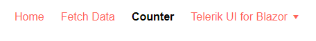

# Menu Templates

The Menu component allows you to define a custom template for its items. This article explains how you can use it.

The `ItemTemplate` of an item is defined under the `ItemTemplate` tag of the menu.

The template receives the model to which the item is bound as its `context`. You can use it to render the desired content. The menu is a generic component, so you can use a named context variable that will be of the model type without additional casting.

You can use the template to render arbitrary content according to your application's data and logic. You can use components in it and thus provide rich content instead of plain text. You can also use it to add DOM event handlers like click, doubleclick, mouseover if you need to respond to them.

>caption Use templates to implement navigation between views without the UrlField feature

````CSHTML
@using Telerik.Blazor.Components.Menu

<TelerikMenu Data="@MenuItems"
             ItemsField="@nameof(MenuItem.SubSectionList)">
    <ItemTemplate Context="item">
        @{
            var shouldNavigate = !string.IsNullOrEmpty(item.Page);
            if (shouldNavigate)
            {
                <NavLink href="@item.Page">@item.Section</NavLink>
            }
            else
            {
                <span style="font-weight: bold;">See more about our @item.Section.ToLowerInvariant()</span>
            }
        }
    </ItemTemplate>
</TelerikMenu>

@code {
    public List<MenuItem> MenuItems { get; set; }

    public class MenuItem
    {
        public string Section { get; set; }
        public string Page { get; set; }
        public List<MenuItem> SubSectionList { get; set; }
    }

    protected override void OnInitialized()
    {
        MenuItems = new List<MenuItem>()
    {
            new MenuItem()
            {
                Section = "Company",
                SubSectionList = new List<MenuItem>()
            {
                    new MenuItem()
                    {
                        Section = "Overview",
                        Page = "company/overview"
                    },
                    new MenuItem()
                    {
                        Section = "Events",
                        Page = "company/events"
                    },
                    new MenuItem()
                    {
                        Section = "Careers",
                        Page = "company/careers"
                    }
                }
            },
            new MenuItem()
            {
                Section = "Services",
                SubSectionList = new List<MenuItem>()
            {
                    new MenuItem()
                    {
                        Section = "Consulting",
                        Page = "consultingservices"
                    },
                    new MenuItem()
                    {
                        Section = "Education",
                        Page = "education"
                    }
                }
            }
        };

        base.OnInitialized();
    }
}
````

>caption Use templates to visually distinguish the current page as an item that is styled differently

````CSHTML
@inject IUriHelper urlHelper
@using Telerik.Blazor.Components.Menu

    <TelerikMenu Data="@MenuItems"
                 ItemsField="@nameof(MenuItem.SubSectionList)">
        <ItemTemplate Context="item">
            @{
                bool isCurrentPage = CompareCurrentPageUrl(item.Page);
                string itemStyling = isCurrentPage ? "color: cyan; cursor: not-allowed;" : "color: blue";
                if (isCurrentPage)
                {
                    <span style="@itemStyling">@item.Section</span>
                }
                else
                {
                    <a style="@itemStyling" href="@item.Page">@item.Section</a>
                }
            }
        </ItemTemplate>
    </TelerikMenu>

@code {
    public List<MenuItem> MenuItems { get; set; }

    public class MenuItem
    {
        public string Section { get; set; }
        public string Page { get; set; }
        public List<MenuItem> SubSectionList { get; set; }
    }

    bool CompareCurrentPageUrl(string urlToCopmare)
    {
        return urlHelper.GetAbsoluteUri().Substring(urlHelper.GetBaseUri().Length).Equals(urlToCopmare);
    }

    protected override void OnInitialized()
    {
        MenuItems = new List<MenuItem>()
    {
            new MenuItem()
            {
                Section = "Components",
                Page = "index",
                SubSectionList = new List<MenuItem>()
                {
                    new MenuItem()
                    {
                        Section = "Menu",
                        Page = "menu/index"
                    },
                    new MenuItem()
                    {
                        Section = "Grid",
                        Page = "grid/index"
                    },
                    new MenuItem()
                    {
                        Section = "Tree",
                        Page = "treeview/index"
                    }
                }
            },
            new MenuItem()
            {
                Section = "Services",
                SubSectionList = new List<MenuItem>()
            {
                    new MenuItem()
                    {
                        Section = "Consulting",
                        Page = "consultingservices"
                    },
                    new MenuItem()
                    {
                        Section = "Education",
                        Page = "education"
                    }
                }
            }
        };

        base.OnInitialized();
    }
}
````

>caption The result from the snippet above, asuming the current page URL is `menu/index` and we hovered the "Components" item



## See Also

  * [Data Binding a Menu]()
  * [Live Demo: Menu Temlate](https://demos.telerik.com/blazor-ui/menu/template)

