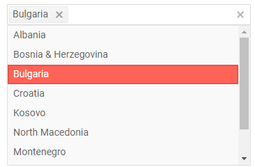

# MultiSelect Overview

The MultiSelect component lets the user select several items from the available list. It is similar to a `<select multiple>` in this regard. The MultiSelect offers suggestions as you type and they can be [filtered](). You can control the list of suggestions through [data binding](), various appearance settings like [dimensions]() and [templates]().

To use a Telerik MultiSelect for Blazor

1. add the `TelerikMultiSelect` tag
1. populate its `Data` property with the collection of items you want in the dropdown
1. (optional) enable features like [filtering]() and clear button

>caption MultiSelect two-way value binding, main features and simple [data binding](data-bind)

````CSHTML
@* Main features and simple data binding for the suggestions and the Value *@

<TelerikMultiSelect Data="@Countries"
                    @bind-Value="@Values"
                    Placeholder="Enter Balkan country, e.g., Bulgaria"
                    Width="350px" ClearButton="true" />

@if (Values.Count > 0)
{
    <ul>
        @foreach (var item in Values)
        {
            <li>@item</li>
        }
    </ul>
}

@code {
    List<string> Countries { get;set; } = new List<string>();
    List<string> Values { get;set; } = new List<string>();

    protected override void OnInitialized()
    {
        Countries.Add("Albania");
        Countries.Add("Bosnia & Herzegovina");
        Countries.Add("Bulgaria");
        Countries.Add("Croatia");
        Countries.Add("Kosovo");
        Countries.Add("North Macedonia");
        Countries.Add("Montenegro");
        Countries.Add("Serbia");
        Countries.Add("Slovenia");

        base.OnInitialized();
    }
}

````

>caption The result from the code snippet above, after you select something



>caption Component namespace and reference

The MultiSelect is a generic component and its type is determined by the type of the model you use as its data source. You can find examples in the [Data Bind - Considerations](#considerations) article.


## Features

>caption The MultiSelect provides the following features:

* `Class` - the CSS class that will be rendered on the main wrapping element of the multiselect.

* `ClearButton` - whether the user will have the option to clear the selected items with a button on the input. When it is clicked, the `Value` will be updated to an empty list.

* `Data` - allows you to provide the data source. Required.

* `Enabled` - whether the component is enabled.

* `Filterable` - whether [filtering]() is enabled for the end user
(suggestions will get narrowed down as they type).

* `FilterOperator` - the string operation that will be used for [filtering](). Defaults to `StartsWith`.

* `Id` - renders as the `id` attribute on the `<select />` element, so you can attach a `<label for="">` to it.

* `MinLength` - how many characters the text has to be before the suggestions list appears. Cannot be `0`. Often works together with [filtering]().

* `Placeholder` - the text the user sees as a hint when there is no selection.

* `PopupHeight` - the height of the expanded dropdown list element.

* `PopupWidth` - the width of the expanded dropdown list element. If you don't specify a value, the dropdown width will match the main element which can help with responsive layouts and 100% widths.

* `TextField` - the field in the model from which the text of the items is taken. Defaults to `Text`.

* `TItem` - the type of the model to which the component is bound. Required if you can't provide `Data` or `Value`. Determines the type of the reference object.

* `TValue` - the type of the value field in the model to which the component is bound. Required if you can't provide `Data` or `Value`. Determines the type of the reference object.

    The type of the values can be:

    * `number` (such as `int`, `double` and so on)
    * `string`
    * `Guid`
    * `Enum`

* `Value` and `bind-Value`- get/set the value of the component, can be used for binding. Use the `@bind-Value` syntax for two-way binding, for example, to a variable of your own. The `Value` must be a `List<TValue>`.

* `ValueField` - the name of the field from the model that will be used as values in the selection. Defaults to `Value`.

* `Width` - the width of the main element. @[template](/_contentTemplates/inputs/inputs-width-template.md#inputs-width-information)

* Templates - they allow you to control the rendering of items in the component. See the [Templates]() article for more details.

* Validation - see the [Input Validation]() article for more details.


## Examples

>caption Pre-select items for the user

````CSHTML
@* You can pre-select an item or set of items only if they exist in the data source. *@

<div>
    <TelerikButton OnClick="@SelectHandler">Pre-select countries</TelerikButton>
    <TelerikButton OnClick="@ClearSelectionHandler">Clear selection</TelerikButton>
</div>

<TelerikMultiSelect Data="@Countries"
                    @bind-Value="@Values"
                    Placeholder="Enter Balkan country, e.g., Bulgaria"
                    Width="350px" ClearButton="true" />

@if (Values.Count > 0)
{
    <ul>
        @foreach (var item in Values)
        {
            <li>@item</li>
        }
    </ul>
}

@code {
    List<string> Countries { get; set; } = new List<string>();
    List<string> Values { get; set; } = new List<string>();

    void SelectHandler()
    {
        List<string> PreselectedValues = new List<string>()
        {
            "Bulgaria", "Croatia"
        };

        // create a new reference so that the framework can notify the component to update
        Values = new List<string>(PreselectedValues);
    }

    void ClearSelectionHandler()
    {
        Values = new List<string>();
    }

    protected override void OnInitialized()
    {
        Countries.Add("Albania");
        Countries.Add("Bosnia & Herzegovina");
        Countries.Add("Bulgaria");
        Countries.Add("Croatia");
        Countries.Add("Kosovo");
        Countries.Add("North Macedonia");
        Countries.Add("Montenegro");
        Countries.Add("Serbia");
        Countries.Add("Slovenia");

        // you can also pre-select items here based on data you fetch, not just on a button click

        base.OnInitialized();
    }
}
````

## See Also

  * [Data Binding]()
  * [Live Demo: MultiSelect](https://demos.telerik.com/blazor-ui/multiselect/overview)
  * [Live Demo: MultiSelect Validation](https://demos.telerik.com/blazor-ui/multiselect/validation)
  * [API Reference](https://docs.telerik.com/blazor-ui/api/Telerik.Blazor.Components.TelerikMultiSelect-2)
