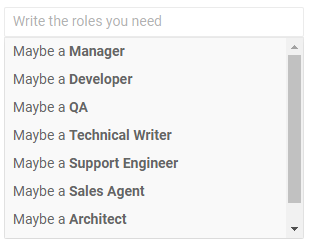
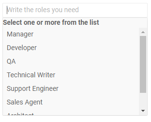
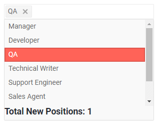

# MultiSelect Templates

The MultiSelect component allows you to change what is rendered in its items, header and footer through templates.

List of the available templates:

* [Item Template](#item-template)
* [Header](#header)
* [Footer](#footer)


## Item Template

The Item template determines how the individual items are rendered in the dropdown element of the component. By default, the text from the particular suggestions is rendered.

>caption Item Template Example

````CSHTML
@* Define what renders for the items in the dropdown *@

<TelerikMultiSelect Data="@Roles" @bind-Value="@TheValues" Placeholder="Write the roles you need">
    <ItemTemplate>
        Maybe a&nbsp;<strong>@context</strong>
    </ItemTemplate>
</TelerikMultiSelect>

@code{
    List<string> TheValues { get; set; } = new List<string>();

    List<string> Roles { get; set; } = new List<string> {
        "Manager", "Developer", "QA", "Technical Writer", "Support Engineer", "Sales Agent", "Architect", "Designer"
    };
}
````

>caption The result from the code snippet above



## Header

The header is content that you can place above the list of items inside the dropdown element. It is always visible when the multiselect is expanded. By default it is empty.

>caption Header Example

````CSHTML
@* Define a header in the dropdown *@

<TelerikMultiSelect Data="@Roles" @bind-Value="@TheValues" Placeholder="Write the roles you need">
    <HeaderTemplate>
        <strong>Select one or more from the list</strong>
    </HeaderTemplate>
</TelerikMultiSelect>

@code{
    List<string> TheValues { get; set; } = new List<string>();

    List<string> Roles { get; set; } = new List<string> {
        "Manager", "Developer", "QA", "Technical Writer", "Support Engineer", "Sales Agent", "Architect", "Designer"
    };
}
````

>caption The result from the code snippet above



## Footer

The footer is content that you can place below the list of items inside the dropdownlist element. It is always visible when the dropdown is expanded. By default it is empty.

>caption Footer Example

````CSHTML
@* Define dropdown footer *@

<TelerikMultiSelect Data="@Roles" @bind-Value="@TheValues" Placeholder="Write the roles you need">
    <FooterTemplate>
        <h5>Total New Positions: @TheValues?.Count()</h5>
    </FooterTemplate>
</TelerikMultiSelect>

@code{
    List<string> TheValues { get; set; } = new List<string>();

    List<string> Roles { get; set; } = new List<string> {
        "Manager", "Developer", "QA", "Technical Writer", "Support Engineer", "Sales Agent", "Architect", "Designer"
    };
}
````

>caption The result from the code snippet above



## See Also

  * [Live Demo: AutoComplete Templates](https://demos.telerik.com/blazor-ui/autocomplete/templates)
   
  
