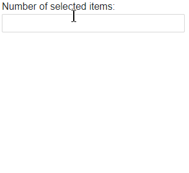

# MultiSelect Virtualization

The MultiSelect @[template](/_contentTemplates/common/dropdowns-virtualization.md#value-proposition)

#### In This Article

* [Basics](#basics)
* [Local Data Example](#local-data-example)
* [Remote Data Example](#remote-data-example)


>caption Display, scroll and filter over 10k records in the MultiSelect without delays and performance issues.




## Basics

@[template](/_contentTemplates/common/dropdowns-virtualization.md#basics-core)


* `ValueMapper` - `Func<List<TValue>, Task<List<TItem>>>` - @[template](/_contentTemplates/common/dropdowns-virtualization.md#value-mapper-text)

@[template](/_contentTemplates/common/dropdowns-virtualization.md#remote-data-specifics)

### Limitations

@[template](/_contentTemplates/common/dropdowns-virtualization.md#limitations)


## Local Data Example

````RAZOR
<p>Number of selected items: @MultiSelectValue?.Count</p>

<TelerikMultiSelect Data="@Data"
                    @bind-Value="@MultiSelectValue"

                    ScrollMode="@DropDownScrollMode.Virtual"
                    ItemHeight="30"
                    PageSize="20"

                    AutoClose="false"
                    
                    Filterable="true"
                    FilterOperator="@StringFilterOperator.Contains">
</TelerikMultiSelect>

@code {
    private List<Person> Data { get; set; } = new();
    private List<int> MultiSelectValue { get; set; } = new();

    protected override void OnInitialized()
    {
        Data = Enumerable.Range(1, 12345).Select(x => new Person { Value = x, Text = $"Name {x}" }).ToList();

        base.OnInitialized();
    }

    public class Person
    {
        public int Value { get; set; }
        public string Text { get; set; } = string.Empty;
    }
}
````


## Remote Data Example

@[template](/_contentTemplates/common/dropdowns-virtualization.md#remote-data-sample-intro)

@[template](/_contentTemplates/common/dropdowns-virtualization.md#value-mapper-in-remote-example)

* An optional [`OnSelectAll` event handler](slug:multiselect-events#onselectall) that toggles all items in the data, rather than just the currently rendered chunk. When filtering is active, the `OnSelectAll` handler should apply the filter criteria to the full data collection before selecting or deselecting items.

Run this and see how you can display, scroll and filter over 10k records in the MultiSelect without delays and performance issues from a remote endpoint. There is artificial delay in these operations for the sake of the demonstration.

````RAZOR
@using Telerik.DataSource
@using Telerik.DataSource.Extensions

<p>Number of selected items: @MultiSelectValue?.Count</p>

<TelerikMultiSelect OnRead="@OnMultiSelectRead"
                    @bind-Value="@MultiSelectValue"
                    TItem="@Person"
                    TValue="@int"

                    ScrollMode="@DropDownScrollMode.Virtual"
                    ValueMapper="@GetItemsFromValue"
                    ItemHeight="30"
                    PageSize="20"
                    
                    AutoClose="false"
                    
                    Filterable="true"
                    FilterOperator="@StringFilterOperator.Contains"
                    PersistFilterOnSelect="false"
                    
                    EnableSelectAll="true"
                    OnSelectAll="@((MultiSelectSelectAllEventArgs<Person> args) => OnMultiSelectAll(args))">
</TelerikMultiSelect>

@code{
    private List<int> MultiSelectValue { get; set; } = new List<int> { 4, 1234 };

    private IList<IFilterDescriptor>? FiltersForSelectAll { get; set; }

    private async Task OnMultiSelectRead(MultiSelectReadEventArgs args)
    {
        // Save the active filter for the OnSelectAll handler.
        FiltersForSelectAll = args.Request.Filters;

        DataEnvelope<Person> result = await MyService.GetItems(args.Request);

        args.Data = result.Data;
        args.Total = result.Total;
    }

    private async Task<List<Person>> GetItemsFromValue(List<int> selectedValues)
    {
        return await MyService.GetItemsFromValue(selectedValues);
    }

    private async Task OnMultiSelectAll(MultiSelectSelectAllEventArgs<Person> args)
    {
        // When the user clicks on "Select All", select or deselect all items instead of just the current chunk.

        List<int> valuesToToggle = args.Items.Select(x => x.Value).ToList();

        if (!valuesToToggle.All(x => MultiSelectValue.Contains(x)))
        {
            DataSourceRequest requestForSelectAll = new DataSourceRequest()
            {
                Filters = FiltersForSelectAll
            };

            DataEnvelope<Person> envelopeForAllItems = await MyService.GetItems(requestForSelectAll);
            args.Items = envelopeForAllItems.Data;
        }
        else
        {
            args.Items = Enumerable.Empty<Person>();
        }
    }

    public static class MyService
    {
        static List<Person>? AllData { get; set; }

        public static async Task<DataEnvelope<Person>> GetItems(DataSourceRequest request)
        {
            if (AllData == null)
            {
                AllData = Enumerable.Range(1, 12345).Select(x => new Person { Value = x, Text = $"Name {x}" }).ToList();
            }

            await Task.Delay(400); // Simulate network delay

            DataSourceResult result = await AllData.ToDataSourceResultAsync(request);
            DataEnvelope<Person> dataToReturn = new DataEnvelope<Person>
            {
                Data = result.Data.Cast<Person>().ToList(),
                Total = result.Total
            };

            return dataToReturn;
        }

        public static async Task<List<Person>> GetItemsFromValue(List<int> selectedValues)
        {
            await Task.Delay(400); // Simulate network delay

            return AllData?.Where(x => selectedValues.Contains(x.Value)).ToList() ?? new List<Person>();
        }
    }

    // Optional. Shows how to simplify the return of more than one value from the service.
    public class DataEnvelope<T>
    {
        public int Total { get; set; }
        public List<T> Data { get; set; } = new List<T>();
    }

    public class Person
    {
        public int Value { get; set; }
        public string Text { get; set; } = string.Empty;
    }
}
````


## See Also

* [Live Demo: MultiSelect Virtualization](https://demos.telerik.com/blazor-ui/multiselect/virtualization)

