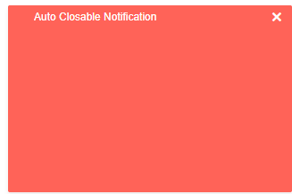
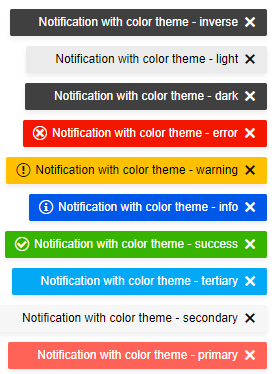
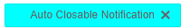
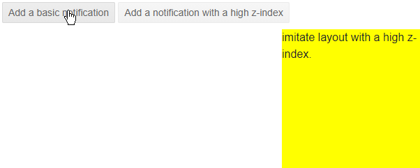

# Appearance Settings

The Notification component provides parameters and properties that allows you to customize its appearance. For brevity, this article will be divided in the following sections:

* [AnimationType](#animationtype)
* [Size](#size)
* [ThemeColor](#themecolor)
* [Z-Index](#z-index)

You can use all three together to get the desired appearance. This article will explain their effect one by one.

## AnimationType

The `AnimationType` parameter controls the way the Notification will appear on the screen. It takes a member of the `Telerik.Blazor.AnimationType` enum:

* `Fade` - the default animation
* `None`
* `PushUp`
* `PushDown`
* `PushLeft`
* `PushRight`
* `RevealVertical`
* `SlideIn`
* `SlideDown`
* `SlideLeft`
* `SlideRight`
* `ZoomIn`
* `ZoomOut`

You can see them in action in the [Notification Animation](https://demos.telerik.com/blazor-ui/notification/animation) Live Demo.

>caption Set an animation for the Notification component


````CSHTML
@* This sample uses the ZoomOut animation, you can change it *@

<TelerikButton OnClick="@AddNotification">Add a basic notification</TelerikButton>

<TelerikNotification @ref="@NotificationReference" AnimationType="@AnimationType.ZoomOut"></TelerikNotification>

@code {
    public TelerikNotification NotificationReference { get; set; }

    public void AddNotification()
    {
        NotificationReference.Show(new NotificationModel()
        {
            Text = "Auto Closable Notification",
            ThemeColor = "primary"
        });
    }
} 
````

## Size

You can control the Size of the Notification by using CSS. To make the cascading of the styles easier and target a single instance of the component you should use the `Class` parameter exposed in the the `<TelerikNotification>` tag.

>caption Control the size of the Notiication component



````CSHTML
@* Use CSS to set the size of the notification *@

<style>
    .MyTelerikNotification .k-notification-container .k-notification-wrap {
        width: 300px;
        height: 200px;
    }
</style>

<TelerikButton OnClick="@AddNotification">Add a basic notification</TelerikButton>

<TelerikNotification @ref="@NotificationReference" Class="MyTelerikNotification"></TelerikNotification>

@code {
    public TelerikNotification NotificationReference { get; set; }

    public void AddNotification()
    {
        NotificationReference.Show(new NotificationModel()
        {
            Text = "Auto Closable Notification",
            ThemeColor = "primary",
            Closable = true,
            CloseAfter = 0
        });
    }
}
````

## ThemeColor

The color of the notification popup is easily controlled through the `ThemeColor` parameter. You can set it to a member of the `Telerik.Blazor.ThemeColor` class:

* `Primary`
* `Secondary`
* `Tertiary`
* `Success`
* `Info`
* `Warning`
* `Error`
* `Dark`
* `Light`
* `Inverse`

These predefined options match the main [Telerik Theme]() and you can see that in action in the [Notification Appearance](https://demos.telerik.com/blazor-ui/notification/appearance) Live Demo.

There are built-in themes for the most common notifications such as Success, Info, Warning, Error, that also come with predefined icons, so you don't have to set them explicitly.

>caption Built-in Theme Colors



````CSHTML
@* This sample adds a notification with each built-in theme color *@

<TelerikButton OnClick="@AddColoredNotifications">Add colored notifications</TelerikButton>

<TelerikNotification @ref="@NotificationReference" AnimationType="@AnimationType.ZoomOut"></TelerikNotification>

@code {
    public TelerikNotification NotificationReference { get; set; }

    public void AddColoredNotifications()
    {
        var fields = typeof(Telerik.Blazor.ThemeColors)
                .GetFields(System.Reflection.BindingFlags.Public | System.Reflection.BindingFlags.Static |
                   System.Reflection.BindingFlags.FlattenHierarchy)
                .Where(fi => fi.IsLiteral && !fi.IsInitOnly).ToList();

        for (int i = 0; i < fields.Count; i++)
        {
            var currentField = fields[i];
            var color = currentField.GetValue(null).ToString();

            NotificationReference.Show(new NotificationModel()
            {
                Text = $"Notification with color theme - {color}",
                ThemeColor = $"{color}"
            });
        }
    }
}
````

The `ThemeColor` parameter renders as the `k-notification-<ThemeColor>` CSS class on the specific notification HTML element and you can set it to a custom value to cascade through, and set the color to a setting of your own without customizing the entire theme.

>caption Custom Notification color without customizing the Telerik Theme



````CSHTML
@* Sample of using a custom notification theme color from your own styles *@

<style>
    .k-notification-custom-color {
        background-color: cyan;
    }
</style>

<TelerikButton OnClick="@AddNotification">Add a notification</TelerikButton>

<TelerikNotification @ref="@NotificationReference"></TelerikNotification>

@code {
    public TelerikNotification NotificationReference { get; set; }

    public void AddNotification()
    {
        NotificationReference.Show(new NotificationModel()
        {
            Text = "Auto Closable Notification",
            ThemeColor = "custom-color"
        });
    }
}
````

## Z-Index

By default, the notification does not have a z-index and it shows above most elements because it has `position: fixed` in its CSS rules.

In some layouts you may have elements with a certain z-index and they will hide the notification.

You can use the `Class` of the notification to set a higher z-index for the notification according to your layout so it can show according to the desired stacking order - above some elements, perhaps behind others.

>caption Set z-index to the notification so it is not shown behind other elements



````CSHTML
@* Add a z-index to a notification so you can show them above layout elements with high z-index *@

<style>
    .high-zindex {
        z-index: 654321;
    }
</style>

<TelerikButton OnClick="@AddBasicNotification">Add a basic notification</TelerikButton>
<TelerikButton OnClick="@AddZIndexNotification">Add a notification with a high z-index</TelerikButton>

<TelerikNotification Class="high-zindex" @ref="@HighZIndexNotification"></TelerikNotification>

<TelerikNotification @ref="@BasicNotification"></TelerikNotification>

<div style="z-index: 1234; position: fixed; right: 0; bottom: 0; width: 200px; height: 200px; background: yellow">
    imitate layout with a high z-index.
</div>

@code {
    TelerikNotification HighZIndexNotification { get; set; }
    TelerikNotification BasicNotification { get; set; }

    void AddZIndexNotification()
    {
        HighZIndexNotification.Show(new NotificationModel()
        {
            Text = "High z-index shows it above other layout elements",
            ThemeColor = "success",
            CloseAfter = 0
        });
    }

    void AddBasicNotification()
    {
        BasicNotification.Show(new NotificationModel()
        {
            Text = "Default behavior - will be hidden behind the \"layout\" element.",
            ThemeColor = "dark",
            CloseAfter = 0
        });
    }
} 
````


## See Also

  * [Live Demo: Notification Overview](https://demos.telerik.com/blazor-ui/notification/overview)
  * [Live Demo: Notification Appearance](https://demos.telerik.com/blazor-ui/notification/appearance)
  * [Live Demo: Notification Animation](https://demos.telerik.com/blazor-ui/notification/animation)
