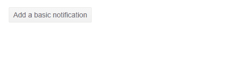

# Blazor Notification Overview

This article provides information about the <a href = "https://www.telerik.com/blazor-ui/notification" target="_blank">Blazor Notification component</a> and its main features.

The Notification component renders a brief message to the user which holds information regarding the status of a process in the application. Using its settings you can customize its position, animation options and rendering. 

<demo metaUrl="client/notification/overview/" height="420"></demo>

## Creating Blazor Notification

1. Add the `<TelerikNotification>` tag to your razor page.
1. Obtain the component reference via `@ref`.
1. Setup an instance of the [`NotificationModel` class](#notificationmodel-class-properties) (provided by the Telerik Blazor package), and pass it to the `Show()` method of the component instance.

````RAZOR
@* This shows a simple text message that hides automatically *@

<TelerikButton OnClick="@AddNotification">Add a basic notification</TelerikButton>

<TelerikNotification @ref="@NotificationReference" Class="MyTelerikNotification"></TelerikNotification>

@code {
    public TelerikNotification NotificationReference { get; set; }

    public void AddNotification()
    {
        NotificationReference.Show(new NotificationModel()
        {
            Text = "Auto Closable Notification",
            ThemeColor = ThemeConstants.Notification.ThemeColor.Primary
        });
    }
}

<style>
    .MyTelerikNotification .k-notification-container .k-notification {
        width: 300px;
        height: 50px;
        font-size: 1.5em;
        text-align: center;
        align-items: center;
    }
</style>
````

>caption Simple Notification



## Stacked Notifications

Multiple Notifications can stack if they derive from different references. [Read the Stacked Notifications article for more information...](slug:notification-stacked-notifications)

## Templates

You can customize the rendering of the Notification by using Templates. To learn more about this feature, refer to the [Notification Templates article](slug:notification-templates).

## Notification Parameters

@[template](/_contentTemplates/common/parameters-table-styles.md#table-layout)

| Parameter | Type and Default value | Description |
|-----------|------------------------|-------------|
| `Class`  | `string` | The CSS class that will be rendered on the main wrapping element of the Notification component - `<div class="k-notification-container">`. You could use that class to to control things like the size or the z-index of the component. You can find more infomation and examples in the [Appearance](slug:notification-appearance) article. |
| `OnChange`  | `EventCallback<bool>` |  This event indicates whether the media query string provided to the `Media` parameter matches the current browser size. It fires when it matches, and when it stops matching. See the [Events](slug:mediaquery-events) article for more information.  |
| `AnimationType`  | `AnimationType` enum <br /> `Fade` | Allows you to customize the animation of the Notifications. You can find more infomation and examples in the [Appearance](slug:notification-appearance) article.  |
| `AnimationDuration`  | `int` <br /> `300` | Defines the duration of the animation in milliseconds.|
| `VerticalPosition`  | `NotificationVerticalPosition` enum <br /> `Bottom` | Defines the vertical position of the Notification.|
| `HorizontalPosition`  | `NotificationHorizontalPosition` enum <br /> `Right` | Defines the horizontal position of the Notification. |

## NotificationModel Class Properties

The `NotificationModel` class is used to add new notifications to the page. You can use it to set settings for each individual message you want to show. The class contains the following properties:

| Property | Type and Default value | Description |
|-----------|------------------------|-------------|
| `ThemeColor`  | `string` | The color of the notification is controlled through this parameter. You can find more infomation and examples in the [Appearance](slug:notification-appearance) article. |
| `Closable`  | `bool` <br /> `true` | If set to `true` a close button will appear which will enable the user to close the Notification. If you want the Notification to not close automatically you should set the `Closable` parameter to `true` and the `CloseAfter` to `0`. |
| `CloseAfter`  | `int` <br /> `5000` | Allows you to configure after how much time the Notification component will close automatically. Set it to `0` to prevent it from closing automatically. |
| `ShowIcon`  | `bool` <br /> `true` | Allows you to specify whether an icon should appear in the component. |
| `Icon`  | `string` | Specifies the icon that will render in the component if the `ShowIcon` parameter is set to `true`. You can find more information on adding an icon to a Telerik Component in [Telerik Font Icons article](slug:common-features-icons#icon-namespaces). |
| `Text`  | `string` | The text that will be rendered in the Notification component. |

### Styling and Appearance

You can customize the appearance and styling of the Notification component by changing the notifications' colors, animation type, size, and stack order. For more information, see the [Notification Appearance](slug:notification-appearance) article.

## Notifications Reference and Methods

To use the Blazor Notification methods, you have to get a reference to the component instance by using the `@ref` directive (example below).

| Method | Description |
| --- | --- |
| `Show` | This method displays a new notification and has two different overloads available. The first overload receives a single parameter of type `NotificationModel`. The second overload accepts two `string` parameters, namely the notification's text and its theme color.  |
| `Hide` | This method accepts a `NotificationModel` reference as a parameter and hides the corresponding notification. |
| `HideAll` | This method hides all notifications. |

>caption Get reference to the Notification and execute methods

````RAZOR
<TelerikButton OnClick="@OpenNotification">Open a notification</TelerikButton>

<TelerikNotification @ref="@NotificationReference" />

@code {
    private TelerikNotification NotificationReference { get; set; }

    private void OpenNotification()
    {
        NotificationReference.Show("Notification Text", "success");
    }
}
````

You can find more information on opening, closing and hiding the Notification in the [Open, Close and Hide](slug:notification-open-close-hide) article.

## Next Steps

* [Learn more about the Notification Templates](slug:notification-templates)

## See Also

* [Live Demo: Notification](https://demos.telerik.com/blazor-ui/notification/overview)
* [Notification API Reference](slug:Telerik.Blazor.Components.TelerikNotification)
* [Reuse One Notification Instance](slug:notification-kb-single-instance)
