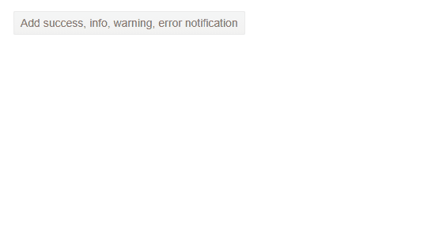

# Notification Overview

This article provides information about the <a href = "https://www.telerik.com/blazor-ui/notification" target="_blank">Blazor Notification component</a> and its main features.

The Notification component renders a brief message to the user which holds information regarding the status of a process in the application. Using its settings you can customize its position, animation options and rendering. 

#### In This Article


- [Basics](#basics)
- [Success, Info, Warning, Error Notifications](#success-info-warning-error-notifications)
- [Features](#features)
- [NotificationModel Class](#notificationmodel-class)
- [Show Method](#show-method)

## Basics

To add a Telerik Notification component to your page:

1. Add the `<TelerikNotification>` tag to the markup section of the page
1. Set the components reference (`@ref=`).
1. Setup an instance of the [`NotificationModel` class](#notificationmodel-class) (provided by the Telerik Blazor package), and pass it to the `Show()` method of the component instance.

````CSHTML
@* This shows a simple text message that hides automatically *@

<TelerikButton OnClick="@AddNotification">Add a basic notification</TelerikButton>

<TelerikNotification @ref="@NotificationReference" Class="MyTelerikNotification"></TelerikNotification>

@code {
    public TelerikNotification NotificationReference { get; set; }

    public void AddNotification()
    {
        NotificationReference.Show(new NotificationModel()
        {
            Text = "Auto Closable Notification",
            ThemeColor = ThemeColors.Primary
        });
    }
}

<style>
    .MyTelerikNotification .k-notification-container .k-notification-wrap {
        width: 300px;
        height: 50px;
        font-size: 1.5em;
        text-align: center;
        align-items: center;
    }
</style>
````

>caption Simple Notification


## Success, Info, Warning, Error Notifications

Use the [`ThemeColor`](#themecolor) parameter to add a different themes to your Telerik Notification.

There are built-in themes for the most common notifications such as Success, Info, Warning, Error, that also come with predefined icons, so you don't have to set them  explicitly.

>caption Success, Info, Warning, Error notifications



````CSHTML
@* This sample shows a Success, Error, Warning and Info notifications *@

<TelerikButton OnClick="@AddNotifications">Add success, info, warning, error notification</TelerikButton>

<TelerikNotification @ref="@NotificationReference" Class="MyTelerikNotification"></TelerikNotification>

@code {
    public TelerikNotification NotificationReference { get; set; }

    public void AddNotifications()
    {
        // Success
        NotificationReference.Show(new NotificationModel()
        {
            ThemeColor = ThemeColors.Success,
            Text = "Success",
        });

        // Info
        NotificationReference.Show(new NotificationModel()
        {
            ThemeColor = ThemeColors.Info,
            Text = "Info",
        });

        // Warning
        NotificationReference.Show(new NotificationModel()
        {
            ThemeColor = ThemeColors.Warning,
            Text = "Warning",
        });

        // Error
        NotificationReference.Show(new NotificationModel()
        {
            ThemeColor = ThemeColors.Error,
            Text = "Error",
        });
    }
}

<style>
    .MyTelerikNotification .k-notification-container .k-notification-wrap {
        width: 300px;
        height: 50px;
        font-size: 1.5em;
        text-align: center;
        align-items: center;
    }
</style>
````


## Features

>caption The Notification provides the following features:

* `Class` - `string` - the CSS class that will be rendered on the main wrapping element of the Notification component. You could use that class to to control things like the size or the z-index of the component. You can find more infomation and examples in the [Appearance]() article.

* `AnimationType` - an `enum` which allows you to customize the animation of the Notifications. You can find more infomation and examples in the [Appearance]() article.

* `AnimationDuration` - `int` - defines the duration of the animation in milliseconds.

* `VerticalPosition` - an `enum` which lets you define the vertical position of the Notification. It has the following members:
    * `Bottom` - the default value
    * `Top`

* `HorizontalPosition` - an `enum` which lets you define the horizontal position of the Notification. It has the following members:
    * `Right` - the default value
    * `Left`
    * `Center`

* `Template` - allows you to control the rendering of the Notification component. You can read more in the [Templates]() article.


## NotificationModel Class

The `NotificationModel` class is used to add new notifications to the page. You can use it to set settings for each individual message you want to show. The class contains the following properties:

* `ThemeColor` - `string` - The color of the notification is controlled through this parameter. You can find more infomation and examples in the [Appearance]() article.

* `Closable` - `bool`, defaults to `true` - if this property is set to `true` a close button will appear which will enable the user to close it. If you want the Notification to not close automatically you should set the `Closable` paramter to `true` and the `CloseAfter` to `0`.

* `CloseAfter` - `int`, defaults to `5000` ms - allows you to configure after how much time the Notification component will close automatically. Set it to `0` to prevent it from closing automatically.

* `ShowIcon` - `bool`, defaults to `true` - allows you to specify whether an icon should appear for the component.

* `Icon` - `string` - specifies the icon that will render in the component if the `ShowIcon` parameter is set to `true`. You can find more information on adding an icon to a Telerik Component in [Telerik Font Icons article](#icon-in-telerik-component).

* `Text` - `string` - the text that will be rendered in the Notification component.


## Show Method

The `Show()` method is accessible through the component's reference. This method allows you to add the Notification to the page. 
You can find more information on opening, closing and hiding the Notification in the [Open, Close and Hide]() article.

>caption Get a reference to the Notification and use the Show method

````CSHTML
@* The fully qualified class name of the notification component so you can use its reference *@

<TelerikButton OnClick="@AutoCloseNotification">Add auto close notification</TelerikButton>

<TelerikNotification @ref="@NotificationReference"></TelerikNotification>

@code {
    Telerik.Blazor.Components.TelerikNotification NotificationReference { get; set; }

    void AutoCloseNotification()
    {
        NotificationReference.Show(new NotificationModel()
        {
            Text = "Auto Closable Notification",
            ThemeColor = "primary",
            Closable = false
        });
    }
} 
````

>tip @[template](/_contentTemplates/notification/templates.md#one-instance-per-app-link)

## See Also

  * [Live Demo: Notification](https://demos.telerik.com/blazor-ui/notification/overview)
  * [Appearance Settings]()
  * [Open, Close and Hide]()
  * [Templates]()
  * [API Reference](https://docs.telerik.com/blazor-ui/api/Telerik.Blazor.Components.TelerikNotification)
  * [One Notification Instance for All Components Sample Project](https://github.com/telerik/blazor-ui/tree/master/notification/single-instance-per-app)
   
