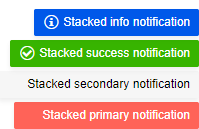

# Stacked Notifications

When you invoke multiple notifications from the same component reference they will be stacked on the screen. Notifications which derive from different references will be rendered on top of one another.

>caption Stacked Notifications in Telerik UI for Blazor



````CSHTML
@* Calling Show() before the previous notifications hide will stack the new messages above the old ones *@

<TelerikButton OnClick="@AddStackedNotifications">Add stacked notifications</TelerikButton>

<TelerikNotification @ref="@NotificationReference" />

@code {
    public TelerikNotification NotificationReference { get; set; }
    public string[] ColorOptions = new string[4] { "primary", "secondary", "success", "info" };

    public void AddStackedNotifications()
    {
        foreach (var color in ColorOptions)
        {
            NotificationReference.Show(new NotificationModel()
            {
                Text = $"Stacked {color} notification",
                ThemeColor = $"{color}"
            });
        }
    }
}
````

>tip @[template](/_contentTemplates/notification/templates.md#one-instance-per-app-link)

## See Also

  * [Live Demo: Notification Overview](https://demos.telerik.com/blazor-ui/notification/overview)
  * [Notification Overview]()
  * [One Notification Instance for All Components Sample Project](https://github.com/telerik/blazor-ui/tree/master/notification/single-instance-per-app)
