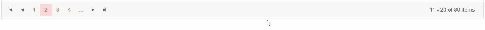

# Pager Events

This article explains the events available in the Telerik Pager for Blazor:

## PageChanged

The `PageChanged` event fires a new page is selected. You can use it to implement [load on demand](#load-on-demand)

>caption Handle PageChanged

````CSHTML
@* Make sure to update the current page index when using the event *@

<TelerikPager Total="@TotalItems"
              ButtonCount="@ButtonCount"
              PageSize="@ItemsOnPage"
              Page="@CurrentPage"
              PageChanged="@( (int page) => PageChangedHandler(page)  )">

</TelerikPager>

<div class="text-info">@Result</div>

@code {
    public int TotalItems { get; set; } = 80;
    public int ButtonCount { get; set; } = 4;
    public int ItemsOnPage { get; set; } = 10;
    public int CurrentPage { get; set; } = 2;
    public string Result { get; set; } = String.Empty;

    void PageChangedHandler(int page)
    {
        CurrentPage = page;
        Result = $"Current page: {page}";
    }
}
````
>caption The result from the code snippet above



## See Also

* [Pager Overview]()
