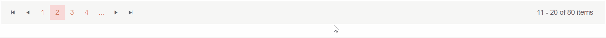

# Pager Events

This article explains the events available in the Telerik Pager for Blazor:

* [PageChanged](#pagechanged) - fires when the user navigates to another page
* [PageSizeChanged](#pagesizechanged) - fires when the user selects a different page size

## PageChanged

The `PageChanged` event fires when a new page is selected. You can use it to implement [load on demand](slug:pager-overview#load-on-demand).

Make sure to update the current page index when using the event.

>caption Handle PageChanged

<demo metaUrl="client/pager/events/page-changed/" height="250"></demo>
>caption The result from the code snippet above

## PageSizeChanged

The `PageSizeChanged` event fires when the user changes the page size via the pager DropDownList. The existence of this event also ensures that the `PageSize` attribute supports two-way binding.

If the user selects the "All" option from the page size DropDownList, the `PageSizeChanged` event will receive the total item count as an argument.

Make sure to update the current page size when using the event.

>caption Handle PageSizeChanged

<demo metaUrl="client/pager/events/page-size-changed/" height="250"></demo>

## See Also

* [Pager Overview](slug:pager-overview)
