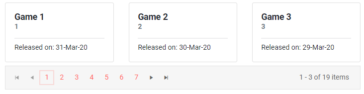
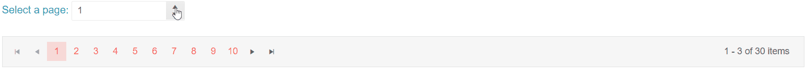

# Pager Overview

The <a href="https://www.telerik.com/blazor-ui/pager" target="_blank">Blazor Pager component</a> will enable you to add paging for your data in a Blazor application. We use it in components like the Grid and ListView, and you can also use it for your own templates and data as a standalone component.

The Pager provides the UI for the user to change the page. To the developer, it provides the page index so you can render only the relevant data portion and an [event]() that you can use to implement [load on demand](#load-on-demand).

#### To use Telerik Pager component for Blazor:

1. Add the `TelerikPager` tag
1. Set its `Total` parameter to the number of items in the data source.
1. Use the values of its `Page` and `PageSize` parameters to extract and render the desired subset of data.

>caption Use the TelerikPager to paginate your own data and content

````CSHTML
@{
    // take and render the relevant data portion based on the pager info
    var pageData = Games.Skip((Page - 1) * PageSize).Take(PageSize).ToList();

    <div class="card-deck mb-2">
        @foreach (Game game in pageData)
        {
            <div class="card">
                <div class="card-body">
                    <h5>@game.GameName</h5>
                    <h6 class="card-subtitle mb-2 text-muted">@game.GameId</h6>
                    <p class="card-text">
                        Released on: @game.ReleaseDate.ToShortDateString()
                    </p>
                </div>
            </div>
        }
    </div>
}

<TelerikPager Total="@Games.Count" PageSize="@PageSize" @bind-Page="@Page"></TelerikPager>

@code {
    public int PageSize { get; set; } = 3;
    public int Page { get; set; } = 1; // the page indexes are 1-based

    public List<Game> Games { get; set; }

    // Generate sample data
    protected override void OnInitialized()
    {
        Games = new List<Game>();
        for (int i = 1; i < 20; i++)
        {
            Games.Add(new Game()
            {
                GameName = $"Game {i}",
                GameId = i,
                ReleaseDate = DateTime.Now.AddDays(-i)
            });
        }
    }

    // In real-case scenario this model should be in a separate file
    public class Game
    {
        public int GameId { get; set; }
        public string GameName { get; set; }
        public DateTime ReleaseDate { get; set; }
    }
}
````

>caption The result from the code snippet above




## Features

* `Total` - `int` - Represents the total count of items in the pager. **Required.**
* `ButtonCount` - `int` - The maximum number of page buttons that will be visible. To take effect, `ButtonCount` must be smaller than the page count (`ButtonCount < Total / PageSize`).
* `Page` - `int` - Represents the current page of the pager. The first page has an index of `1`. Supports two-way data binding. If no value is provided, the parameter will default to the first page (1), but you should always use this parameter value in order to successfully use the component. If you don't use two-way binding and you don't update the value of the parameter after the user action, the pager UI will not reflect the change and will revert to the previous value (page index).
* `PageSize` - `int` - The number of items to display on a page.
* `PageSizes` - `List<int?>` - Allows users to change the page size via a DropDownList. The attribute configures the DropDownList options. A `null` item in the `PageSizes` `List` will render an "All" option. By default, the Pager DropDownList is not displayed. You can also set `PageSizes` to `null` programmatically to remove the DropDownList at any time.
* `InputType` - `PagerInputType` - Determines if the pager will show numeric buttons to go to a specific page, or a textbox to type the page index. The arrow buttons are always visible. The `PagerInputType` enum accepts values `Buttons` (default) or `Input`. When `Input` is used, the page index will change when the textbox is blurred, or when the user hits Enter. This is to avoid unintentional data requests.
* `Class` - The CSS class that will be rendered on the main wrapping element of the Pager.

## Examples

### Load On Demand

You can avoid loading all the data at once, as this can be a costly operation. In such a case, you should use the `PageChanged` event of the Pager component to fetch the new subset of data to render. It is important to always provide the correct `Total` count of items in the full data source to the component so it can render the correct amount of page buttons.

>caption Load paged data on demand

````CSHTML
@{
    <div class="card-deck mb-2">
        @foreach (Game game in PagedDataToRender)
        {
            <div class="card">
                <div class="card-body">
                    <h5>@game.GameName</h5>
                    <h6 class="card-subtitle mb-2 text-muted">@game.GameId</h6>
                    <p class="card-text">
                        Released on: @game.ReleaseDate.ToShortDateString()
                    </p>
                </div>
            </div>
        }
    </div>
}

<TelerikPager Total="@TotalGames"
              Page="@CurrPage"
              PageChanged="@PageChangedHandler"
              PageSize="@PageSize"
              PageSizes="@GamesPerPage">
</TelerikPager>

@code {
    int TotalGames { get; set; }
    int CurrPage { get; set; } = 1; // page index is 1-based
    int PageSize { get; set; } = 5;
    public List<int?> GamesPerPage = new List<int?> { 5, 10, 20, null };

    List<Game> PagedDataToRender { get; set; }

    protected override async Task OnInitializedAsync()
    {
        await LoadDataOnDemand();
    }

    async Task PageChangedHandler(int page)
    {
        CurrPage = page;
        await LoadDataOnDemand();
    }

    async Task LoadDataOnDemand()
    {
        TotalGames = await GetCountFromService();
        PagedDataToRender = await GetPagedDataFromService(CurrPage - 1, PageSize);
    }

    // simulate a service below
    private List<Game> _allData { get; set; } = Enumerable.Range(1, 100).Select(x => new Game
    {
        GameName = $"Game {x}",
        GameId = x,
        ReleaseDate = DateTime.Now.AddDays(-x)
    }).ToList();

    public async Task<int> GetCountFromService()
    {
        return await Task.FromResult(_allData.Count);
    }

    public async Task<List<Game>> GetPagedDataFromService(int pageIndex, int pageSize)
    {
        var pagedData = _allData.Skip(pageIndex * pageSize).Take(pageSize);
        return await Task.FromResult(pagedData.ToList());
    }

    // In real-case scenario this model should be in a separate file
    public class Game
    {
        public int GameId { get; set; }
        public string GameName { get; set; }
        public DateTime ReleaseDate { get; set; }
    }
}
````

### Two-way Binding

You can use two-way binding for the `Page` parameter so it can respond to changes from other element, and to also update other elements. This is the most straightforward use of the component. As an alternative, use the `PageChanged` event to implement additional logic when paging the data, such as [loading it on demand](#load-on-demand).

````CSHTML
@*This example showcases how the Pager reacts when the page is selected from an outside input.*@

<div class="mb-3">
    <label class="text-info">
        Select a page:
        <TelerikNumericTextBox @bind-Value="@Page" />
    </label>
</div>

<TelerikPager Total="30" PageSize="@PageSize" @bind-Page="@Page" />

@code {
    public int PageSize { get; set; } = 3;
    public int Page { get; set; } = 1;
}
````
>caption The result from the code snippet above



## See Also

* [Live Demo: Pager Overview](https://demos.telerik.com/blazor-ui/pager/overview)
* [Live Demo: Pager Integration](https://demos.telerik.com/blazor-ui/pager/integration)
* [Live Demo: Pager Localization](https://demos.telerik.com/blazor-ui/pager/localization)
* [Live Demo: Pager Keyboard Navigation](https://demos.telerik.com/blazor-ui/pager/keyboard-navigation)
