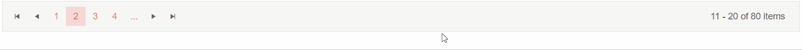

# Pager Overview

The **Pager** component will enable you to add paging for your data in a Blazor application. We use it in components like the Grid and ListView, and you can also use it for your own templates and data as a standalone component.

To use Telerik Pager component for Blazor:

1. Add the `TelerikPager` tag
1. (optional) Populate it's `Total` parameter
1. (optional) Set it's `ButtonCount` parameter
1. (optional) Set the `PageChanged` parameter
1. (optional) Set `Page` or `@bind-Page` (one and two-way data binding)
1. (optional) Set a `PageSize`

>caption Basic setup of Pager component in your application

````CSHTML
@*Basic Pager configuration.*@

<TelerikPager Total="TotalItems"
              ButtonCount="ButtonCount"
              PageSize="ItemsOnPage"
              @bind-Page="CurrentPage">

</TelerikPager>

@code {
    public int TotalItems { get; set; } = 80;
    public int ButtonCount { get; set; } = 4;
    public int ItemsOnPage { get; set; } = 10;
    public int CurrentPage { get; set; } = 2;
}
````

>caption The result from the code snippet above


## Features
* `Class` - The CSS class that will be rendered on the main wrapping element of the Pager.
* `Total` - **int** - Represents the total count of items in the pager.
* `ButtonCount` - **int** - The number of pages to be visible. To take effect the `ButtonCount` must be **less** than the pages count (ButtonCount < Total / number of items on the page)
* `Page` and `@bind-Page` - **int** - Represents the current page of the pager. Those parameters are respectively for one and two-way data binding. If no `Page` or `@bind-Page` are provided they will default to the first page (1).
* `PageChanged` - Fires when a new page is selected (used in one-way data binding).
* `PageSize` - **int** - The number of items to be presented on a page.

## Examples

>caption Observe the behavior of the Pager with one-way data binding

````CSHTML
@*This example showcases the usage of Page and PageChanged in conjunction*@

<TelerikPager Total="TotalItems"
              ButtonCount="ButtonCount"
              PageSize="ItemsOnPage"
              Page="CurrentPage"
              PageChanged="@( (int page) => PageChangedHandler(page)  )">

</TelerikPager>

<div class="text-info">@Result</div>

@code {
    public int TotalItems { get; set; } = 80;
    public int ButtonCount { get; set; } = 4;
    public int ItemsOnPage { get; set; } = 10;
    public int CurrentPage { get; set; } = 2;
    public string Result { get; set; } = String.Empty;

    void PageChangedHandler(int page)
    {
        CurrentPage = page;
        Result = $"Current page: {page}";
    }
}
````
>caption The result from the code snippet above



>caption Observe the behavior of the Pager with two-way data binding

````CSHTML
@*This example showcases the usage of Page and PageChanged in conjunction*@

<TelerikPager Total="TotalItems"
              ButtonCount="ButtonCount"
              PageSize="ItemsOnPage"
              @bind-Page="CurrentPage">

</TelerikPager>
<div class="text-info">Current page: @CurrentPage</div>
@code {
    public int TotalItems { get; set; } = 80;
    public int ButtonCount { get; set; } = 4;
    public int ItemsOnPage { get; set; } = 10;
    public int CurrentPage { get; set; } = 2;
}
````
>caption The result from the code snippet above


## See Also

* [Live Demo: Pager Overview](https://demos.telerik.com/blazor-ui/pager/overview)
* [Live Demo: Pager Integration](https://demos.telerik.com/blazor-ui/pager/integration)
* [Live Demo: Pager Localization](https://demos.telerik.com/blazor-ui/pager/localization)
* [Live Demo: Pager Keyboard Navigation](https://demos.telerik.com/blazor-ui/pager/keyboard-navigation)
