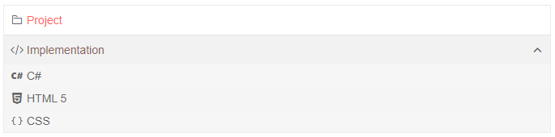

# PanelBar Data Binding Basics

This article explains the different ways to provide data to a PanelBar component, the properties related to data binding and their results.

@[template](/_contentTemplates/common/general-info.md#valuebind-vs-databind-link)

First, review:

* The available (bindable) [features of a PanelBar item](#panelbar-item-features).
* How to match fields in the model with the PanelBar item [data bindings](#data-bindings).

There are two modes of providing data to a PanelBar, and they both use the items' features. Once you are familiar with the current article, choose the data binding mode you wish to use:

* [Flat data]() - a single collection of items with defined parent-child relationships.
* [Hierarchical data]() - separate collections of items and their child items.

## PanelBar Item Features

The PanelBar items provide the following features that you control through the corresponding fields in their data binding:

* `Id` - `string` - a unique identifier for the item. Required for binding to flat data.

* `ParentId` - `string` - identifies the parent to whom the item belongs. Required only when binding to flat data. All items with the same `ParentId` will be rendered at the same level. For a root level item, this must be `null`.

* `HasChildren` - `string` - whether the item has children. Determines whether an expand arrow is rendered next to the item. Required for binding to flat data. With hierarchical data, the PanelBar will render the icon based on the existence of child items, but `HasChildren` will take precedence.

* `Items` - `string` - the collection of child items that will be rendered under the current item. Required only when binding to hierarchical data.

* `Text` - `string` - the text that will be shown on the item.

* `DisabledField` - `string` - whether the item is disabled. If an item is disabled it will not be clickable and cannot be expanded by the user. The [`OnItemClick`](#onitemclick) will not be fired if the item is disabled.

* `ImageUrl` / `Icon` / `IconClass` -the URL to a raster image, the [Telerik icon](), or a class for a custom font icon that will be rendered in the item. They have the listed order of precedence in case more than one is present in the data (that is, an `ImageUrl` will have the highest importance).

* `Url` - the view the item will navigate to by generating a link.

## Data Bindings

The properties of a panelbar item match directly to a field of the model the component is bound to. You provide that relationship by providing the name of the field from which the corresponding information is present. To do this, under the `PanelBarBindings` tag, use the `PanelBarBinding` tag properties.

Each `PanelBarBinding` tag exposes the following properties that refer to item properties:

* IdField => Id

* ParentIdField => ParentId

* TextField => Text

* DisabledField => Disabled

* IconClassField => IconClass

* IconField => Icon

* ImageUrlField => ImageUrl

* UrlField => Url

* ExpandedField => Expanded

* HasChildrenField => HasChildren

* ItemsField => Items

* Level - this is used for defining [different bindings for different levels](#multiple-level-bindings). If no level is set, the bindings are taken as default for any level that does not have explicit settings. You should have one `TelerikPanelBarBinding` without a level.

>tip There are default values for the field names. If your model names match the defaults, you don't have to define them in the bindings settings.

@[template](/_contentTemplates/common/navigation-components.md#default-fields-match-issues)

>important If you are using hierarchical data binding, your model must not contain a field called `ParentId` (or a field that matches the name given to the `ParentIdField` parameter of a `PanelBarBinding`). That would confuse the PanelBar that it is binding to flat data, and so there may be no roots and you may see no data.

>caption Default field names for PanelBar item bindings. If you use these, you don't have to specify them in the `PanelBarBinding` tag explicitly.

````CSHTML
public class PanelBarItem
{
	public int Id { get; set; }
	public string Text { get; set; }
	public int? ParentId { get; set; }
	public bool Disabled { get; set; }
	public bool HasChildren { get; set; }
	public string Icon { get; set; }
	public string Url { get; set; }
}
````

The following **Example** shows how to define simple binding to match item fields to a model so a tree renders the provided flat data source.

>caption Sample binding on a flat data source. Showcases how to set the properties to match the model. With this model, the only field name you must explicitly specify is `ParentIdField`, the others match the defaults.

````CSHMTL
@* Sample PanelBar bound to self-referencing flat data. Also uses the built-in icons from the Telerik suite. The Project item in the PanelBar redirects to a sample url. *@

<div style="width: 30%;">
    <TelerikPanelBar Data="@Items" 
                     @bind-ExpandedItems="@ExpandedItems">
    </TelerikPanelBar>
</div>

@code {
    public List<PanelBarItem> Items { get; set; }
    public IEnumerable<object> ExpandedItems { get; set; } = new List<object>();

    public class PanelBarItem
    {
        public int Id { get; set; }
        public string Text { get; set; }
        public int? ParentId { get; set; }
        public bool HasChildren { get; set; }
        public string Icon { get; set; }
        public string Url { get; set; }
    }

    private List<PanelBarItem> LoadFlatData()
    {
        List<PanelBarItem> items = new List<PanelBarItem>();

        items.Add(new PanelBarItem()
        {
            Id = 1,
            Text = "Project",
            ParentId = null,
            HasChildren = false,
            Icon = "folder",
            Url = "projectURL.url"
        });

        items.Add(new PanelBarItem()
        {
            Id = 2,
            Text = "Implementation",
            ParentId = null,
            HasChildren = true,
            Icon = "code"
        });

        items.Add(new PanelBarItem()
        {
            Id = 3,
            Text = "C#",
            ParentId = 2,
            HasChildren = false,
            Icon = "cs"
        });

        items.Add(new PanelBarItem()
        {
            Id = 4,
            Text = "HTML 5",
            ParentId = 2,
            HasChildren = false,
            Icon = "html5"
        });

        items.Add(new PanelBarItem()
        {
            Id = 5,
            Text = "CSS",
            ParentId = 2,
            HasChildren = false,
            Icon = "css"
        });

        return items;
    }

    protected override void OnInitialized()
    {
        Items = LoadFlatData();

        ExpandedItems = new List<object>() { Items[1] };

        base.OnInitialized();
    }
}
````

>caption The result from the snippet above



### Multiple Level Bindings

You can define different binding settings for the different levels of nodes in the PanelBar. With this, the children of a node can consume a different field than their parent, and this may make your application more flexible. If you use [hierarchical data binding](), the children can even use a different field or model from their parent.

This also allows you to define a different [`ItemTemplate`]() for different levels.

To define multiple bindings, add multiple `PanelBarBinding` tags and define their `Level`.

If a certain level does not have an explicit data bindings tag, it will use the default one that has no level.

>caption How to use per-level data binding settings to change model fields

````CSHTML
@* Provide data to different levels of the PanelBar *@

<div style="width: 30%;">
    <TelerikPanelBar Data="@Items"
                     @bind-ExpandedItems="@ExpandedItems">
        <PanelBarBindings>
            <PanelBarBinding Level="1" TextField="SecondLevelText">
                <HeaderTemplate>
                    @{ 
                        var item = context as PanelBarItem;

                        <div style="font-weight: bold; text-decoration: underline">
                            @item.SecondLevelText
                        </div>
                    }
                </HeaderTemplate>
            </PanelBarBinding>
        </PanelBarBindings>
    </TelerikPanelBar>
</div>

@code {
    public List<PanelBarItem> Items { get; set; }
    public IEnumerable<object> ExpandedItems { get; set; } = new List<object>();

    public class PanelBarItem
    {
        public int Id { get; set; }
        public string Text { get; set; }
        public string SecondLevelText { get; set; }
        public int? ParentId { get; set; }
        public bool HasChildren { get; set; }
        public string Icon { get; set; }
        public string Url { get; set; }
    }

    private List<PanelBarItem> LoadFlatData()
    {
        List<PanelBarItem> items = new List<PanelBarItem>();

        items.Add(new PanelBarItem()
        {
            Id = 1,
            Text = "Project",
            ParentId = null,
            HasChildren = false,
            Icon = "folder",
            Url = "projectURL.url"
        });

        items.Add(new PanelBarItem()
        {
            Id = 2,
            Text = "Implementation",
            ParentId = null,
            HasChildren = true,
            Icon = "code"
        });

        items.Add(new PanelBarItem()
        {
            Id = 3,
            SecondLevelText = "C#",
            ParentId = 2,
            HasChildren = false,
            Icon = "cs"
        });

        items.Add(new PanelBarItem()
        {
            Id = 4,
            SecondLevelText = "HTML 5",
            ParentId = 2,
            HasChildren = false,
            Icon = "html5"
        });

        items.Add(new PanelBarItem()
        {
            Id = 5,
            SecondLevelText = "CSS",
            ParentId = 2,
            HasChildren = false,
            Icon = "css"
        });

        return items;
    }

    protected override void OnInitialized()
    {
        Items = LoadFlatData();

        ExpandedItems = new List<object>() { Items[1] };

        base.OnInitialized();
    }
}
````

>note To improve performance when using [flat data binding](), all the bindings for all the levels should use the same `ParentIdField`.

## See Also

  * [Binding to Flat Data]()
  * [Binding to Hierarchical Data]()
  * [Live Demo: PanelBar Flat Data](https://demos.telerik.com/blazor-ui/panelbar/flat-data)
  * [Live Demo: PanelBar Hierarchical Data](https://demos.telerik.com/blazor-ui/panelbar/hierarchical-data)
