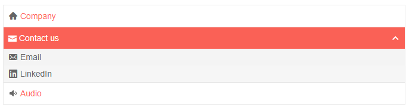

# PanelBar Icons

You can put an image, icon class or a font icon for each item in the PanelBar to illustrate its purpose for your end users. To apply them, use the following properties:

* for a [Telerik font icon](), point the `IconField` parameter of the component to a string field of the model that contains the corresponding icon name.

* for a raster image, point the `ImageUrlField` parameter of the component to a `string` field of the model that contains the URL to the image (relative or absolute).

* for a custom font icon class, point the `IconClassField` parameter of the component to a `string` field of the model that contains the desired CSS class list which provides the required rules (like font name and glyph symbol). Make sure to also reference the desired font in your app and to use its own recommendations.

The `IconClassField` and `ImageUrlField` are rendered, respectively, as `<span class="the custom class" />` and as ``

>caption How to use icons in Telerik PanelBar

````CSHTML
@* This example shows how to add icons or images to the PanelBar items
Make sure that you also refernce the OpenIconic font that comes with the Blazor App template to see the custom font icon *@

<div style="width: 30%;">
    <TelerikPanelBar Data="@Items">
        <PanelBarBindings>
            <PanelBarBinding IconClassField="@nameof(PanelBarItem.MyIconClass)"
                             IconField="@nameof(PanelBarItem.MyIcon)"
                             ImageUrlField="@nameof(PanelBarItem.MyImageUrl)"></PanelBarBinding>
        </PanelBarBindings>
    </TelerikPanelBar>
</div>

@code {
    public List<PanelBarItem> Items { get; set; }

    public class PanelBarItem
    {
        public int Id { get; set; }
        public string Text { get; set; }
        public int? ParentId { get; set; }
        public bool HasChildren { get; set; }
        public string MyIcon { get; set; }
        public string MyIconClass { get; set; }
        public string MyImageUrl { get; set; }
    }

    private List<PanelBarItem> LoadFlatData()
    {
        List<PanelBarItem> items = new List<PanelBarItem>();

        items.Add(new PanelBarItem()
        {
            Id = 1,
            Text = "Company",
            ParentId = null,
            HasChildren = false,
            MyIcon = "home"
        });

        items.Add(new PanelBarItem()
        {
            Id = 2,
            Text = "Contact us",
            ParentId = null,
            HasChildren = true,
            MyIconClass = "oi oi-envelope-closed"
        });

        items.Add(new PanelBarItem()
        {
            Id = 3,
            Text = "Email",
            ParentId = 2,
            HasChildren = false,
            MyIcon = "envelop"
        });

        items.Add(new PanelBarItem()
        {
            Id = 4,
            Text = "LinkedIn",
            ParentId = 2,
            HasChildren = false,
            MyIcon = "linkedin-box"
        });

        items.Add(new PanelBarItem()
        {
            Id = 5,
            Text = "Audio",
            ParentId = null,
            HasChildren = false,
            MyImageUrl = "https://docs.telerik.com/blazor-ui/images/speaker.png"
        });

        return items;
    }

    protected override void OnInitialized()
    {
        Items = LoadFlatData();

        base.OnInitialized();
    }
}
````

>caption The result from the code snippet above, after expanding the first node



## See Also

  * [PanelBar Overview]()
