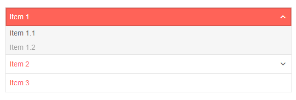
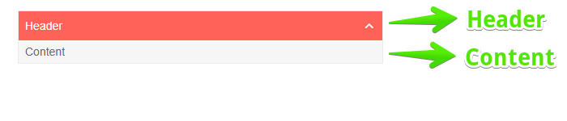

# PanelBar Overview

The <a href="https://www.telerik.com/blazor-ui/panelbar" target="_blank">Blazor PanelBar component</a> displays [data]() ([flat]() or [hierarchical]()) in an accordion type structure. In addition to built-in [navigation capabilities](), you can navigate through the items and their children, define [templates](), render text and [icons/images](), and respond to [events]().


#### In this article:

* [Basics](#basics)

* [Elements of a PanelBar Item](#elements-of-a-panelbar-item)


## Basics

To use a Telerik PanelBar for Blazor:

1. Add the `TelerikPanelBar` tag
1. Provide a collection of models to its `Data` parameter (read more in the [Data Binding article]())
1. Match the fields in the models with the binding schema for the nodes

>caption Basic PanelBar with flat data binding and built-in icons 

````CSHTML
@* Provide a flat collection of models to the PanelBar *@

<TelerikPanelBar Data="@Items">
</TelerikPanelBar>


@code {
    public List<PanelBarItem> Items { get; set; }

    public class PanelBarItem
    {
        public string Text { get; set; }
        public bool Disabled { get; set; }
        public string Url { get; set; }
        public List<PanelBarItem> Items { get; set; }
    }

    protected override void OnInitialized()
    {
        Items = GenerateData();

        base.OnInitialized();
    }

    private List<PanelBarItem> GenerateData()
    {
        List<PanelBarItem> collection = new List<PanelBarItem>()
        {
            new PanelBarItem()
            {
                Text = "Item 1",
                Items = new List<PanelBarItem>()
                {
                    new PanelBarItem()
                    {
                        Text = "Item 1.1"
                    },
                    new PanelBarItem()
                    {
                        Text = "Item 1.2",
                        Disabled = true,
                        Items = new List<PanelBarItem>()
                        {
                            new PanelBarItem()
                            {
                                Text = "Item 1.2.1"
                            },
                            new PanelBarItem()
                            {
                                Text = "Item 1.2.2"
                            }
                        }
                    }
                }
            },
            new PanelBarItem()
            {
                Text = "Item 2",
                Items = new List<PanelBarItem>()
                {
                    new PanelBarItem()
                    {
                        Text = "Item 2.1",
                        Items = new List<PanelBarItem>()
                        {
                            new PanelBarItem()
                            {
                                Text = "Item 2.1.1"
                            }
                        }
                    },
                    new PanelBarItem()
                    {
                        Text = "Item 2.2",
                        Url = "https://google.com"
                    }
                }
            },
            new PanelBarItem()
            {
                Text = "Item 3"
            }
        };

        return collection;
    }
}
````

>caption The result from the snippet above



>caption Component namespace and reference

````CSHTML
@* Get a reference to the PanelBar *@

<TelerikPanelBar @ref="@PanelBarReference">
</TelerikPanelBar>

@code {
    private Telerik.Blazor.Components.TelerikPanelBar PanelBarReference { get; set; }
}
````

## Elements of a PanelBar Item

Each item in the PanelBar consists of a `Header` and `Content`. The image below illustrates the concept.

You can customize their rendering through the corresponding [Header Template]() and [Content Template]().

The content represents the items in the hierarchy that does not have children. If the items have children and the ContentTemplate is defined, the template will not render. The header contains the Text of the correponding data item (model).




## See Also

  * [Data Binding a PanelBar]()
  * [Live Demo: TreeView](https://demos.telerik.com/blazor-ui/panelbar/index)
  * [API Reference](https://docs.telerik.com/blazor-ui/api/Telerik.Blazor.Components.PanelBar)

