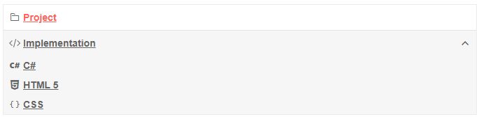

# HeaderTemplate


You can control and customize the rendering of the header items in the PanelBar by using the `HeaderTemplate`. It provides a `context` object that you can cast to the type that the PanelBar is bound it.

The `HeaderTemplate` of a level is defined under the `PanelBarBinding` tag.

If no levels are defined the `HeaderTemplate` will apply to the entire data.

>caption Use HeaderTemplate to customize the rendering of the headers in the PanelBar

````CSHTML
@* Customize the rendering of the parent items in the PanelBar *@

<div style="width: 30%;">
    <TelerikPanelBar Data="@Items"
                     @bind-ExpandedItems="@ExpandedItems">
        <PanelBarBindings>
            <PanelBarBinding>
                <HeaderTemplate>
                    @{ 
                        var item = context as PanelBarItem;

                        <div style="font-weight: bold; text-decoration: underline">
                            @item.Text
                        </div>
                    }
                </HeaderTemplate>
            </PanelBarBinding>
        </PanelBarBindings>
    </TelerikPanelBar>
</div>

@code {
    public List<PanelBarItem> Items { get; set; }
    public IEnumerable<object> ExpandedItems { get; set; } = new List<object>();

    public class PanelBarItem
    {
        public int Id { get; set; }
        public string Text { get; set; }
        public int? ParentId { get; set; }
        public bool HasChildren { get; set; }
    }

    private List<PanelBarItem> LoadFlatData()
    {
        List<PanelBarItem> items = new List<PanelBarItem>();

        items.Add(new PanelBarItem()
        {
            Id = 1,
            Text = "Parent 1",
            ParentId = null,
            HasChildren = true
        });

        items.Add(new PanelBarItem()
        {
            Id = 2,
            Text = "Parent 2",
            ParentId = null,
            HasChildren = true,
        });

        items.Add(new PanelBarItem()
        {
            Id = 3,
            Text = "Child 1 of Parent 2",
            ParentId = 2,
            HasChildren = false
        });

        items.Add(new PanelBarItem()
        {
            Id = 4,
            Text = "Child 2 of Parent 2",
            ParentId = 2,
            HasChildren = false
        });

        items.Add(new PanelBarItem()
        {
            Id = 5,
            Text = "Child 1 of Parent 1",
            ParentId = 1,
            HasChildren = false
        });

        return items;
    }

    protected override void OnInitialized()
    {
        Items = LoadFlatData();

        ExpandedItems = new List<object>() { Items[1] };

        base.OnInitialized();
    }
}
````

>caption The result from the code snippet above



## See Also

  * [Data Binding a PanelBar]()
  * [Live Demo: PanelBar](https://demos.telerik.com/blazor-ui/panelbar/index)
