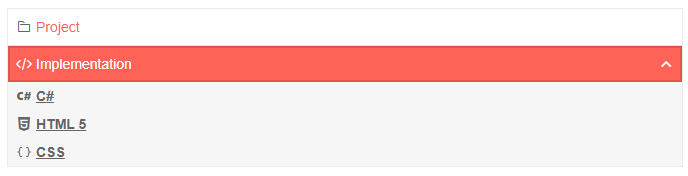

# HeaderTemplate

You can control and customize the rendering of the header items in the PanelBar by using the `HeaderTemplate`. It provides a `context` object that you can cast to the type that the PanelBar is bound to.

The `HeaderTemplate` of a level is defined under the `PanelBarBinding` tag. Set the `Level` parameter of the `PanelBarBinding` to specify the level the `HeaderTemplate` must be applied to. 

If the `Level` parameter of the `PanelBarBinding` is not set, the `HeaderTemplate` will apply to the entire data.

>caption Use HeaderTemplate to customize the rendering of the headers in the PanelBar

<demo metaUrl="client/panelbar/templates/header/" height="500"></demo>

>caption The result from the code snippet above

## See Also

* [Data Binding a PanelBar](slug:panelbar-data-binding-overview)
* [Live Demo: PanelBar](https://demos.telerik.com/blazor-ui/panelbar/overview)
