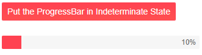

# Indeterminate state

The Indeterminate state of the ProgressBar can be used in cases when the estimated time of completion of the task is unknown or the progress can not be represented as a physical value. The ProgressBar is filled with flowing motion animation to showcase that the task is running. 

>caption Telerik ProgressBar in Indeterminate state


To put the ProgressBar in Indeterminate state set the `Indeterminate`, `boolean` parameter to `true`.

>caption Put the ProgressBar in Indeterminate State

````CSHTML
<div>
    <TelerikButton Primary="true" OnClick="(_ => isIndeterminate = true)">Put the ProgressBar in Indeterminate State</TelerikButton>
</div>

<br />

<TelerikProgressBar Indeterminate="@isIndeterminate" Value="10" Max="100" />

@code {
    public bool isIndeterminate { get; set; } = false;
}
````




## See Also

  * [Live Demo: ProgressBar Overview](https://demos.telerik.com/blazor-ui/loader/overview)
  * [Overview]()
  * [Labels]()
  
