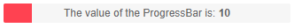

# Label for the ProgressBar

The label for the ProgressBar is a text representation for the completion of the task. By default the value of completion is shown as percent `%`. This article explains how to customize the label for the `<TelerikProgressBar>`. 

To access the customization settings use the `<ProgressBarLabel>`. It provides a context which exposes a `Value` parameter which is representation of the current value of the component.

>caption Customize the label for the ProgressBar. The result from the code snippet below.



````CSHTML
<TelerikProgressBar Max="@MaxValue" Value="@PBValue">
    <ProgressBarLabel Visible="true" Position="@ProgressBarLabelPosition.Center">
        <Template>
            <div>
                The value of the ProgressBar is: <span style="font-weight:bold">@(context.Value)</span>
            </div>
        </Template>
    </ProgressBarLabel>
</TelerikProgressBar>

@code {
    public double MaxValue { get; set; } = 50;
    public double PBValue { get; set; } = 10;
}
````

## Features

* [Visible](#visible)
* [Position](#position)
* [Template](#template)

### Visible

The `Visible` parameter takes a `boolean` value and controls whether the label of the Progress Bar are visible and defaults to `true`.

### Position

To control the position of the label for the Progress Bar, set the `ProgressBarLabelPosition` enum to one of its members:

    * `Start`
    * `Center`
    * `End` - this is the default value
    
    
### Template

The `Template` allows you to control the entire rendering of the label for the Progress Bar.


## See Also

  * [Live Demo: ProgressBar Overview](https://demos.telerik.com/blazor-ui/progressbar/overview)
  * [Overview]()
  * [Indeterminate state]()
