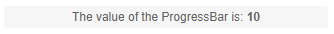

# Label for the ProgressBar

The label for the ProgressBar is a text representation for the completion of the task. To customize the label for the Progress Bar add the `<ProgressBarLabel>` tag, nested in `<TelerikProgressBar>`.

## Features

* [Visible](#visible)
* [Position](#position)
* [Template](#template)

### Visible

The `Visible` parameter takes a `boolean` value and controls whether the label of the Progress Bar are visible and defaults to `true`.

### Position

To control the position of the label for the Progress Bar, set the `ProgressBarLabelPosition` enum to one of its members:

    * `Start`
    * `Center`
    * `End` - this is the default value
    
    
### Template

The `Template` allows you to control the entire rendering of the labels for the Progress Bar. The `Context` provides the current value of the Progress Bar through the `Value`, `double`, parameter.

### Example of customizing the labels using the features

````CSHTML
<TelerikProgressBar Max="@MaxValue" Value="@PBValue">
    <ProgressBarLabel Visible="true" Position="@ProgressBarLabelPosition.Center">
        <Template>
            <div>
                The value of the ProgressBar is: <span style="font-weight:bold">@(context.Value)</span>
            </div>
        </Template>
    </ProgressBarLabel>
</TelerikProgressBar>

@code {
    public double MaxValue { get; set; } = 50;
    public double PBValue { get; set; } = 10;
}
````




## See Also

  * [Live Demo: ProgressBar Overview](https://demos.telerik.com/blazor-ui/loader/overview)
  * [Live Demo: Loader Appearance](https://demos.telerik.com/blazor-ui/loader/appearance)
