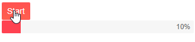

# Blazor ProgressBar Overview

The <a href = "https://www.telerik.com/blazor-ui/progressbar" target = "_blank">Blazor ProgressBar component</a> tracks the execution of operations and displays what portion of it is completed. For very long tasks, you can also make it [indeterminate]().

## Creating Blazor ProgressBar

1. Use the `<TelerikProgressBar>` tag.
1. Set its `Value` parameter to denote how much is completed.

>caption ProgressBar with maximum and initial values

````CSHTML
@*Set the maximum and the current values of the ProgressBar*@

<TelerikProgressBar Max="@MaxValue" Value="@PBValue" />

@code {
    public double MaxValue { get; set; } = 100;
    public double PBValue { get; set; } = 10;
}
````

## Label

The label is a text representation of the current progress. It is rendered inside the ProgressBar and by default shows the component value in percent. The ProgressBar allows customization of the label position and content. [Read more about the ProgressBar Label...]()

## Indeterminate State

In some scenarios the estimated time of completion is unknown or the progress cannot be strictly measured. The ProgressBar supports continuous animation that can cover these cases. [Read more about the ProgressBar Indeterminate State...]()

## Responsive ProgressBar

The ProgressBar will resize with the parent element dimensions when you set its width to 100%:

````CSHTML
<div style="width: 50%; border: 1px solid red;">

    <style>
        .width-100 {
            width: 100%;
        }
    </style>

    <TelerikProgressBar Class="width-100" Value="44" />
</div>
````

## ProgressBar Parameters

The ProgressBar provides the following features to further customize its behavior:

@[template](/_contentTemplates/common/parameters-table-styles.md#table-layout)

| Attribute | Type and Default Value | Description |
|----------|----------|----------|
| `Class` | `string` | the CSS class that will be rendered on the main wrapping element. You can use it to cascade styles more easily.
| `Max` | `double` <br/> 100 | the maximum value of the ProgressBar. It must be greater than `0`.
| `Value` | `double` | the value of the ProgressBar. This value indicates the progress of the tracked process. It is a fraction of the `Max`.
| `Orientation` | `ProgressBarOrientation` enum <br/> `ProgressBarOrientation.Horizontal` | controls the orientation of the ProgressBar. Takes a member of the `ProgressBarOrientation` enum - `Horizontal` or `Vertical`.
| `Indeterminate` | `bool` <br/> `false` | see the [Indeterminate]() article for more information.

## Simulate progress completion with a Timer



````CSHTML
@using System.Timers
@implements IDisposable

<TelerikButton ThemeColor="primary" OnClick="@StartProgress">Start</TelerikButton>

<br />

<TelerikProgressBar Max="@MaxValue" Value="@PBValue" Indeterminate="@isIndeterminate">
</TelerikProgressBar>

@code {
    public double MaxValue { get; set; } = 100;
    public double PBValue { get; set; } = 10;
    public bool isIndeterminate { get; set; } = false;

    public Timer Timer { get; set; } = new Timer();

    public void Dispose()
    {
        StopProgress();
        Timer?.Close();
    }

    public void StartProgress()
    {
        if (Timer?.Enabled == false)
        {
            Timer.Interval = 200;
            Timer.Elapsed -= OnTimerElapsedEvent;
            Timer.Elapsed += OnTimerElapsedEvent;
            Timer.AutoReset = true;
            Timer.Start();
        }
    }

    public void OnTimerElapsedEvent(Object source, ElapsedEventArgs e)
    {
        if (PBValue < MaxValue)
        {
            UpdateProgress();
        }
        else
        {
            StopProgress();
        }
    }

    public void UpdateProgress()
    {
        PBValue += 5;

        InvokeAsync(StateHasChanged);
    }

    public void StopProgress()
    {
        Timer?.Stop();
        InvokeAsync(StateHasChanged);
    }
}
````

## Next Steps

* [Customize the ProgressBar Label]()

## See Also

  * [Live Demo: ProgressBar](https://demos.telerik.com/blazor-ui/progressbar/overview)
  * [Label]()
  * [Indeterminate state]()
  * [API Reference](https://docs.telerik.com/blazor-ui/api/Telerik.Blazor.Components.TelerikProgressBar)
   
